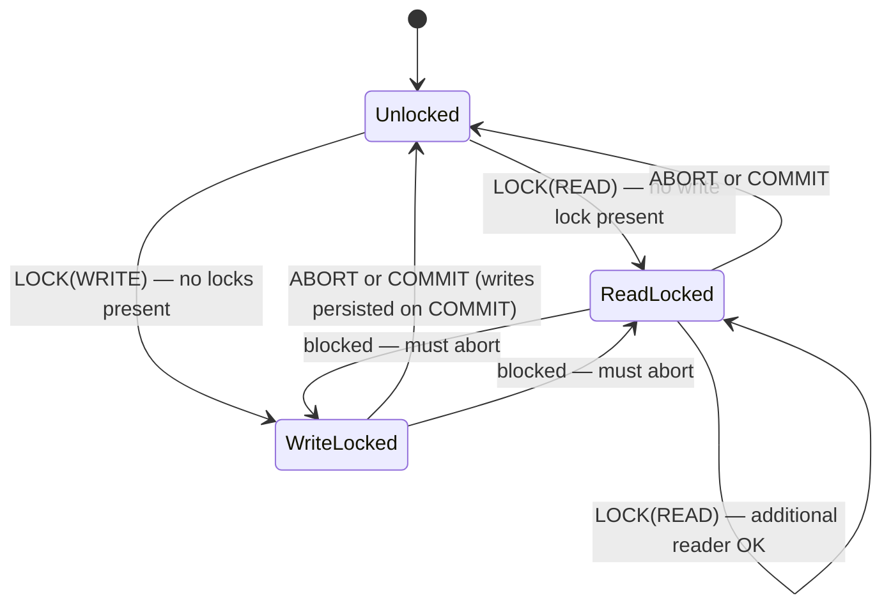

# CSE452: 2PC Locking and Deadlock

Locking is how [[Phases and Roles|2PC]] enforces serializability across groups. Every lock acquired during the Prepare phase is held until `COMMIT` or `ABORT` — preventing any other transaction from reading or writing those keys while this one is in flight.

---

## Read and Write Locks

**Read locks** (`LOCK(READ, var)`): Allow multiple concurrent readers. Block writers. Can only be acquired if no write lock is currently held on `var`.

**Write locks** (`LOCK(WRITE, var, value)`): Exclusive access. Block both readers and writers. Only one write lock can be held on `var` at a time.

**Compatibility rule**:

| | Read lock held | Write lock held |
| :--- | :--- | :--- |
| Acquire read lock | Allowed | Blocked |
| Acquire write lock | Blocked | Blocked |

---

## Locks Are Held in the Replicated State Machine

In a sharded environment, locks are not held in a separate lock manager — they are part of the **replicated state machine** stored directly in the `ShardStoreServer`'s fields. This means every lock acquisition is proposed to and committed by the local [[Multi-Paxos|Paxos]] group before it takes effect.

The consequence is significant: if the Paxos leader crashes mid-transaction, the new leader inherits the full lock state from the replicated log. No locks are silently dropped on node failure. This is what makes the coordinator and participants **fault-tolerant** — their lock state survives individual node crashes because it was committed to the Paxos log before being acknowledged.

---

## Deadlock Avoidance: Abort-on-Conflict

If two transactions each hold a lock the other needs, they deadlock — neither can proceed. The simplest prevention strategy used here is **abort-on-conflict** (also called "no-wait"):

- If a participant cannot immediately acquire the needed lock for a `Prepare` request, it aborts the transaction rather than waiting.
- The coordinator (or client) retries the transaction later.

This prevents circular waits entirely, at the cost of potential **livelock** — two transactions repeatedly aborting each other.

**Livelock prevention**: Groups are assigned fixed priorities (e.g., based on `GID`). Clients route transactions to the highest-priority participating group to serve as coordinator, so one transaction always wins the conflict ordering. In practice the lab uses random backoff or coordinator-priority conventions to reduce repeated conflicts.

---

## Differentiation and Retry

When a transaction is aborted and retried, participants that saw an earlier `Prepare` attempt must distinguish the new attempt from the old one. This is handled with **unique transaction IDs** or **attempt counters** embedded in every `Prepare` message. Without this, a stale `PrepareOK` from a prior attempt could confuse the coordinator into committing with inconsistent state.

---

## Industry Standard Terms

| CSE452 Term | Industry / Standard Term |
| :--- | :--- |
| **Read lock** | Shared lock / S-lock |
| **Write lock** | Exclusive lock / X-lock |
| **Abort-on-conflict** | No-wait deadlock prevention |
| **Locks in state machine** | Replicated lock manager |

---

## Related

- [[Transactions|Transactions (2PC)]] — hub file
- [[Phases and Roles|Phases and Roles]] — how locks fit into Phase 1 and Phase 2
- [[Log Operations|Log Operations]] — LOCK(READ), LOCK(WRITE), and their log semantics
- [[Failure Scenarios|Failure Scenarios]] — abort-on-conflict in action when a lock is taken
- [[Vanilla 2PC vs Paxos Commit|Vanilla 2PC vs Paxos Commit]] — why replicated lock state matters for fault tolerance
