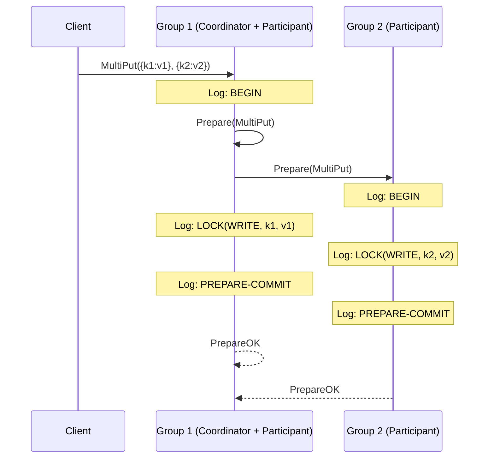
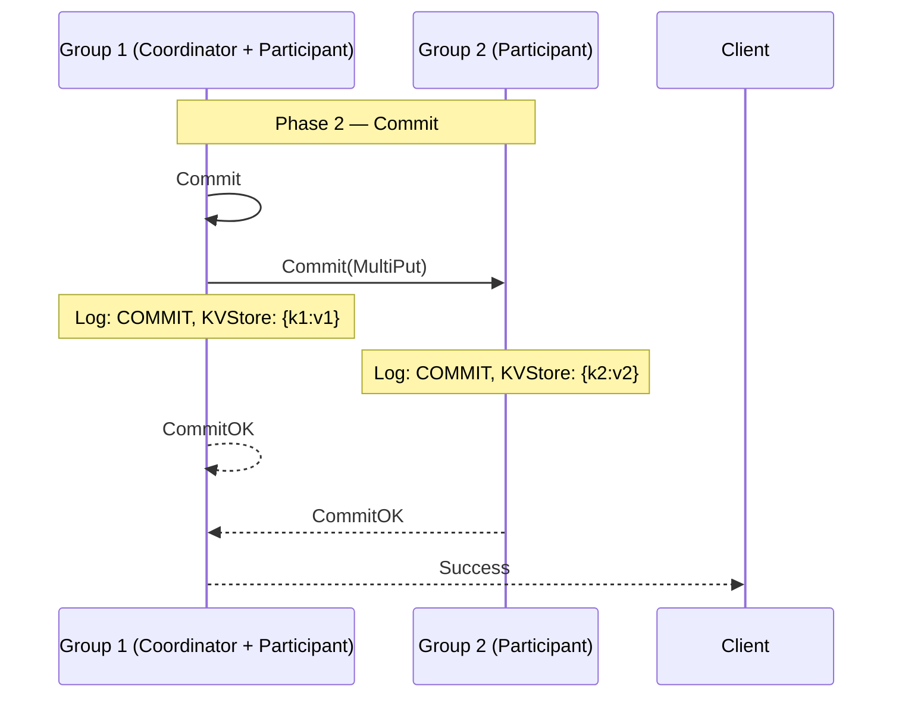

# Distributed Systems: 2PC MultiPut Walkthrough

This is a concrete step-by-step trace of [[Transactions|Two-Phase Commit (2PC)]] applied to a `MultiPut({k1: v1}, {k2: v2})` operation across two [[Replica Group|replica groups]]. Each step shows the messages exchanged and the state of each group's [[Log Operations|log]].

**Setup**: `k1` is owned by Group 1, `k2` is owned by Group 2. Group 3 owns unrelated keys and is not involved. The client sends the request to Group 1, which becomes the **coordinator**. Group 2 becomes a **participant**.

---

## Phase 1: Prepare

### Step 1 — Client sends MultiPut to Group 1; coordinator logs BEGIN

The client sends `MultiPut({k1: v1}, {k2: v2})` to Group 1. Group 1 receives the request, recognizes it is the coordinator (it received the request from the client), and logs the start of the transaction.

```
Group 1 Log:        Group 2 Log:
┌──────────┐        ┌──────────┐
│  BEGIN   │        │          │
└──────────┘        └──────────┘
```

### Step 2 — Coordinator sends Prepare to all participants; each logs BEGIN

Group 1 identifies which groups own the keys involved: it owns `k1` itself, and Group 2 owns `k2`. Group 1 sends `Prepare(MultiPut({k1: v1}, {k2: v2}))` to both itself (as participant) and to Group 2. Group 2 receives the `Prepare` message, recognizes it is a participant, and logs `BEGIN`.

```
Group 1 Log:        Group 2 Log:
┌──────────┐        ┌──────────┐
│  BEGIN   │        │  BEGIN   │
└──────────┘        └──────────┘
```

Group 3 receives no message — it owns none of the affected keys.

### Step 3 — Each participant acquires write locks on its keys

Group 1 needs to modify `k1`, so it acquires a write lock on `k1` and stages the tentative value `v1`. Group 2 needs to modify `k2`, so it acquires a write lock on `k2` and stages the tentative value `v2`. Both log their write lock acquisitions.

```
Group 1 Log:              Group 2 Log:
┌──────────────────┐      ┌──────────────────┐
│  BEGIN           │      │  BEGIN           │
│  LOCK(WRITE,k1,v1)│     │  LOCK(WRITE,k2,v2)│
└──────────────────┘      └──────────────────┘
```

The `k1` and `k2` values are now **tentatively held** in each group's state — not yet committed to the durable KVStore.

### Step 4 — Both participants log PREPARE-COMMIT and send PrepareOK

Both groups have successfully acquired their write locks. Each logs `PREPARE-COMMIT` — a binding promise to commit if the coordinator says so — and sends `PrepareOK` to the coordinator (Group 1).

```
Group 1 Log:              Group 2 Log:
┌──────────────────┐      ┌──────────────────┐
│  BEGIN           │      │  BEGIN           │
│  LOCK(WRITE,k1,v1)│     │  LOCK(WRITE,k2,v2)│
│  PREPARE-COMMIT  │      │  PREPARE-COMMIT  │
└──────────────────┘      └──────────────────┘
```



---

## Phase 2: Commit

### Step 5 — Coordinator receives all PrepareOKs and decides to commit

Group 1 has received `PrepareOK` from both itself and Group 2. All participants are ready. The coordinator sends `Commit(MultiPut({k1: v1}, {k2: v2}))` to all participants.

### Step 6 — Participants commit to persistent memory and release locks

Both groups receive the `Commit` message. Each logs `COMMIT`, writes the tentative value to persistent memory (the durable KVStore), and releases its write lock. The KVStore is now updated.

```
Group 1 Log:              Group 2 Log:
┌──────────────────┐      ┌──────────────────┐
│  BEGIN           │      │  BEGIN           │
│  LOCK(WRITE,k1,v1)│     │  LOCK(WRITE,k2,v2)│
│  PREPARE-COMMIT  │      │  PREPARE-COMMIT  │
│  COMMIT          │      │  COMMIT          │
└──────────────────┘      └──────────────────┘

Group 1 KVStore: {k1: v1}
Group 2 KVStore: {k2: v2}
```

### Step 7 — Participants send CommitOK; transaction complete

Both groups send `CommitOK` back to the coordinator. The coordinator acknowledges the client with a success response. Group 3's KVStore is untouched throughout.



---

## Cross-Shard Walkthrough: Lecture Log Notation

The following is the same bank-transfer scenario from the lecture — `checking_bal` on Group 1 (coordinator), `savings_bal` on Group 2 (participant) — shown using the lecture's log naming (see [[Phases and Roles|Phases and Roles: Lecture vs. Lab Terminology]] for the mapping).

The client sends RPCs sequentially. Each shard **Paxos-replicates** every lock acquisition before the lock takes effect.

**Transaction execution (before any prepare):**

```
Coordinator (Leader 1) Log:           Participant (Leader 2) Log:
  1. A: Transaction start(coord)         1. A: Transaction start(part)
  2. A: Lock(R, checking_bal)            2. A: Lock(R, savings_bal)
  3. A: Lock(W, checking_bal)
  4. A: Write(checking_bal, 100)
```

The client decides it wants to commit and sends `commit(A)` to the coordinator.

**Phase 1 — Prepare:**

The coordinator logs `Coordinator prepared` and sends `prepare(A)` to all shards. Each participant logs `Prepared` and responds `ready(A)`.

```
Coordinator (Leader 1) Log:           Participant (Leader 2) Log:
  1. A: Transaction start(coord)         1. A: Transaction start(part)
  2. A: Lock(R, checking_bal)            2. A: Lock(R, savings_bal)
  3. A: Lock(W, checking_bal)            3. A: Lock(W, savings_bal)
  4. A: Write(checking_bal, 100)         4. A: Write(savings_bal, 100)
  5. A: Coordinator prepared             5. A: Prepared
```

**Phase 2 — Commit:**

All shards voted ready. The coordinator logs `Commit` and broadcasts `commit(A)` to all participants. Each participant logs `Committed`, writes its tentative values to durable storage, then logs `Unlock`.

```
Coordinator (Leader 1) Log:           Participant (Leader 2) Log:
  1. A: Transaction start(coord)         1. A: Transaction start(part)
  2. A: Lock(R, checking_bal)            2. A: Lock(R, savings_bal)
  3. A: Lock(W, checking_bal)            3. A: Lock(W, savings_bal)
  4. A: Write(checking_bal, 100)         4. A: Write(savings_bal, 100)
  5. A: Coordinator prepared             5. A: Prepared
  6. A: Commit                           6. A: Committed
  7. A: Unlock(checking_bal)             7. A: Unlock(savings_bal)
```

The coordinator sends the final `commit(A)` acknowledgment to the client. Both KV stores are updated atomically.

---

## Industry Standard Terms

| CSE452 Term | Industry / Standard Term |
| :--- | :--- |
| **MultiPut** | Multi-key write / batch put |
| **Coordinator** | Transaction Manager (TM) |
| **Participant** | Resource Manager (RM) |
| **PrepareOK** | Vote-commit |
| **CommitOK** | Acknowledgment |

---

## Related

- [[Transactions|Transactions (2PC)]] — hub file
- [[Log Operations|Log Operations]] — detailed semantics of each log entry used in this walkthrough
- [[Failure Scenarios|Failure Scenarios]] — what happens when this walkthrough goes wrong
- [[Phases and Roles|Phases and Roles]] — the full protocol rules
- [[Locking and Deadlock|Locking and Deadlock]] — the locking discipline behind each step
