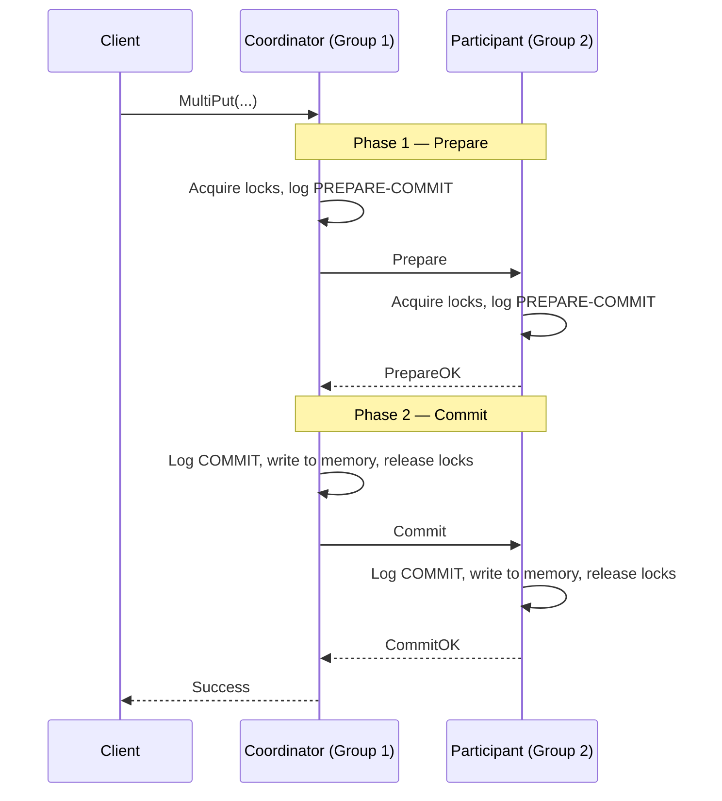

# Distributed Systems: 2PC Phases and Roles

This file covers the two protocol phases and the roles each group plays in a [[Transactions|Two-Phase Commit (2PC)]] transaction. For locking mechanics and deadlock avoidance, see [[Locking and Deadlock|Locking and Deadlock]]. For why vanilla 2PC is blocking and how Paxos fixes it, see [[Vanilla 2PC vs Paxos Commit|Vanilla 2PC vs Paxos Commit]].

---

## Roles

**Transaction Coordinator**: The [[Replica Group|replica group]] that receives the client request becomes the coordinator. It is responsible for driving the 2PC state machine to completion — sending `Prepare` to all participants, collecting responses, and issuing the final `Commit` or `Abort`. The coordinator is also a participant itself: it owns some of the keys involved in the transaction.

In the CSE452 labs, the coordinator is always the group the client contacted. In theory the coordinator could be any node, but designating the receiving group simplifies the protocol.

**Participants**: All other replica groups that own keys involved in the transaction. They respond to `Prepare`, acquire locks, and wait for the coordinator's final decision.

**Non-participants**: Groups that own no keys relevant to the transaction. They receive no messages and are unaffected.

---

## Phase 1: Prepare

The coordinator sends a `Prepare` request to all participants (including itself). Each participant:

1. Logs `BEGIN` if it has not already done so.
2. Attempts to acquire the appropriate locks on every key it is responsible for.
3. If all locks are acquired successfully, logs `LOCK(...)` entries then `PREPARE-COMMIT`, and replies `PrepareOK`.
4. If any lock cannot be acquired, logs `ABORT` immediately and replies `PrepareNotOK`.

The core purpose of the Prepare phase is to make the system state **temporarily stable** before any values are exchanged. By locking the relevant keys before executing, the protocol prevents other transactions from inserting themselves between the read and write steps — directly addressing the non-linearizable interleaving problem described in [[Two-Phase Commit|Two-Phase Commit: Motivation]].

### Paxos Replication of Lock Acquisition

A critical detail: **each shard Paxos-replicates its lock acquisitions** before acting on them. This means every `Lock(R, key)`, `Lock(W, key)`, and `Write(key, value)` entry is driven to chosen in the local Paxos log before the shard executes the operation. This is **phase 1 of Two-Phase Locking (2PL)** — the growing phase where all locks are acquired.

This Paxos replication of locks enables fault tolerance within each shard. If the Leader fails after acquiring some locks but before the Prepare phase completes, a new Leader can reconstruct the transaction state from the log and either resume or abort correctly. Without this, a leader crash during transaction execution would leave the shard in an ambiguous partial-lock state with no recovery path.

### Lecture vs. Lab Log Terminology

The lecture uses slightly different names for the same log entries used in the lab:

| Lecture Term | Lab Term (`Log Operations`) | Meaning |
| :--- | :--- | :--- |
| `Transaction start(coord)` | `BEGIN` (at coordinator) | Coordinator starts tracking the transaction |
| `Transaction start(part)` | `BEGIN` (at participant) | Participant logs receipt of Prepare |
| `Lock(R, key)` | `LOCK(READ, key)` | Read lock acquired |
| `Lock(W, key)` | part of `LOCK(WRITE, key, value)` | Write lock acquired (lecture separates lock and write) |
| `Write(key, value)` | part of `LOCK(WRITE, key, value)` | Tentative value staged (lecture separates lock and write) |
| `Coordinator prepared` | `PREPARE-COMMIT` (at coordinator) | Coordinator ready; can commit if all respond OK |
| `Prepared` | `PREPARE-COMMIT` (at participant) | Participant ready; binding promise to commit |

---

## Phase 2: Commit or Abort

The coordinator collects responses from all participants:

- If **all** replied `PrepareOK`: The coordinator logs `COMMIT`, sends `Commit` to all other participants, and each participant logs `COMMIT` (the lecture calls this `Committed` at the participant), writes tentative values to persistent memory, and releases locks.
- If **any** replied `PrepareNotOK` or **timed out**: The coordinator logs `ABORT`, sends `Abort` to all participants that sent `PrepareOK`, and each participant logs `ABORT` and releases its locks without modifying state.

This guarantees atomicity: a transaction either commits at every participating group or at none.

Each shard Paxos-replicates the commit entry before applying it — this is **phase 2 of Two-Phase Locking (2PL)**, the shrinking phase where all locks are released. After `COMMIT` is logged and applied, the shard releases all locks for the transaction.

---

## Interactions with Reconfiguration

Executing transactions during a [[Reconfiguration|Reconfiguration]] is dangerous — a shard might be moved to a different group while it is locked by an in-progress transaction.

### The One-Configuration Rule

Any transaction must occur entirely within a single configuration. All transaction messages (`Prepare`, `Commit`, `Abort`) are tagged with the sender's current `config_num`. If a participant receives a `Prepare` with a different `config_num` than its own, it immediately rejects it with `PrepareNotOK`.

### Delaying Reconfiguration

If a group is holding locks for a pending transaction, it must delay processing any new configuration until the transaction is resolved — only after `COMMIT` or `ABORT` is logged and locks are released does the group process the queued reconfiguration.

---

## Linearizability and Progress

**Linearizability**: Because all locks are held from `PREPARE-COMMIT` until `COMMIT`/`ABORT`, no other transaction can observe a partial state. The transaction appears to execute atomically at a single instant.

**Deadlock-free**: Abort-on-conflict (see [[Locking and Deadlock|Locking and Deadlock]]) and configuration tagging together prevent circular waits.

**Progress**: As long as the underlying Paxos groups remain available, the coordinator can always drive the protocol to a decision. For why Paxos groups are the key to non-blocking progress, see [[Vanilla 2PC vs Paxos Commit|Vanilla 2PC vs Paxos Commit]].

---

## Industry Standard Terms

| CSE452 Term | Industry / Standard Term |
| :--- | :--- |
| **Transaction Coordinator** | Transaction Manager (TM) |
| **Participant** | Resource Manager (RM) |
| **Prepare Phase** | Voting phase |
| **Commit/Abort Phase** | Decision / completion phase |
| **One-configuration rule** | Epoch-bound transactions |

---

## Related

- [[Transactions|Transactions (2PC)]] — hub file
- [[Locking and Deadlock|Locking and Deadlock]] — locking mechanics, deadlock avoidance, and retry differentiation
- [[Vanilla 2PC vs Paxos Commit|Vanilla 2PC vs Paxos Commit]] — blocking problem and why Paxos groups make 2PC non-blocking
- [[Log Operations|Log Operations]] — the log entries behind each phase step
- [[MultiPut Walkthrough|MultiPut Walkthrough]] — end-to-end example of both phases
- [[Failure Scenarios|Failure Scenarios]] — what happens in Phase 1 when things go wrong
- [[Two-Phase Commit|Two-Phase Commit: Motivation]] — the naive protocol failures that 2PC solves
- [[Reconfiguration|Reconfiguration]] — the broader shard handoff protocol

## Sources

- Jim Gray & Leslie Lamport, [Consensus on Transaction Commit](https://arxiv.org/abs/cs/0408036) (2004) — foundational paper formalizing the atomic commitment problem
- Princeton COS 418, [Two-Phase Commit Lecture Notes](https://www.cs.princeton.edu/courses/archive/fall16/cos418/docs/L6-2pc.pdf)
- Cornell HarmonyDocs, [Transactions and Two-Phase Commit](https://harmony.cs.cornell.edu/docs/textbook/2pc/)
- MIT 6.5830, [Distributed Transactions & Two-Phase Commit](https://dsg.csail.mit.edu/6.5830/2022/lectures/lec17-2022.pdf)
