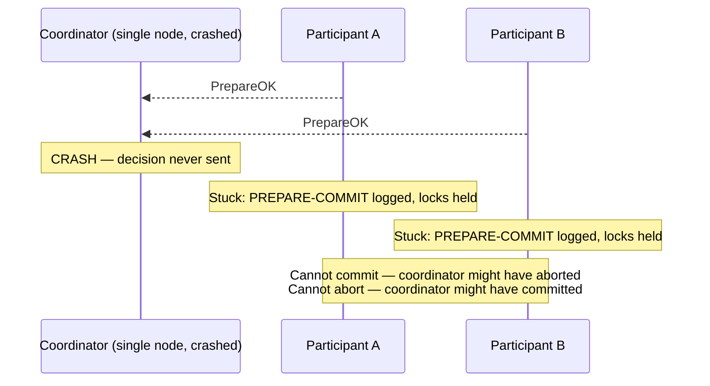
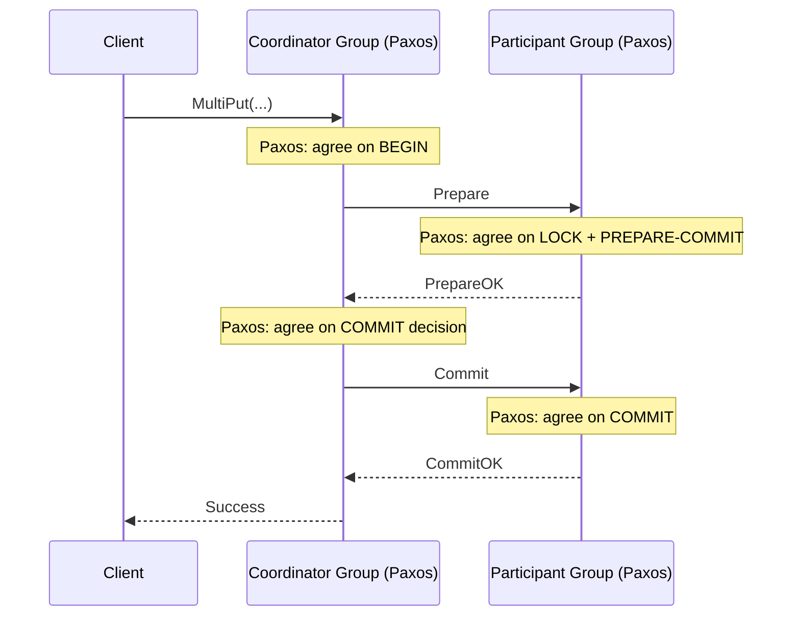

# Distributed Systems: Vanilla 2PC vs Paxos Commit

Classic 2PC with a single coordinator has a fundamental blocking problem. This file explains what that problem is, how Gray & Lamport's **Paxos Commit** solves it, and how this course's implementation already embodies the solution.

---

## The Blocking Problem in Vanilla 2PC

Classic (vanilla) 2PC uses a **single coordinator node**. This creates a critical vulnerability: if the coordinator crashes **after** all participants have replied `PrepareOK` and logged `PREPARE-COMMIT` but **before** it sends `Commit` or `Abort`, every participant is stuck indefinitely.

The participants are in the worst possible state. They have logged `PREPARE-COMMIT`, promised to commit, and are holding locks — but have no way to know what the coordinator decided before it crashed. They cannot:
- **Unilaterally abort** — the coordinator may have already sent `Commit` to other participants, which would cause a split where some groups committed and others did not.
- **Unilaterally commit** — the coordinator may have decided to abort before crashing.

All they can do is wait with their locks held, blocking every other transaction that needs those keys. The only recovery path is to wait for the coordinator to come back online and replay its decision from its durable log.

This is the core limitation of vanilla 2PC: **it is a blocking protocol under coordinator failure** (Gray & Lamport, 2004).

---

## Paxos Commit: Making 2PC Non-Blocking

Gray and Lamport's key insight is that **vanilla 2PC is the F=0 special case of a more general protocol called Paxos Commit**. The blocking problem exists because there is only one coordinator node — if it fails, no one can drive the protocol forward. The fix is to replace the single coordinator node with a **Paxos group of 2F+1 coordinators**, so that F failures can be tolerated without blocking.

In Paxos Commit, a separate Paxos instance runs **for each participant's vote**. Instead of the coordinator simply receiving a `PrepareOK` and recording it locally, the coordinator group runs a round of Paxos to agree on that vote among all coordinators. Once a majority accepts a participant's vote, that vote is durable even if F coordinators crash. After all participants' votes are decided, any surviving coordinator can compute the final outcome — commit if all voted yes, abort if any voted no — and broadcast it.

**Paxos Commit is non-blocking as long as a majority of coordinators are alive**, because any surviving majority can reconstruct all votes from their Paxos logs and complete the protocol.

### Formal Definition

Let $V_i$ be the Paxos instance deciding participant $i$'s vote. The commit decision $D$ is:

$$D = \text{commit} \iff \forall i: V_i = \text{Prepared}$$

Each $V_i$ is decided by a majority quorum of the coordinator group, tolerating up to $F$ coordinator failures with $2F+1$ coordinators. Vanilla 2PC is Paxos Commit with $F = 0$: one coordinator node, requiring unanimous agreement, blocking on any failure.

### Simplified Explanation

Instead of one coordinator that can crash and leave everyone stuck, you have a group of coordinators running Paxos. Even if some die, the rest can look at their logs, see all the PrepareOKs already agreed upon, and drive the transaction to completion. No participant gets stuck holding locks forever.

---

## How This Course's Implementation Relates

This course's implementation is already a form of Paxos Commit, even though it is not labeled as such. The "coordinator" is not a single node — it is a **Paxos replica group** (the ShardKV group that received the client request). Every `Prepare`, `Commit`, and `Abort` decision the coordinator makes must first be committed to that group's internal Paxos log and reach majority consensus before taking effect.

This means the coordinator tolerates up to $F$ internal node failures without blocking — if the leader of the coordinator group crashes, Paxos re-elects a new leader who picks up from the replicated log exactly where the old one left off. The same applies to every participant group: their `PREPARE-COMMIT`, `COMMIT`, and `ABORT` entries are replicated via Paxos, so participant-side node failures are equally tolerated.

This is also why [[Locking and Deadlock|locks are stored in the replicated state machine]] rather than in a single node's memory — the lock state must survive node failures within the group just as the log entries do.

If a node in either group crashes at any point, Paxos leader election inside that group restores progress without the other group ever knowing a failure occurred.

---

## Industry Standard Terms

| CSE452 Term | Industry / Standard Term |
| :--- | :--- |
| **Vanilla 2PC** | Classic 2PC / non-replicated 2PC |
| **Paxos Commit** | Replicated transaction coordinator |
| **Blocking protocol** | Non-atomic termination / coordinator SPOF |
| **2F+1 coordinator group** | Quorum-based transaction manager |

---

## Related

- [[Transactions|Transactions (2PC)]] — hub file
- [[Phases and Roles|Phases and Roles]] — the protocol phases this fault tolerance wraps around
- [[Locking and Deadlock|Locking and Deadlock]] — why locks must be stored in the replicated state machine
- [[Failure Scenarios|Failure Scenarios]] — participant-side timeout and what happens during recovery
- [[Multi-Paxos|Multi-Paxos]] — the consensus layer that makes each group fault-tolerant

## Sources

- Jim Gray & Leslie Lamport, [Consensus on Transaction Commit](https://arxiv.org/abs/cs/0408036) (2004) — the primary source; defines Paxos Commit and shows vanilla 2PC is the F=0 case
- Adrian Colyer, [Consensus on Transaction Commit — the morning paper](https://blog.acolyer.org/2016/01/13/consensus-on-transaction-commit/) — accessible breakdown of the Paxos Commit algorithm
- Predrag Gruevski, [How Paxos and Two-Phase Commit Differ](https://predr.ag/blog/paxos-vs-2pc/) — concise comparison: vanilla 2PC requires unanimous agreement and blocks on coordinator failure; Paxos Commit requires only a majority quorum and is non-blocking
