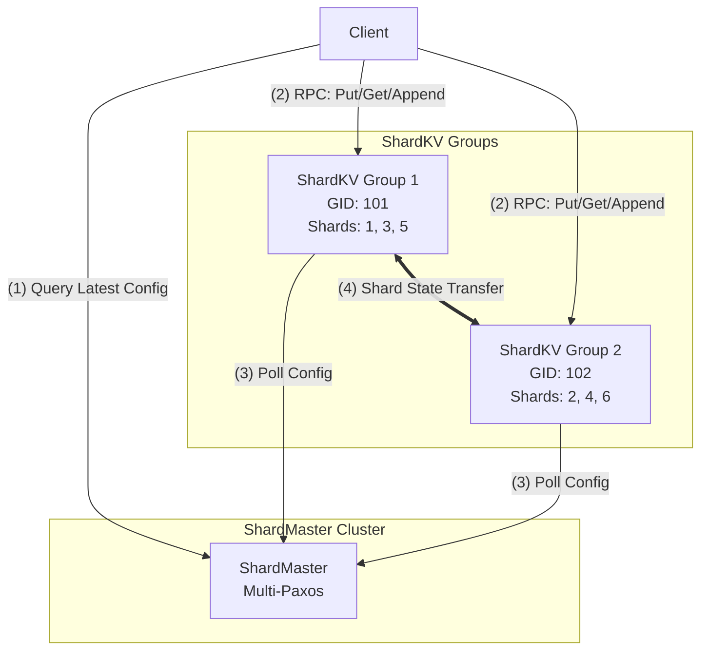

# Distributed Systems: Sharding

**Sharding** (or **Partitioning**) is the architectural pattern of horizontally scaling a system by dividing a single logical dataset into multiple smaller, autonomous subsets called **shards**. While [[Primary Backup|Replication]] solves for **Availability** and **Fault Tolerance** by duplicating data, Partitioning solves for **Throughput** and **Capacity** by distributing the storage and computational burden across a cluster of independent nodes.
- Divides keyspace (the **K** in K/V) into multiple subsets, called **shards**
	- Shard keys can be on many things (alphabetically, random/hashes, load-balanced, etc.)
	- Shards are numbered **1...numShards**. Example: shard 1 covers keys a–d, shard 2 covers e–h, etc.
	- Each shard is handled by a **group** of servers. Each group:
		- Runs Paxos (from Lab 3) — so we can assume a group will not fail
		- Stores all key/value pairs in the database that correspond to its shard
		- Accepts/responds to client requests that correspond to its shard
	- Since different sharding groups can run in parallel without communicating, performance is increased proportionally to the number of shards
	- Shards vs. groups:
		- A **shard** is a subset of the key-space — the unit of partitioning
		- A **group** is a cluster of Paxos nodes that serves one or more shards. Each group can hold multiple shards.

---

## Why Sharding?

The primary driver for sharding is **performance** and **elasticity**. While replication (like [[Primary Backup|Primary-Backup]]) provides fault tolerance, it does not scale write throughput because every node must process every write.

1.  **Throughput**: By partitioning keys, each replica group handles requests for only a fraction of the data. Since groups operate in parallel, total system throughput increases in proportion to the number of groups.
2.  **Capacity**: Sharding allows the system to store more data than can fit on a single machine. Total storage capacity is the aggregate of all groups.
3.  **Load Balancing**: If certain shards become "hot" (more popular), they can be moved to less loaded groups to balance the computational burden.
4.  **Elasticity**: Replica groups can join the system to increase capacity or leave for repair/retirement without taking the entire service offline.

---

## Pros & Cons of Sharding

### Pros
- **Horizontal Scalability**: Add more hardware to handle more requests.
- **Fault Isolation**: A failure or corruption in one replica group only affects a subset of the data (the shards it owns), rather than the entire database.
- **Parallelism**: Multiple independent consensus groups ([[Multi-Paxos|Multi-Paxos]]) can decide and execute commands simultaneously.

### Cons
- **Architectural Complexity**: Requires a dedicated metadata service ([[Shard Master|Shard Master]]) and complex [[Reconfiguration|Reconfiguration]] logic to handle shard migrations.
- **Multi-Key Operations**: Operations involving multiple shards (e.g., cross-group transactions) are significantly slower and more complex, requiring protocols like **[[Transactions|Two-Phase Commit (2PC)]]**.
- **The "Hot Shard" Problem**: If the hashing strategy doesn't distribute keys evenly, or if a few keys are extremely popular, specific groups can become bottlenecks despite the overall system having idle capacity.
- **Implementation Limitations (Lab 4)**: In this specific implementation, shard handoff is relatively slow and does not allow concurrent client access during the migration window.

---

## Architectural Overview

A sharded storage system (like Lab 4) consists of two main components:
1.  **[[ShardMaster|The Shard Master]]**: A fault-tolerant metadata service that manages the mapping of shards to replica groups.
2.  **[[Replica Group|Replica Groups]]**: Clusters of servers that store and serve a subset of the shards.

### Visual Representation


---

## Lab 4: Building a Sharded Service

The goal of Lab 4 is to build a **linearizable, sharded key-value store with multi-key updates and dynamic load balancing**, similar in functionality to Amazon's DynamoDB or Google's Spanner.

A critical design distinction: **the assignment of keys to shards is fixed** (via a deterministic hash). What Lab 4 actually implements is dynamic load balancing by **assigning shards to groups** — the [[Shard Master|ShardMaster]] manages this shard-to-group mapping. Paxos provides reliability; sharding provides performance and scalability.

The implementation is divided into three core phases:

### Phase 1: [[Shard Master|The Shard Master]]
The **Shard Master** manages a sequence of numbered configurations. It is responsible for re-balancing shards when replica groups join or leave the system. It uses [[Multi-Paxos|Multi-Paxos]] to ensure the configuration metadata is fault-tolerant and linearizable.
- keeps track of which groups server which shards
- required because
	- clients need to be able to figure out what groups to send requests to
		- avoid broadcasting
	- we might want to reconfig the system (including redistribution of shards)
		- add/remove paxos replica groups
		- move a shard to another group
- keeps track of the current config object (ShardConfig)
```java
private final int configNum;
// GroupId -> (Addresses of all members in that group, all shard numbers the group holds)
private final Map<Integer, Pair<Set<Address>, Set<Integer>>> groupInfo;
```
	- also remembers all old configs
		- does not need to be garbage collected
		- query can ask for any past configs
		- for every config number, want to store a config object like above

### Phase 2: [[Sharded Key-Value Server|Sharded Key-Value Server]] & [[Reconfiguration|Reconfiguration]]
Each replica group serves a subset of the key-space. When the configuration changes, groups must perform a **[[Reconfiguration|Shard Handoff]]** to transfer data while maintaining [[Linearizability|Linearizability]].

### Phase 3: [[Transactions|Cross-Group Transactions]]
To support operations that span multiple shards (and thus multiple groups), the system uses **[[Transactions|Two-Phase Commit (2PC)]]** with distributed locking.

---

## Comparison: View Server vs. ShardMaster

The **ShardMaster** in Lab 4 is essentially a **fault-tolerant, multi-group View Server**.

| Feature | [[Distributed Systems/Primary-Backup/View Server|View Server]] (Lab 2) | ShardMaster (Lab 4) |
| :--- | :--- | :--- |
| **Control Unit** | A single **[[Distributed Systems/Primary-Backup/View Server|View]]** (Primary/Backup pair). | A sequence of **[[Distributed Systems/Sharding/Definitions/Configuration|Configurations]]** (Multi-Group mapping). |
| **Consensus Engine** | Single node (SPOF) or hardcoded logic. | **[[Distributed Systems/Paxos/Multi-Paxos|Multi-Paxos]]** (Fully fault-tolerant consensus). |
| **Responsibility** | Manages 1 partition (the whole DB). | Manages $N$ partitions (shards) across $M$ groups. |
| **State Transfer** | Primary $\to$ Backup on view change. | Group A $\to$ Group B on config change (shard migration). |

---

## Partitioning Strategies: Static vs. Dynamic

### 1. Static Partitioning
- **Mechanism**: The mapping of keys to shards is fixed (e.g., $GID = hash(key) \mod N$).
- **Trade-off**: Zero metadata lookup overhead, but fails in the face of **skew** (hot keys) and **elasticity** (adding/removing nodes).

### 2. Dynamic Partitioning
- **Mechanism**: Assignments are stored in a **Configuration** managed by the ShardMaster.
- **Benefits**: When a node becomes overloaded, the ShardMaster updates the metadata to move a shard to a cooler node. This provides a level of indirection between the key and its physical location.

---

## The Heavy Hitter Problem and Skew

**Skew** is the condition where load is distributed unevenly across shards — some shards receive far more requests than others. A **heavy hitter** is the extreme case: a single key (or small set of keys) that accounts for a disproportionately large fraction of total traffic. A viral social media post, a trending product page, or a globally shared configuration key are all real-world examples.

### Why Skew Is Destructive

The core issue is that **your system's throughput is bounded by its slowest node, not its average node**. If one shard handles 10× the traffic of the others, that one node is your bottleneck — the remaining nodes sit mostly idle while requests queue at the hot shard. This means:

- **Latency degrades at the hot shard**: Requests pile up waiting for the single overloaded node, blowing up p99 latency for a large fraction of users.
- **Wasted capacity**: The remaining nodes in your cluster are underutilized. You are paying for horizontal scale that you cannot actually exploit.
- **Scalability ceiling**: Simply adding more shards or nodes does not fix the problem if the hot key still maps to one of them. The heavy hitter follows the key, not the cluster size. You've added hardware but not capacity where it matters.
- **Increased failure risk**: The hot node operates at or near its resource ceiling. It is the most likely node in the cluster to exhaust memory, hit connection limits, or experience GC pressure and crash — making the busiest node simultaneously the most fragile.

### Why Static Partitioning Makes This Worse

Under **static partitioning** (e.g., $GID = hash(key) \mod N$), there is no escape valve. A heavy hitter key is deterministically pinned to one shard forever, with no operator recourse short of changing the hash function and resharding the entire dataset — an expensive, disruptive operation.

**Dynamic partitioning** via the [[Shard Master|ShardMaster]] is the architectural response: because shards are a logical layer above groups, the ShardMaster can move a hot shard to a less loaded group to rebalance load. However, this only helps when the shard itself is hot. If a single *key within a shard* is the heavy hitter, the entire shard must still be served by one group — shard migration cannot split a shard's keyspace.

### Mitigation Strategies

| Strategy | Mechanism | Trade-off |
| :--- | :--- | :--- |
| **Key salting** | Split one hot key into $k$ virtual keys (`key_0`, `key_1`, ..., `key_k`) distributed across $k$ shards | Reads must fan out and merge results across $k$ shards |
| **Caching** | Absorb hot reads at a cache layer before they reach the shard | Cache invalidation complexity; writes still hit the shard |
| **Shard splitting** | Subdivide the hot shard into smaller shards, each served by a different group | Requires ShardMaster reconfiguration; adds coordination overhead |
| **Application-level routing** | Detect heavy hitters and route them to a dedicated replica set | Requires monitoring infrastructure and custom client logic |

---

## Core Concepts

The sharded architecture is built from four fundamental entities. Each has its own glossary entry with a full formal definition:

- **[[Shard|Shard]]** — a discrete, disjoint subset of the total key-space; the unit of partitioning. Keys map to shards via a deterministic hash function.
- **[[Replica Group|Replica Group]]** — a fault-tolerant cluster of servers (a [[Multi-Paxos|Multi-Paxos]] state machine) that serves a set of shards.
- **[[ShardMaster|ShardMaster]]** — the fault-tolerant metadata service; the authoritative source of truth for the configuration.
- **[[Configuration|Configuration]]** — the numbered metadata tuple $\langle config\_num, M_{shard}, M_{group} \rangle$ mapping shards to groups and groups to addresses.

---

## Industry Standard Terms

| CSE452 Term | Industry / Standard Term |
| :--- | :--- |
| **Sharding / Partitioning** | Horizontal partitioning / data partitioning |
| **Shard** | Shard / partition |
| **Replica Group** | Replica set / partition group |
| **ShardMaster** | Configuration service / control plane |
| **Hot Shard** | Hotspot / skewed partition |
| **Static / Dynamic Partitioning** | Fixed-hash vs. directory-based partitioning |

---

## Related
- [[Multi-Paxos|Multi-Paxos]] — The consensus engine for the entire system.
- [[View Server|View Server]] — The conceptual ancestor of the Shard Master.
- [[Linearizability|Linearizability]] — The consistency model guaranteed for client operations.
- [[Remote Procedure Call (RPC)|RPC At-Most-Once Semantics]] — Crucial for safe state transfer.
- [[Database Internals/Index|CSE444: Database Systems]] — For more on 2PC and distributed joins.
- [[Introduction to Data Management/Query Execution/Parallel Query Execution|CSE344: Horizontal vs. Vertical Partitioning]]
- [[Distributed Databases|CSE444: Hash vs. Range Sharding Strategies]]
