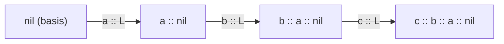

# CSE 311: List of Integers

A **List** is an [[Foundations of Computing I/Part I - Mathematical Foundations/Data Structures/Inductive Data Types|inductive data type]] defined recursively, in the same basis-plus-recursive-step style as the [[Recursive Definition of Sets|recursive definition of sets]].

**Basis:** $\text{nil} \in \text{List}$ — the empty list is a List.

**Recursive Step:** if $L \in \text{List}$ and $a \in \mathbb{Z}$, then $a \mathbin{::} L \in \text{List}$ — prepending an integer to an existing List yields another List.

Because every List is built up by a finite number of `::` steps starting from `nil`, the type is well-defined and every List is finite. The `::` ("cons") notation itself is covered in [[Lists|Lists]].

## Related

- [[Lists|Lists]]
- [[Recursive Definition of Sets|Recursive Definition of Sets]]
- [[Functions on Lists|Functions on Lists]]
- [[Foundations of Computing I/Part II - Formal Reasoning/Proof Techniques/Structural Induction|Structural Induction]]
- [[Foundations of Computing I/Part I - Mathematical Foundations/Data Structures/Inductive Data Types|Inductive Data Types]]

## Industry Standard Terms

| CSE 311 Term | Industry-Standard Equivalent |
| --- | --- |
| List | Singly linked list |
| `nil` | Empty list / null terminator |
| `::` (cons) | Prepend / push-front |
