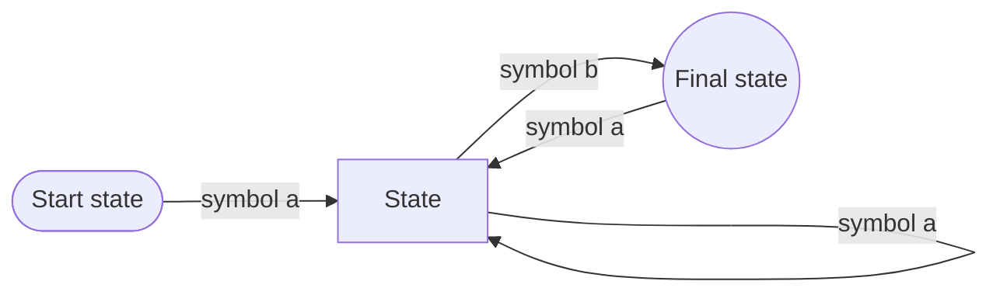

# CSE 311: Deterministic Finite Automata

A **Deterministic Finite Automaton (DFA)** is a finite state machine that recognizes a regular language — a language describable by a [[Regular Expressions|regular expression]].

A DFA consists of:
- A finite set of **states**.
- A designated **start state**.
- A set of **final states** (or accepting states).
- **Transitions** on input symbols: exactly one transition is defined from each state for *every* symbol in the [[Strings|alphabet]] $\Sigma$. The word "deterministic" refers to exactly this — there is never a choice of which transition to take.

The "language recognized" by the DFA is the set of [[Set of Strings|strings]] that reach a final state from the start state.

## State Minimization
Many DFAs can exist for the same problem. We can find the unique minimal equivalent DFA by grouping states that cannot be distinguished and collapsing them:
1. Put states into two groups based on their outputs (accepting vs rejecting).
2. Repeat until no change happens: If there is a letter $s$ such that not all states in a group $G$ agree on which group $s$ leads to, split $G$ into smaller groups based on which group the states go to on $s$.
3. Convert the resulting groups to states.

## Distinguishing Sets and Irregular Languages
To prove a language $L$ is **not regular** (i.e., no DFA can recognize it), we can find an infinite **distinguishing set** $S$ of prefixes.
1. Suppose for contradiction that some DFA $M$ recognizes $L$.
2. Choose an infinite set $S$ of strings.
3. Since $S$ is infinite and $M$ has finitely many states, by Lemma 1 there must be two strings $s_a$ and $s_b$ in $S$ ($s_a \neq s_b$) that end up at the same state of $M$.
4. Consider appending a carefully chosen string $t$ to both $s_a$ and $s_b$ such that $s_a t \in L$ and $s_b t \notin L$ (or vice versa).
5. Since $s_a$ and $s_b$ ended at the same state, appending $t$ will lead to the same state $q$. Thus, $M$ either accepts both or rejects both, making a mistake on one.
6. This contradicts the assumption that $M$ recognizes $L$. Thus, $L$ is not regular.

## Related
- [[Regular Expressions|Regular Expressions]]
- [[Nondeterministic Finite Automata|Nondeterministic Finite Automata]]
- [[Context-Free Grammars|Context-Free Grammars]]

## Industry Standard Terms

| CSE 311 Term | Industry-Standard Equivalent |
| --- | --- |
| Deterministic Finite Automaton (DFA) | Finite state machine (FSM) |
| Final / accepting state | Accept state |
| State minimization | DFA minimization (Hopcroft's algorithm) |
| Distinguishing set | Myhill-Nerode argument / pumping lemma alternative |
