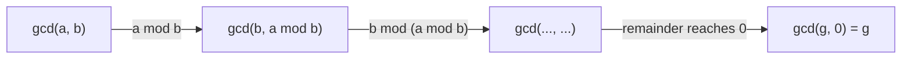

# CSE 311: Greatest Common Divisor (GCD)

## Formal Definition

#Definition The **GCD Theorem** states: for integers $a, b$ with $a > 0$, there exists a unique integer $n$ such that:
1. $n \mid a$ and $n \mid b$ — $n$ is a common [[Divides|divisor]].
2. For all $d$, if $d \mid a$ and $d \mid b$, then $d \le n$ — $n$ is the *largest* such divisor.

We denote this unique number as $n = \gcd(a, b)$.

## Simplified Explanation

The **greatest common divisor** is the biggest number that divides both $a$ and $b$ evenly.

## Euclid's Algorithm

**Useful Fact**: Let $a$ and $b$ be positive integers. We have $\gcd(a,b) = \gcd(b, a \bmod b)$.

We can repeatedly apply this fact to reduce the numbers until we get $\gcd(g, 0) = g$, which gives us the greatest common divisor. The fact holds because, by the [[Division Theorem|Division Theorem]], any common divisor of $a$ and $b$ is also a common divisor of $b$ and $a \bmod b$.

The [[Extended Euclid|Extended Euclidean Algorithm]] augments this process to also recover the Bézout coefficients $s, t$ with $\gcd(a,b) = sa + tb$.

## Related

- [[Divides|Divides]]
- [[Division Theorem|Division Theorem]]
- [[Extended Euclid|Extended Euclid]]

## Industry Standard Terms

| CSE 311 Term | Industry-Standard Equivalent |
| --- | --- |
| Greatest Common Divisor (GCD) | GCD / `gcd()` |
| Euclid's Algorithm | Euclidean algorithm |
