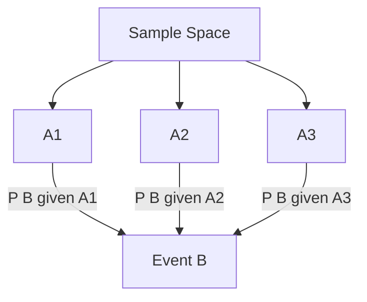

# CSE 312: Law of Total Probability

Let $A_1, A_2, \ldots, A_n$ be a **partition** of the sample space (mutually exclusive and collectively exhaustive events). Then for any event $B$:

$$\mathbb{P}(B) = \sum_{i=1}^{n} \mathbb{P}(B \mid A_i)\,\mathbb{P}(A_i)$$

This allows computing the total probability of $B$ by conditioning on each part of the partition.

### Simplified Explanation

If you cannot compute $P(B)$ directly, split the world into mutually exclusive, collectively exhaustive cases $A_1, \ldots, A_n$. Compute $B$'s probability inside each case, weight each by how likely that case is, and add them up. Every outcome in $B$ lands in exactly one case, so nothing is double-counted or missed.

## Related

- [[Conditional Probability]]
- [[Bayes Rule]]
- [[Foundations of Computing II/Part I - Discrete Mathematics/Basic Probability/Mutual Exclusion]]
- [[Law of Total Expectation]]

## Industry Standard Terms

- **Law of Total Probability** → "total probability theorem" / "partition theorem" / "marginalization" (when $B$'s probability is recovered by summing over a partition).
