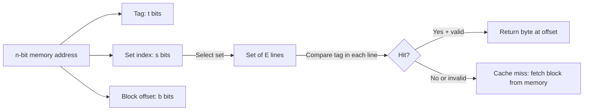

# CSE351: Cache Organization

A cache is a small, fast memory that sits between the CPU and main memory. Its organization — defined by four parameters — determines how addresses are mapped, how blocks are found, and how conflicts are resolved.

## Cache Parameters

| Parameter | Meaning |
|:---|:---|
| $n$ | Total number of address bits |
| $K$ | Block (cache line) size in bytes |
| $C$ | Total cache capacity in bytes |
| $E$ | **Associativity** — number of lines (ways) per set |
| $S$ | Number of sets: $S = C / (K \cdot E)$ |

## Address Splitting (Bit Math)

When the CPU issues an $n$-bit address, the cache hardware splits it into three fields to navigate its structure:

### Formal Definition

| Field | Bits | Formula | Purpose |
|:---|:---|:---|:---|
| Block offset | $b$ | $b = \log_2(K)$ | Selects the specific byte within the cache block |
| Set index | $s$ | $s = \log_2(S)$ | Selects which set to check |
| Tag | $t$ | $t = n - s - b$ | Identifies which block occupies a cache line within the set |

$$n = t + s + b$$

### Simplified Explanation

The offset says "which byte within the block"; the index says "which row (set) in the cache"; the tag says "is this the block I actually want?"

**Edge cases:**
- **Direct-mapped** ($E = 1$): $s = \log_2(C/K)$ — every set has exactly one line.
- **Fully associative** ($S = 1$): $s = 0$ — no set indexing; the tag must be compared against every line.

## Memory Hierarchy Latencies

Typical access times in processor cycles show why caching is essential:

| Level | Access Latency |
|:---|:---|
| **L1 Cache** | ~4 cycles |
| **L2 Cache** | ~10 cycles |
| **L3 Cache** | ~40–50 cycles |
| **Main Memory** | ~100–200 cycles |

## Cache Line Anatomy

A single cache line (the unit of storage in a cache) contains:

1. **Valid bit:** 1 if the line holds valid data, 0 if the line is empty.
2. **Tag:** The tag bits from the address, used to verify on hit.
3. **Data block:** The actual $K$ cached bytes.

### Replacement Policy

On a cache miss, if the target set has an empty line the new block is placed there. When all lines in a set are full, a **replacement policy** selects the victim:

- **Direct-mapped:** No choice — the single line in the set is evicted.
- **Set/fully associative:** Ideally **LRU (Least Recently Used)**, but hardware typically uses an approximation (pseudo-LRU) due to the cost of tracking exact recency.

## Types of Misses: The 3 C's

| Miss Type | Cause | How to Reduce |
|:---|:---|:---|
| **Compulsory** (cold-start) | First-ever access to a block — always unavoidable | Larger block size (to load more data per miss) |
| **Conflict** | Block maps to a full set even though other sets are free | Higher associativity |
| **Capacity** | The active working set is too large to fit in the cache | Larger cache; reduce working set (e.g., cache blocking) |

Conflict misses do **not** occur in fully associative caches (since any block can go anywhere). Compulsory misses cannot be eliminated.

---

---

## Related

- [[Cache Associativity|Cache Associativity]]
- [[Cache Locality|Locality]]
- [[Handling Writes|Handling Writes]]
- [[Program Optimizations via Cache|Program Optimizations via Cache]]
- [[Temporal Locality|Temporal Locality]]
- [[Spatial Locality|Spatial Locality]]
- [[Virtual and Physical Caches|Virtual and Physical Caches (CSE451)]]

---

## Industry Standard Terms

| Course Term | Industry / Standard Term |
|:---|:---|
| Cache line / block | Cache line; cache block (typically 64 bytes on x86-64) |
| Block offset | Cache offset; byte select |
| Set index | Cache index; row index |
| Tag | Cache tag |
| Associativity $E$ | Ways per set; $n$-way set associative |
| Replacement policy | LRU; pseudo-LRU; PLRU; FIFO |
| 3 C's (Compulsory, Conflict, Capacity) | Miss classification; the 3 C's model (Hill, 1987) |
