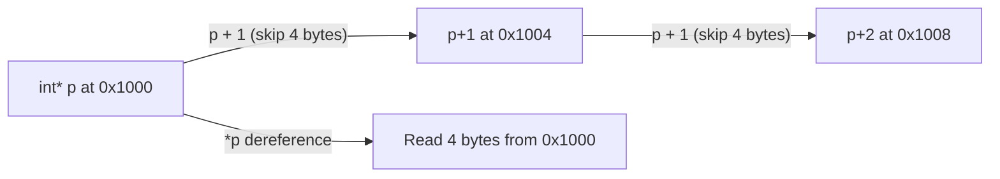

# CSE351: Pointers

A **pointer** is a special variable that stores a **memory address**. In a 64-bit architecture like x86-64, pointers are always 8 bytes in size, regardless of the data type they point to. The type annotation on a pointer (`int*`, `char*`, etc.) tells the compiler how many bytes to read or write when dereferencing, and how to scale pointer arithmetic.

## Key Pointer Operators

| Operator | Name | Description |
|:--------:|:-----|:------------|
| `&` | **Address-of** | Returns the memory address of a variable. |
| `*` | **Dereference** | Accesses the value stored at the address a pointer holds. |

## Defining and Using Pointers

```c
#include <stdio.h>

int main() {
    int q = 10;

    // Declare pointer and assign address
    int* ptr1 = &q;

    // Dereference to get value
    int p = *ptr1;  // p = 10

    printf("Value of q: %d\n", q);
    printf("Address of q (&q): %p\n", &q);
    printf("Pointer ptr1 holds: %p\n", ptr1);
    printf("Value of p (*ptr1): %d\n", p);

    return 0;
}
```

The type a pointer points to determines:
- How many bytes to read/write when dereferencing.
- How **pointer arithmetic** scales operations.

---

## Pointer Arithmetic

Pointer arithmetic automatically scales operations by the size of the data type being pointed to. This lets the programmer think in terms of "elements" rather than raw bytes — the compiler handles the multiplication.

### Adding an Integer to a Pointer

Calculates the memory address of an element a certain number of positions away.

### Formal Definition

`New Address = Current Address + (Integer × sizeof(Data Type))`

### Simplified Explanation

Moving a pointer forward by 1 moves it to the **next element**, not the next byte. For an `int*`, moving by 1 skips 4 bytes; for a `char*`, moving by 1 skips 1 byte.

- **`int` pointer (4 bytes):** `p1 + 3` starting at `0x1000` → `0x1000 + (3 × 4) = 0x100C`
- **`char` pointer (1 byte):** `p1 + 3` starting at `0x1000` → `0x1000 + (3 × 1) = 0x1003`

### Subtracting Two Pointers

Returns the **number of elements** between two addresses.

**Formula:** `Element Difference = (Address2 − Address1) / sizeof(Data Type)`

- **Example:** If `p1` is `0x1000` and `p2` is `0x1030` (48 bytes apart), the difference for `int*` pointers is `48 / 4 = 12` elements.

### Connection to Arrays

The subscript operator `ar[i]` is syntactic sugar for pointer arithmetic. At the machine level they are identical:

```c
ar[i] == *(ar + i)
```

This relationship is why [[Hardware & Software Interface/Data Structures/Arrays|array]] access in x86-64 uses scaled memory operands like `(%rdi,%rsi,4)`.

---



---

## Related

- [[Words and Memory|Words and Memory (including Endianness)]]
- [[Hardware & Software Interface/Data Structures/Arrays|Arrays]]
- [[x86-64 Memory Operands|x86-64 Memory Operands]]
- [[Systems Programming/C Fundamentals/Pointers|Pointers (CSE333)]]

---

## Industry Standard Terms

| Course Term | Industry / Standard Term |
|:---|:---|
| Pointer | Pointer; raw pointer; memory address variable |
| Address-of (`&`) | Reference operator; address-of operator |
| Dereference (`*`) | Indirection operator; pointer dereference |
| Pointer arithmetic scaling | Stride; element-size scaling |
| `ar[i]` = `*(ar + i)` | Array indexing is pointer arithmetic (C standard definition) |
