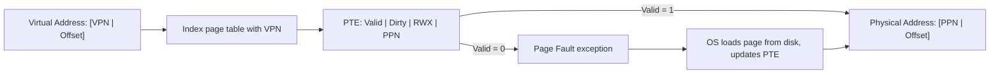

# CSE351: Page Tables

**Page tables** are per-process lookup tables maintained by the OS that perform address translation from virtual page numbers to physical page numbers.

---

## Page Table Entry (PTE)

Each row in a page table is a **Page Table Entry (PTE)**, analogous to a cache line:
- **Data:** Physical Page Number (PPN) — where the page lives in RAM.
- **Management bits:** Control access permissions and track state.

---

## Organization

- **Index:** The Virtual Page Number (VPN) directly indexes the page table.
- **Requirement:** One entry for every possible VPN.
- **Size:** $2^{n-p}$ entries for $n$-bit virtual addresses with $P = 2^p$-byte pages.

---

## PTE Fields

| Field | Purpose |
|:---|:---|
| Valid bit | Is the page currently in physical memory (RAM)? |
| Dirty bit | Has the page been modified since being loaded from disk? |
| Access rights | Read / Write / Execute permissions for this page |
| PPN | Physical page number — where the page resides in RAM |

---

## Address Translation Process

### Formal Definition

Given a virtual address $VA = \text{VPN} \| \text{PageOffset}$:

$$\text{PA} = \text{PageTable}[\text{VPN}].\text{PPN} \| \text{PageOffset}$$

(if the valid bit is 1; otherwise a page fault occurs.)

### Simplified Explanation

Use the VPN as an index into the page table array. Read out the PPN stored there. Append the unchanged page offset to the PPN to form the physical address.

1. **Extract VPN** from the virtual address (upper $n-p$ bits).
2. **Index the page table** using the VPN.
3. **Check the valid bit** — if 0, trigger a [[Page Faults|page fault]].
4. **Extract PPN** from the PTE.
5. **Combine PPN + page offset** → physical address.

---

## Page Table Size Example

**32-bit machine with 2 MiB pages:**
- Virtual address space: $2^{32}$ bytes
- Page size: $2^{21}$ bytes
- Virtual pages: $2^{32-21} = 2^{11} = 2{,}048$ entries — each entry stores a PPN and management bits.

---

## Memory Protection

Each process has its **own page table**, providing isolation:
- **Protection:** Two processes have separate page tables → their VPNs map to different PPNs → they cannot access each other's memory (unless the OS explicitly sets up sharing).
- **Sharing:** Multiple VPNs across different processes can map to the **same PPN** (e.g., shared libraries), saving physical memory.

### Access Rights Bits

| Bit | Permission |
|:---|:---|
| R | Read |
| W | Write |
| X | Execute |

### Example by Section

| Section | R | W | X | Rationale |
|:---|:---|:---|:---|:---|
| Code | 1 | 0 | 1 | Execute instructions but cannot modify code |
| Data | 1 | 1 | 0 | Read/write data; not executable (prevents code injection) |
| Literals | 1 | 0 | 0 | Read-only constants |
| Stack | 1 | 1 | 0 | Read/write local variables; not executable (NX protection) |

---

---

## Related

- [[Hardware & Software Interface/Memory Management/Virtual Memory|Virtual Memory]]
- [[Hardware & Software Interface/Memory Management/Paging|Paging]]
- [[Page Faults|Page Faults]]
- [[Translation Lookaside Buffer (TLB 351)|TLB]]
- [[Buffer Overflow|Buffer Overflow (NX bit protection)]]
- [[Page Table|Page Table (CSE451)]]
- [[Page Table Entry Anatomy|Page Table Entry Anatomy (CSE451)]]
- [[Computer Security/Memory Exploits/Memory Layout|Memory Layout (CSE484)]]

---

## Industry Standard Terms

| Course Term | Industry / Standard Term |
|:---|:---|
| Page Table Entry (PTE) | PTE; page descriptor |
| Valid bit | Present bit; valid bit |
| Dirty bit | Modified bit; dirty bit |
| Access rights (R/W/X) | Page permissions; protection bits; PTE flags |
| PTBR | Page Table Base Register; CR3 register (x86-64) |
| Per-process page table | Address space descriptor; page directory |
| VPN → PPN translation | Page table walk; address translation |
| NX bit (no Execute on stack/data) | NX bit (Intel); XD bit; W^X policy; DEP |
