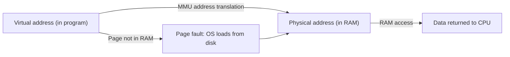

# CSE351: Virtual Memory

**Virtual memory** provides each process with the illusion of a private, dedicated address space, hiding the actual physical RAM layout and enabling isolation between processes.

---

## Key Address Spaces

### Virtual Address Space

- **Definition:** The set of addresses each process thinks it has exclusive access to.
- **Size:** $N = 2^n$ bytes for $n$-bit virtual addresses (on 64-bit systems, $n = 64$, giving 16 EiB per process — though current x86-64 hardware typically uses only 48 bits).
- **Characteristics:** Private to each process; can exceed the amount of physical memory.

### Physical Address Space

- **Definition:** The actual bytes in physical RAM, shared across all processes.
- **Size:** $M = 2^m$ bytes for $m$-bit physical addresses ($m$ is determined by how much RAM is installed).
- **Characteristics:** Managed by the OS; shared and partitioned among all running processes.

### Swap Space

- A region of disk reserved for use when physical memory is exhausted.
- Allows the virtual address space to exceed physical RAM by "swapping" pages to disk when RAM is full.
- Much slower than RAM — a disk access takes ~10,000,000 cycles vs. ~100 cycles for RAM.

---

## Address Types

| Type | Width | Usage |
|:---|:---|:---|
| Virtual | $n$ bits | Used in every program instruction and pointer |
| Physical | $m$ bits | Actual hardware byte locations in RAM |

---

## The Indirection Layer

Virtual memory maps virtual addresses to physical addresses through **address translation**, performed by the **MMU (Memory Management Unit)** in hardware.

**Key insight:** Every address used in a running program is a virtual address. The hardware transparently converts it to a physical address on every memory access, using data structures maintained by the OS ([[Page Tables|Page Tables]]).

---

## Process Memory Reality

Most processes use only a tiny fraction of their virtual address space:
- A 64-bit process has $2^{64}$ = 16 EiB of virtual address space.
- Typical usage: a few physical pages for stack, heap, code, and data.
- Unused virtual pages are never assigned physical memory — they do not consume RAM until accessed.

---

## Physical Memory as Cache

Because disk access is massively slower than RAM, the OS manages physical memory like a cache of disk pages:

| Parameter | Value | Reason |
|:---|:---|:---|
| Page size | Large (4 KiB–4 MiB) | Amortize the high cost of disk I/O over many bytes |
| Associativity | Fully associative | Minimize [[CSE351/Memory Management/Page Faults|page faults]] by allowing any page to go anywhere in RAM |
| Write policy | Write-back | Reduce disk writes by deferring them until pages are evicted |

---

---

## Related

- [[Hardware & Software Interface/Memory Management/Paging|Paging]]
- [[Page Tables|Page Tables]]
- [[Page Faults|Page Faults]]
- [[Translation Lookaside Buffer (TLB 351)|TLB]]
- [[Processes|Processes]]
- [[Operating Systems/Virtualization/Memory/Virtual Memory|Virtual Memory (CSE451)]]
- [[Paged Virtual Memory|Paged Virtual Memory (CSE451)]]
- [[Operating Systems/Virtualization/Memory/Concepts/Virtual Addresses|Virtual Addresses (CSE451)]]
- [[Computer Security/Memory Exploits/Memory Layout|Memory Layout (CSE484)]]

---

## Industry Standard Terms

| Course Term | Industry / Standard Term |
|:---|:---|
| Virtual memory | Virtual memory; virtual address space (VAS) |
| Virtual address | Virtual address; logical address |
| Physical address | Physical address; real address |
| MMU | Memory Management Unit (MMU) |
| Swap space | Swap space; paging file (Windows: `pagefile.sys`) |
| Physical memory as a cache of disk | Demand paging; page-based virtual memory |
