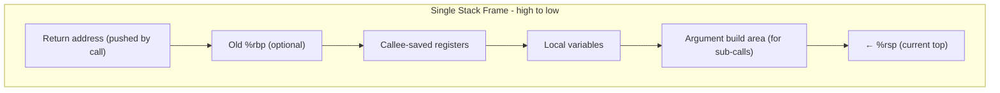

# CSE351: Stack Frames

**Stack frames** (also called activation records) are contiguous regions of the stack that hold all the local state for a single procedure invocation. Each call to a function creates a new frame; each return destroys it.

---

## Why Stack Frames?

- **Enable recursion:** Multiple simultaneous invocations of the same procedure each have their own private frame, so local variables do not interfere.
- **Organize memory:** Groups all data relevant to one procedure call (parameters, locals, saved registers, return address) into a single unit.
- **Automatic management:** The frame is created implicitly by `call` and `push`/`sub` in the prologue; destroyed implicitly by `pop`/`add` and `ret` in the epilogue.

---

## Stack Discipline

**Key principle:** Space allocated during execution must be deallocated in **opposite (LIFO) order** before returning.

This ensures:
- `ret` correctly pops the return address (the oldest thing pushed in the frame).
- Nested calls do not corrupt each other's frames.
- No stale frame data is left on the stack.

---

## LIFO Consequences

For the call chain `main → foo → bar`:
- `bar` must return before `foo` can return.
- `foo` must return before `main` can return.
- Accessing data from a frame that has already returned is undefined behavior — the memory may have been reused.

---

## Stack Frame Layout

```
Higher addresses
┌─────────────────┐
│  Caller's frame │
├─────────────────┤
│  Arguments 7+   │ ← Caller builds these before call
├─────────────────┤
│  Return address │ ← Pushed by call; marks the frame boundary
├─────────────────┤
│  Old %rbp       │ ← Optional saved frame pointer
├─────────────────┤
│ Saved registers │ ← Callee-saved registers (if used)
├─────────────────┤
│ Local variables │ ← Compiler-allocated locals
├─────────────────┤
│  Arguments 7+   │ ← Build area for calls this frame makes
├─────────────────┤ ← Current %rsp
Lower addresses
```

---

## Frame Components

| Component | Purpose |
|:---|:---|
| Return address | Where to return after this function completes (pushed by `call`) |
| Frame pointer (`%rbp`) | Optional stable reference point within the frame |
| Saved registers | Callee-saved register values that must be restored before `ret` |
| Local variables | Stack-allocated variables that don't fit in registers |
| Argument build area | Space to construct arguments 7+ for functions this frame calls |

---

## Frame Pointer (`%rbp`)

Optional in x86-64 (compilers often omit it for smaller frames). When used, it provides a stable reference point that does not move even as `%rsp` changes (due to additional pushes). This simplifies debugging and stack unwinding.

```assembly
pushq %rbp              # Save caller's frame pointer
movq %rsp, %rbp         # Point %rbp at the new frame base
# ... function body ...
popq %rbp               # Restore caller's frame pointer
ret
```

---



---

## Related

- [[Stack Pointer|Stack Pointer]]
- [[Calling Conventions|Calling Conventions]]
- [[Register Saving Conventions|Register Saving Conventions]]
- [[Recursion|Recursion]]
- [[Hardware & Software Interface/Procedures and Stack/Memory Layout|Memory Layout]]

---

## Industry Standard Terms

| Course Term | Industry / Standard Term |
|:---|:---|
| Stack frame | Activation record; call frame; stack frame |
| Frame pointer (`%rbp`) | Base pointer; frame pointer (FP); `%ebp` in 32-bit |
| Callee's build area | Stack-allocated argument area; outgoing parameter area |
| LIFO discipline | Stack invariant; last-in-first-out ordering |
| Frame prologue / epilogue | Function prologue (setup) and epilogue (teardown) |
