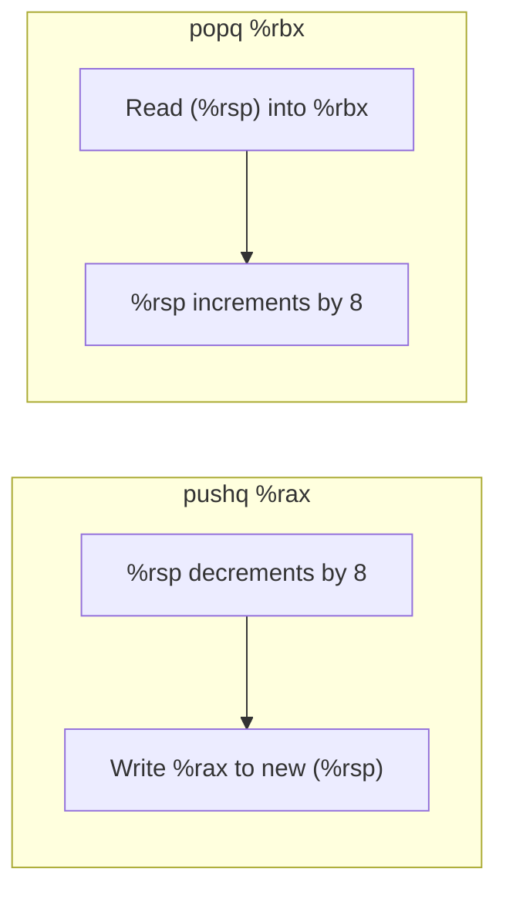

# CSE351: Stack Pointer (`%rsp`)

The **stack pointer** `%rsp` holds the address of the current "top" of the stack — the lowest address that belongs to the currently active stack frame. Because the stack grows downward, "top" means the lowest address currently in use.

---

## Key Concept

- Addresses **below** `%rsp` are **not part of the stack** — they are outside the allocated region and their contents are undefined.
- The stack "top" moves as `%rsp` is manipulated by `push`, `pop`, `call`, `ret`, and explicit arithmetic.
- `%rsp` is a useful reference point for accessing local variables and saved values within the current frame.

---

## Accessing Stack Data

```assembly
movq 8(%rsp), %rax      # Access data 8 bytes above the current top
movq -16(%rsp), %rbx    # Access data 16 bytes below (into the "red zone")
```

---

## Stack Manipulation

### Direct Manipulation

```assembly
subq $16, %rsp          # Allocate 16 bytes on the stack (grows down)
addq $16, %rsp          # Deallocate 16 bytes (shrinks)
```

**Note:** This only changes `%rsp` — it does not initialize or clear the memory. The data may still be present until overwritten.

---

## Push Instruction

```assembly
pushq %rax              # Push %rax onto stack
```

**Steps:**
1. Decrement `%rsp` by 8 (allocate 8 bytes).
2. Copy `%rax` to the memory at the new `%rsp`.

**Equivalent to:**

```assembly
subq $8, %rsp
movq %rax, (%rsp)
```

---

## Pop Instruction

```assembly
popq %rbx               # Pop from stack into %rbx
```

**Steps:**
1. Copy the value at `(%rsp)` into `%rbx`.
2. Increment `%rsp` by 8 (deallocate 8 bytes).

**Equivalent to:**

```assembly
movq (%rsp), %rbx
addq $8, %rsp
```

---

## Example

If `%rsp = 0x7fffff000000`, after `popq %rbx`:
- `%rbx` receives the 8 bytes at `0x7fffff000000`.
- `%rsp = 0x7fffff000008` (stack shrinks — top moves to higher address).

---



---

## Related

- [[Hardware & Software Interface/Procedures and Stack/Memory Layout|Memory Layout]]
- [[Stack Frames|Stack Frames]]
- [[Calling Conventions|Calling Conventions]]
- [[x86-64 Registers|x86-64 Registers]]
- [[CPU State#Stack Pointer (SP)|Stack Pointer (CSE451)]]

---

## Industry Standard Terms

| Course Term | Industry / Standard Term |
|:---|:---|
| Stack pointer (`%rsp`) | Stack pointer (SP); RSP in Intel notation |
| `pushq` / `popq` | Push / pop instructions; stack operations |
| Addresses below `%rsp` | Unallocated stack region; below the red zone |
| `subq $N, %rsp` | Stack frame allocation; prologue allocation |
| `addq $N, %rsp` | Stack frame deallocation; epilogue teardown |
