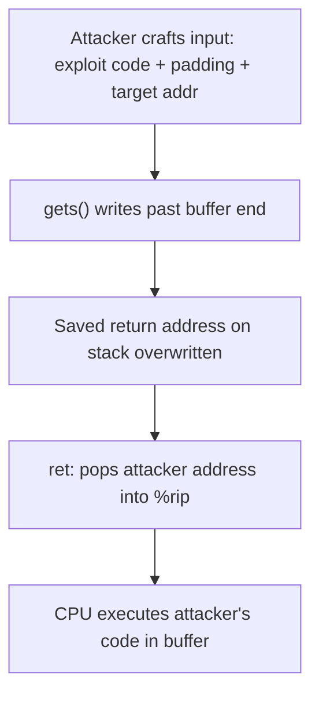

# CSE351: Buffer Overflow

---

## Core Concepts

### Buffer

A **buffer** is a region of memory (usually an array) used to temporarily hold data. In C, buffers are typically allocated on the stack as local arrays.

### Buffer Overflow

A **buffer overflow** occurs when a program writes data past the end of a buffer, overwriting adjacent memory locations.

- Possible in C because there is **no automatic bounds checking** — the programmer must enforce limits.
- Outcomes range from innocuous corruption to crashes to fully controlled malicious exploitation, depending on what memory is overwritten.

---

## Stack Smashing

**Stack smashing** is a specific type of buffer overflow targeting **local arrays on the stack**. The attacker exploits the stack's memory layout to overwrite the saved return address.

### Memory Layout Behavior

- Array elements grow toward **higher** addresses: `&a[i+1] > &a[i]`.
- The stack grows **downward** (toward lower addresses).
- Overflowing a local buffer therefore writes toward **higher** addresses — toward the return address and the caller's stack frame.

### Why the Return Address Is the Target

When a function returns, the CPU executes `ret`, which pops the return address from the stack into `%rip`. If the attacker has overwritten that value, execution jumps to whatever address the attacker wrote — typically the start of the attacker's injected shellcode.

---

## Little-Endian Impact

In little-endian systems (see [[Words and Memory|Words and Memory]]):
- The least significant byte of a multi-byte value is stored at the lowest address.
- During stack smashing, the buffer fills from lower to higher addresses.
- Therefore, the **lowest (least significant) byte of the return address is overwritten first**.
- **Example:** Return address `0x4011b1` has byte `0xb1` at the lowest address — that byte is overwritten first.

The attacker must supply the target address in little-endian byte order to overwrite `%rip` correctly.

---

## Vulnerable Code Patterns

### Dangerous Functions (No Bounds Checking)

| Function | Risk |
|:---|:---|
| `gets()` | Reads from stdin until newline — no length limit |
| `strcpy()` | Copies until null terminator — no destination size check |
| `scanf("%s")` | Reads whitespace-delimited input — no size limit |

```c
char buffer[SIZE];
gets(buffer);  // Will overflow if input exceeds SIZE bytes
```

---

## Code Injection Attacks

### Attack Structure

1. **Exploit code:** Malicious machine code placed at the start of the buffer.
2. **Padding:** Filler bytes to reach the location of the saved return address.
3. **Address overwrite:** Replace the saved return address with the address of the buffer (where the exploit code lives).

### Attack Flow

1. Attacker crafts input: exploit code + padding + new return address (pointing at the buffer).
2. The buffer overflow writes this crafted input past the buffer's end, overwriting the saved return address.
3. When the function executes `ret`, it pops the attacker's address into `%rip`.
4. Execution jumps to the start of the buffer, where the exploit code begins running with the program's privileges.

---

## Address Calculation

If the buffer is $N$ bytes below the saved return address on the stack:

**Total bytes to overwrite the return address = $N + 8$ bytes** (8 bytes = size of the return address on 64-bit systems).

---

## Stack Frame Layout During Attack

```
Higher Addresses
├─ Previous Stack Frame Data
├─ Return Address (8 bytes) ← OVERWRITE TARGET
├─ Local Variables
├─ Buffer (vulnerable)      ← OVERFLOW STARTS HERE
└─ Lower Addresses (stack grows down)
```

---

## Return Address Manipulation

- `ret` pops the value at `(%rsp)` into `%rip`.
- A modified return address redirects execution to an arbitrary location.
- Can cause segfaults, unexpected behavior, or fully controlled code execution.

---

## Prevention

| Technique | Mechanism |
|:---|:---|
| **Stack canaries** | A random value placed between locals and the return address; checked before `ret` — tampering detected |
| **Non-executable stack (NX / W^X)** | Mark stack pages as non-executable; injected code cannot run |
| **ASLR (Address Space Layout Randomization)** | Randomize base addresses of stack, heap, and code; attacker cannot predict the buffer's address |
| **Bounds-safe functions** | Use `fgets` instead of `gets`, `strncpy` instead of `strcpy` |

---



---

## Related

- [[Stack Frames|Stack Frames]]
- [[Calling Conventions|Calling Conventions]]
- [[Hardware & Software Interface/Data Structures/Arrays|Arrays (no bounds checking)]]
- [[Words and Memory|Words and Memory (Endianness)]]
- [[Page Tables|Page Tables (NX bit / memory protection)]]
- [[Computer Security/Memory Exploits/Memory Layout|Memory Layout (CSE484)]]
- [[CPU State#Stack Pointer (SP)|Stack Pointer (CSE451)]]

---

## Industry Standard Terms

| Course Term | Industry / Standard Term |
|:---|:---|
| Buffer overflow | Buffer overflow; buffer overrun |
| Stack smashing | Stack-based buffer overflow; stack smash |
| Return address overwrite | Return address corruption; RIP control |
| Stack canary | Stack guard; stack canary (GCC `-fstack-protector`) |
| Non-executable stack | NX bit; W^X (Write XOR Execute); DEP (Data Execution Prevention) |
| ASLR | Address Space Layout Randomization (ASLR) |
| Code injection via overflow | Shellcode injection; return-to-stack attack |
