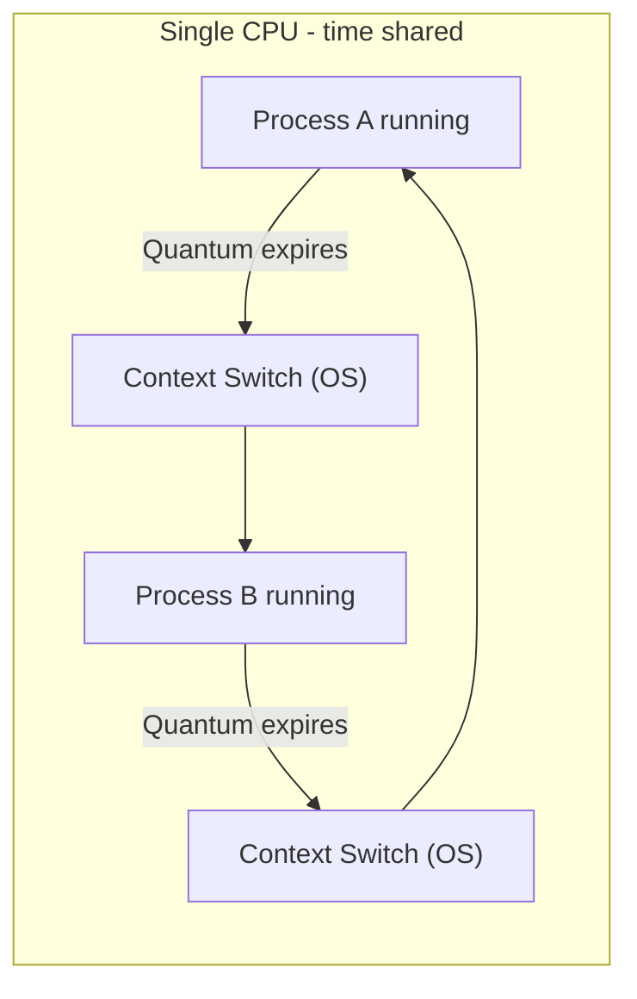

# CSE351: Processes

A **process** is an instance of a running program — the OS's abstraction of an executing computation with its own state, resources, and execution thread.

---

## Key Process Abstractions

### 1. Logical Control Flow

- **Illusion:** Each process appears to have exclusive use of the CPU.
- **Reality:** CPU time is shared among many processes through [[Context Switching|context switching]].
- **Implementation:** The OS scheduler rapidly switches between processes, giving each one a short time slice.

### 2. Private Address Space

- **Illusion:** Each process appears to have exclusive use of all of memory.
- **Reality:** Physical memory is shared and partitioned by the OS among all running processes.
- **Implementation:** [[Hardware & Software Interface/Memory Management/Virtual Memory|Virtual Memory]] — each process has its own page table mapping its virtual addresses to different physical pages.

---

## Program vs. Process

```
Program: chrome (executable file on disk — static)
    ↓ exec()
Process: Running instance with:
    - Logical control flow (program counter, registers)
    - Private address space (virtual memory)
    - Process ID (PID)
    - Open file descriptors
    - Execution state (running, blocked, ready)
```

Multiple simultaneous processes can be running instances of the same program (e.g., two browser windows). Each has its own separate state.

---

## Concurrency

Two processes run **concurrently** if their instruction executions overlap in time — they appear to run simultaneously from the user's perspective.

### Single-CPU Concurrency

Achieved through:
- **Time slicing:** The OS gives each process a brief time quantum (e.g., ~10 ms).
- **Context switching:** When a quantum expires or a process blocks, the OS saves the current process's state and restores another's.
- **Scheduling:** The OS scheduler decides which process runs next, based on priority, waiting time, or other policies.

---

## Viewing Processes

| OS | Tool |
|:---|:---|
| Windows | Task Manager |
| macOS | Activity Monitor |
| Linux | `ps`, `top`, `htop` commands |

---



---

## Related

- [[Exceptions|Exceptions]]
- [[Context Switching|Context Switching]]
- [[Fork-Exec Model|Fork-Exec Model]]
- [[Hardware & Software Interface/Memory Management/Virtual Memory|Virtual Memory]]
- [[Process|Process (CSE451)]]
- [[Sequential Process And what is Proc|Process vs Program (CSE451)]]
- [[Operating Systems/Virtualization/Memory/Virtual Memory|Virtual Memory (CSE451)]]
- [[Systems Programming/Process Management/Process Management|Process Management (CSE333)]]
- [[Computer Security/Memory Exploits/Memory Layout|Memory Layout (CSE484)]]

---

## Industry Standard Terms

| Course Term | Industry / Standard Term |
|:---|:---|
| Process | Process; task; heavyweight thread |
| Logical control flow | Thread of execution; control flow |
| Private address space | Virtual address space (VAS); process address space |
| Process ID (PID) | PID (POSIX); process handle (Windows) |
| Time slicing | Time-sharing; preemptive multitasking |
| Context switching | Context switch; task switch |
| Concurrent processes | Concurrent execution; multiprogramming |
