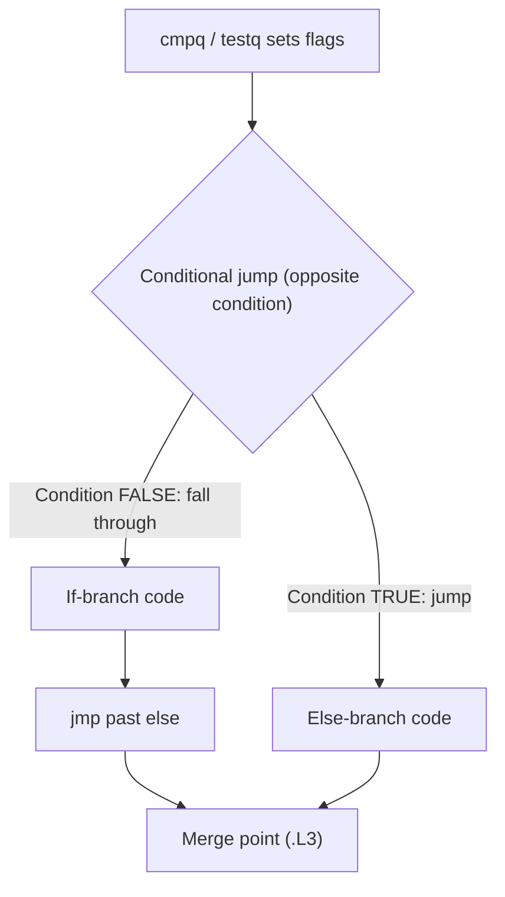

# CSE351: Conditionals (If-Else)

Conditionals use [[Labels|labels]] and [[Jump Instructions|jump instructions]] to ensure that only one branch executes. The compiler translates every C `if-else` into a compare-and-jump sequence.

---

## Basic Strategy

1. Set condition codes with `cmp` or `test` (or a preceding arithmetic instruction).
2. Use a **conditional jump** to skip one branch.
3. Use an **unconditional `jmp`** to skip the other branch (if needed).

---

## Key Principle

All conditional jumps test the result **relative to zero**. The compiler reformulates C conditions as subtractions before jumping:

- `x >= y` becomes `x - y >= 0`
- `x == 3` becomes `x - 3 == 0`

---

## Example: If-Else

### C Code

```c
if (x < 3)          // x in %rax
    y += 2;         // y in %rbx
else
    y = 10;
```

### Assembly (Version 1) — Jump on True Condition

```assembly
cmpq $2, %rax       # Compute x - 2; sets flags
jg .L2              # Jump if x > 2 (i.e., x >= 3) → go to else
addq $2, %rbx       # if branch: y += 2
jmp .L3             # Skip else branch
.L2:
movq $10, %rbx      # else branch: y = 10
.L3:
```

### Assembly (Version 2) — Jump on Negated Condition

```assembly
cmpq $3, %rax       # Compute x - 3; sets flags
jl .L2              # Jump if x < 3 → go to if branch
movq $10, %rbx      # else branch: y = 10
jmp .L3             # Skip if branch
.L2:
addq $2, %rbx       # if branch: y += 2
.L3:
```

---

## Pattern: Jump on Opposite Condition

To execute code when a condition is true, **jump on the opposite condition** to skip past that code and land in the else block. This is the standard compiler idiom.

| C Condition | Jump Used to Skip |
|:---|:---|
| `x < 3` | `jge` (jump if x >= 3) |
| `x > 1` | `jle` (jump if x <= 1) |
| `x == 0` | `jne` (jump if x != 0) |

---



---

## Related

- [[Condition Codes|Condition Codes]]
- [[Jump Instructions|Jump Instructions]]
- [[Labels|Labels]]
- [[Hardware & Software Interface/x86-64 Assembly/Loops|Loops]]
- [[Switch Statements|Switch Statements]]

---

## Industry Standard Terms

| Course Term | Industry / Standard Term |
|:---|:---|
| If-else in assembly | Conditional branching; branch-based control flow |
| Jump on opposite condition | Inverse branch; negated conditional jump |
| `cmpq` + conditional jump | Compare-and-branch idiom |
| Merge point label | Join point; post-dominator in control flow graph |
