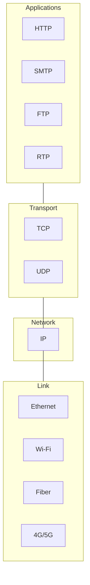

# CSE461: Network Layer - Internetworking and IP

## Low-Level Primer: The "Narrow Waist"
The **Network Layer** (Layer 3) is the central layer of the Internet architecture. Its primary objective is to facilitate **Internetworking**—connecting heterogeneous link-layer technologies (Ethernet, Wi-Fi, 4G/5G, Fiber) into a single, logical, end-to-end communication system. 

The **[[Internet Protocol (IP)|Internet Protocol (IP)]]** acts as the "narrow waist" of the hourglass: it abstracts away the complexity of various hardware links below it and provides a unified interface for the myriad of applications above it.

---

## 1. The Internetworking Principle

- **Heterogeneity**: Different networks have different frame formats, addressing schemes, and **Maximum Transmission Units (MTU)**. IP hides these differences.
- **Best-Effort Delivery**: IP makes no guarantees. Packets can be lost, delayed, or delivered out of order. This simplicity allows IP to run over "anything."
- **End-to-End Principle**: Complex logic (reliability, flow control) is implemented at the endpoints (**Hosts**), while the core network (**Routers**) remains simple and "dumb," focusing only on moving packets.

---

## 2. Network Service Models

There are two fundamental strategies for moving packets across an internetwork:

### The Datagram Model (Connectionless)
Used by **[[IPv4|IPv4]]** and **[[IPv6|IPv6]]**.
- **Mechanism**: Every packet is treated as an independent unit containing the full destination address.
- **Forwarding**: Routers maintain a **Forwarding Table**. When a packet arrives, the router looks up the destination and sends it to the **Next Hop**.
- **State**: The network maintains no state about individual connections.
- **Robustness**: If a router or link fails, packets can be routed around the failure instantly without tearing down a connection.

### The Virtual Circuit (VC) Model (Connection-Oriented)
Used by **ATM**, **Frame Relay**, and modern **[[Network Layer - MPLS|MPLS]]**.
- **Mechanism**: A logical path is established *before* data is sent.
- **Signaling**: A setup phase where routers along the path allocate resources and assign a **Virtual Circuit Identifier (VCI)**.
- **Label Switching**: Packets carry a short, local VCI. Routers use this ID as a direct index into their table and "swap" it for a new VCI at each hop.
- **Quality of Service (QoS)**: Because the path is fixed and known, the network can provide bandwidth and latency guarantees.

---

## 3. Layering and Encapsulation

The Network Layer provides **Host-to-Host** delivery.

| Layer | Protocol Data Unit (PDU) | Responsibility |
| :--- | :--- | :--- |
| **Transport** | Segment / Datagram | Process-to-Process delivery. |
| **Network** | **Packet** | **Host-to-Host delivery.** |
| **Link** | Frame | Node-to-Node (adjacent) delivery. |

### The Encapsulation Stack
1. **Application Message** is generated.
2. **Transport Layer** adds a header (e.g., TCP) creating a **Segment**.
3. **Network Layer** adds an IP header creating a **Packet**.
4. **Link Layer** adds a frame header and trailer (e.g., Ethernet) creating a **Frame**.

![[Header Fields used in IP fragmentation.png]]
![[IP Datagram traversing the sequence of physical networks graphed.png]]

![[Middleboxes.png]]

---

## Industry Standard Terms
- **Network Layer** $\rightarrow$ Layer 3
- **Datagram** $\rightarrow$ IP Packet / Connectionless PDU
- **Forwarding** $\rightarrow$ Data Plane operation
- **Routing** $\rightarrow$ Control Plane operation

## Related
- [[Link Layer Overview|Link Layer Overview]]
- [[Transport Layer - Transmission Control Protocol (TCP)|Transport Layer: TCP]]
- [[Fragmentation and PMTUD|IP Fragmentation and MTU]]
- [[Why Not Just Use TCP|CSE452: Why Not Just Use TCP? (Reliability over Unreliable IP)]]
