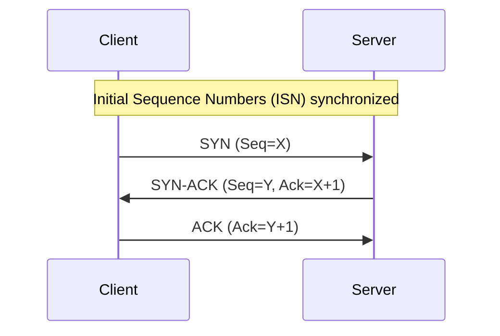

# CSE461: Transmission Control Protocol (TCP)

## Low-Level Primer: The Reliable Byte-Stream
**Transmission Control Protocol (TCP)** is a connection-oriented, full-duplex, reliable transport protocol. It abstracts the underlying unreliable, packet-switched network provided by **[[Network Layer - Internetworking and IP|Internet Protocol (IP)]]** into a logical, bit-perfect pipe between two application processes.

- **Byte-Stream Model**: TCP does not preserve application message boundaries. It views data as a continuous stream of bytes.
- **End-to-End Argument**: TCP implements reliability at the endpoints (**Hosts**), following the principle that complex functions should not be placed in the core network.
- **Connection State**: The OS maintains a **Transmission Control Block (TCB)** for every active connection, storing sequence numbers, window sizes, and timers.

---

## 1. TCP Segment Format

A standard TCP header is **20 bytes** long (without options).

| Field | Size | Purpose |
| :--- | :--- | :--- |
| **Source/Dest Port** | 16 Bits each | Process-to-process demultiplexing. |
| **Sequence Number** | 32 Bits | The byte-stream index of the first data byte in this segment. |
| **ACK Number** | 32 Bits | The **Next Expected Byte** from the peer (cumulative ACK). |
| **Data Offset** | 4 Bits | Header length in 32-bit words. |
| **Flags** | 9 Bits | `SYN`, `ACK`, `FIN`, `RST`, `PSH`, `URG`. |
| **Advertised Window**| 16 Bits | Used for **[[CSE461/Definitions/Flow Control|Flow Control]]**. |
| **Checksum** | 16 Bits | Covers header, payload, and IP **Pseudo-Header**. |

---

## 2. Connection Management

### Three-Way Handshake (Establishment)
Used to synchronize **Initial Sequence Numbers (ISNs)** and exchange options (e.g., MSS).

1.  **Client (CLOSED $\to$ SYN_SENT)**: Sends SYN, seq=$X$.
2.  **Server (LISTEN $\to$ SYN_RCVD)**: Receives SYN, sends SYN-ACK, seq=$Y$, ack=$X+1$.
3.  **Client (SYN_SENT $\to$ ESTABLISHED)**: Receives SYN-ACK, sends ACK, ack=$Y+1$.
4.  **Server (SYN_RCVD $\to$ ESTABLISHED)**: Receives ACK.

#### Kernel Handshake Management
The Linux kernel maintains two queues for a listening socket:
- **SYN Queue (Incomplete)**: Stores half-open connections in the `SYN_RECV` state. Limited by `tcp_max_syn_backlog`.
- **Accept Queue (Complete)**: Stores fully established connections waiting for the app's `accept()` call. Limited by the `backlog` parameter in `listen()`.
- **Syncookies**: A defense against **SYN Floods**. When the SYN Queue is full, the server encodes TCB state into the SYN-ACK sequence number instead of allocating memory. This bypasses the queue but disables some TCP options (like Window Scaling) due to bit-space constraints.

#### TCP Options
- **Maximum Segment Size (MSS)**: The largest payload a host can receive. Negotiated in the SYN/SYN-ACK. Default is **MTU (1500) - 40 bytes (Headers) = 1460 bytes**.
- **Window Scaling**: Extends the 16-bit window field (64KB) up to 1GB using a shift count. **Must** be negotiated during the handshake.
- **Selective Acknowledgement (SACK)**: Allows the receiver to ACK non-contiguous blocks, so the sender only retransmits missing gaps.

### High-Performance Networking (Server Side)
- **SO_REUSEPORT**: A socket option that allows multiple processes to bind to the same port. The kernel performs built-in load balancing across processes.
- **sendfile()**: Implements **Zero-Copy** data transfer. It allows the kernel to move data directly from a file buffer to a socket buffer without user-space copying.

### Four-Way Teardown (Termination)
TCP supports **Half-Close**; one side can stop sending while still receiving.
1.  **Active Closer (ESTABLISHED $\to$ FIN_WAIT_1)**: Sends FIN.
2.  **Passive Closer (ESTABLISHED $\to$ CLOSE_WAIT)**: Receives FIN, sends ACK.
3.  **Active Closer (FIN_WAIT_1 $\to$ FIN_WAIT_2)**: Receives ACK.
4.  **Passive Closer (CLOSE_WAIT $\to$ LAST_ACK)**: Sends FIN.
5.  **Active Closer (FIN_WAIT_2 $\to$ TIME_WAIT)**: Receives FIN, sends ACK.
6.  **Passive Closer (LAST_ACK $\to$ CLOSED)**: Receives ACK.
7.  **Active Closer (TIME_WAIT $\to$ CLOSED)**: Wait $2 \times MSL$ (Maximum Segment Lifetime) to ensure the final ACK reached the peer and old segments clear the network.

---

## 3. Flow Control: The Sliding Window

TCP prevents a fast sender from overwhelming a slow receiver's buffer.

*   **Advertised Window ($W_r$)**: The receiver specifies available buffer space in every ACK.
*   **The Constraint**: $LastByteSent - LastByteAcked \leq W_r$.
*   **Zero Window Probing**: If $W_r = 0$, the sender periodically sends a 1-byte probe to check if space has opened.

### Silly Window Syndrome
Occurs when the receiver advertises tiny windows, causing high overhead.
- **Nagle's Algorithm (Sender-side)**: Delay sending small segments until a full **MSS** is reached or an ACK for previous data arrives.
- **Clark's Algorithm (Receiver-side)**: Do not increase the advertised window until it can be increased by a full MSS or $1/2$ the total buffer size.

---

## 4. End-to-End Issues

- **RTT Variance**: Unlike the link layer, TCP RTTs vary significantly. Retransmission timers must be **Adaptive**.
- **Reordering**: IP packets may take different paths. TCP uses the Receive Window to buffer out-of-order segments and reassembles them.
- **Segment Lifetime**: TCP assumes a finite **MSL** (typically 120s). The 32-bit sequence number space prevents "wrap-around" within one MSL.

---

## Industry Standard Terms
- **Advertised Window** $\rightarrow$ Receive Window (rwnd)
- **Three-Way Handshake** $\rightarrow$ SYN-SYNACK-ACK
- **TCP Segment** $\rightarrow$ Layer 4 PDU
- **TCB** $\rightarrow$ Socket State / Control Block

## Related
- [[Transport Layer - TCP Congestion Control|TCP Congestion Control (AIMD, Slow Start)]]
- [[Network Layer - Internetworking and IP|Network Layer and IP]]
- [[CSE452/RPC/Why Not Just Use TCP|CSE452: Why Not Just Use TCP?]]
- [[CSE444/Transactions/Recovery/Recovery|CSE444: WAL and Recovery (Durability vs. TCP ACKs)]]
- [[TCP Sockets|CSE333: TCP Sockets in C]]

![[TCP Connection Release.png]]

![[Three-Way Handshake.png]]
