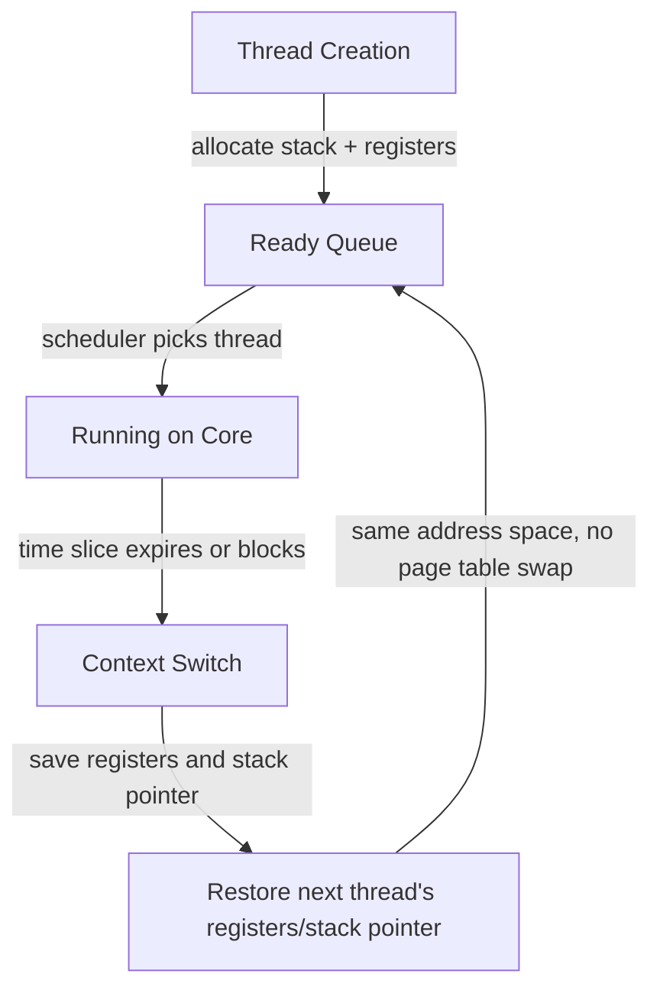

# CSE451: How Can We Achieve Multithreading

We need to have multiple hardware execution states:
- Execution stack, stack pointer, program counter, registers, etc.

To achieve this:
- Fork several processes
- Cause each to map to the same physical memory to share data

But this is heavyweight. A better approach is to support multiple **[[Thread|threads]]** within a single process natively:
- The OS allocates a separate stack and register set for each thread
- All threads share the same page table (address space) — see **[[Address Space with Threads]]** for how this shared address space is laid out
- The thread scheduler can switch between threads without changing address spaces

At the hardware level, each CPU core can only run one thread at a time. The OS uses context switching to multiplex threads onto available cores. On a multicore machine, threads can truly run in parallel on different cores.

## Key Mechanisms
- **Thread creation**: allocate a new stack within the process's address space, initialize the program counter to the thread's start function, set up initial register values
- **Thread scheduling**: the OS scheduler treats each thread as a schedulable entity, picking which thread runs on which core
- **Context switching between threads**: save the current thread's registers/stack pointer, restore the next thread's registers/stack pointer. Since threads share an address space, no page table switch is needed (unlike process context switches)

The heavyweight "fork several processes and map to the same physical memory" approach is exactly what full multi-process concurrency would require without native thread support — each process would need its own address space, and any shared data would require explicitly mapping the same physical pages into each process's page table (or relying on OS-mediated IPC, as discussed in **[[The Big Picture]]**). Native thread support avoids this duplication entirely, since threads already live inside one shared address space by construction.

## Deep Dive

On modern operating systems, thread creation and context switching are implemented via specific syscalls: Linux's `clone()` (with flags like `CLONE_VM` to share the address space), Windows's `CreateThread`, and POSIX's `pthread_create` (itself typically a wrapper around `clone()` on Linux). The "allocate a separate stack and register set" step in thread creation corresponds to the kernel setting up a new Thread Control Block (TCB) and a fixed-size stack region, exactly as detailed in **[[Address Space with Threads]]**.

## Industry Standard Terms
- **Thread creation** -> `pthread_create()` (POSIX) / `CreateThread()` (Windows) / `clone()` (Linux syscall)
- **Context switching between threads** -> thread context switch / TCB save-restore
- **Thread scheduler** -> OS scheduler / kernel scheduler

## Related
- [[Thread]]
- [[Key Idea]]
- [[Address Space with Threads]]
- [[The Big Picture]]
- [[Thread Levels]]
- [[Operating Systems/Processes/Process and Thread Fundamentals]]
