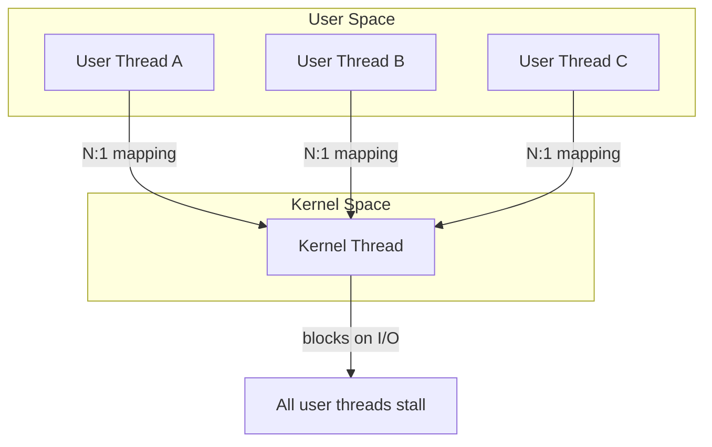

# CSE451: Thread Levels

- **[[Thread Levels/Kernel Threads|Kernel threads]]** are managed by the kernel for scheduling on a CPU
- **[[Thread Levels/User Threads|User threads]]** are managed by the user for scheduling on a kernel thread

Threads support concurrency and parallelism within an application, as introduced in **[[Threads Overview]]**. They are more lightweight than processes, making them much faster to create and switch between (see **[[Achieving Multithreading]]**).

## What if a Thread Tries to Do I/O

I/O operations are blocking. The kernel thread "powering" a user-level thread is lost for the duration of the operation:
- The kernel thread blocks in the OS, as always
- It can't run a different user-level thread

The main issue is that the kernel doesn't know there are user threads and doesn't know there's something else it could run. This is examined in full in **[[Blocking IO Problem]]**.

## Topics

- [[Thread Levels/Kernel Threads|Kernel Threads]] — OS-managed threads using 1:1 scheduling
- [[Thread Levels/User Threads|User Threads]] — user-space threads using N:1 scheduling
- [[Blocking IO Problem]] — the main drawback of N:1 threading
- [[Thread Levels/Scheduler Activations|Scheduler Activations]] — letting the kernel and user scheduler communicate to solve blocking
- [[Thread Levels/User vs Kernel Threads|User vs Kernel Threads]] — comparison of both approaches

## Related
- [[Threads Overview]]
- [[Achieving Multithreading]]
- [[Blocking IO Problem]]
