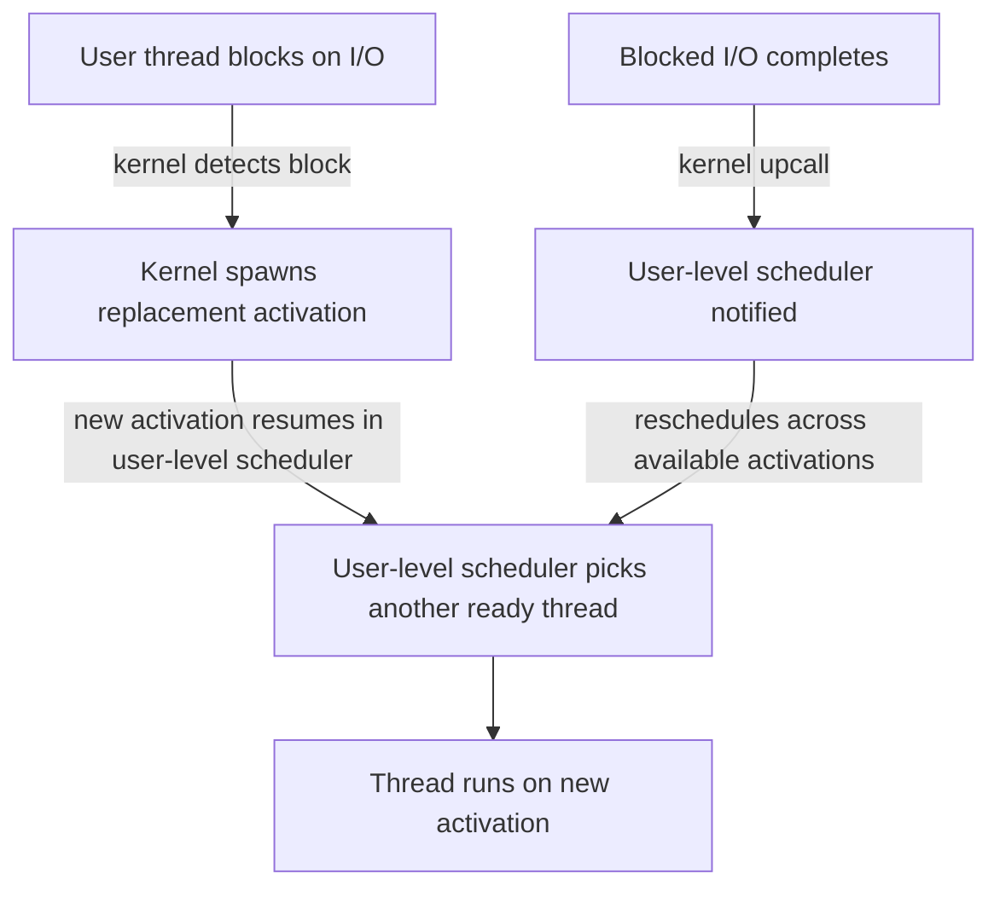

# CSE451: Scheduler Activations

The core idea is to let the kernel and user-level scheduler communicate with each other to avoid the **[[Blocking IO Problem]]**, combining the low cost of **[[User Threads]]** with the I/O-blocking resilience of **[[Kernel Threads]]**.

## Two-Way Communication

- The OS and user-level scheduler exchange hints
- The user-level scheduler tells the kernel what it needs (it may or may not get those resources)
- The kernel notifies the user-level scheduler of events via an **upcall**:
	- More or fewer CPUs available to the process
	- A thread blocked on I/O, or unblocked when I/O finishes

## What Is a Scheduler Activation?

A scheduler activation replaces a kernel thread. Like a kernel thread, it has its own stack, processor context, and can be scheduled on a CPU. The key difference: if the kernel interrupts an activation, it does not restart it where it left off. Instead, it restarts execution in the user-level scheduler, which then decides which thread to run on that CPU.

## How It Works

When a user-level thread blocks, the kernel spawns additional kernel threads to service the remaining user threads. When the blocked thread finishes, the kernel performs an upcall and the user-level scheduler reschedules threads across the available kernel threads.

## Performance

- When threads aren't blocking on I/O, it's just user-level thread management — an order of magnitude faster than **[[Kernel Threads|kernel-level threads]]**
- Solves the **[[Blocking IO Problem]]** by giving the kernel just enough visibility to react to blocking without requiring a dedicated kernel thread per user thread (as **[[Kernel Threads|1:1 scheduling]]** does)

## Deep Dive

Scheduler activations were proposed as an academic solution (Anderson et al., 1991) to combine the strengths of the N:1 and 1:1 models, but they never saw widespread production adoption because of their implementation complexity — correctly handling the upcall protocol across nested blocking events proved difficult to get right. In practice, most modern systems instead converge on either pure 1:1 kernel threading (Linux, Windows) or M:N hybrid models with cooperative, non-blocking runtimes (e.g., Go's goroutine scheduler, which multiplexes M goroutines onto N OS threads and transparently moves a goroutine off a blocked OS thread rather than relying on kernel upcalls).

## Industry Standard Terms
- **Scheduler activation** -> Academic term; no direct mainstream OS equivalent, but conceptually similar to Go's M:N goroutine scheduler or Windows User-Mode Scheduling (UMS)
- **Upcall** -> Kernel-to-userspace event notification

## Related
- [[Thread Levels]]
- [[User Threads]]
- [[Kernel Threads]]
- [[User vs Kernel Threads]]
- [[Blocking IO Problem]]
