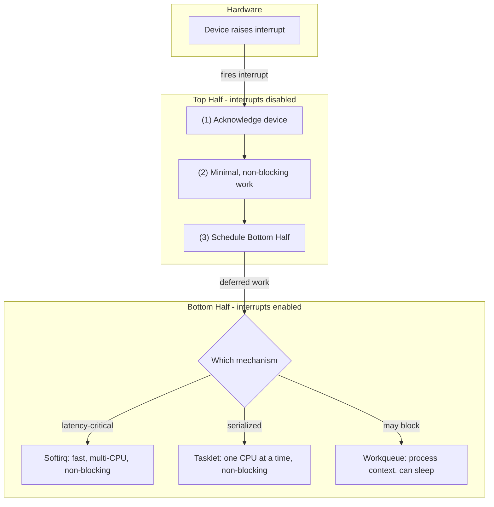

# CSE451: Kernel Internals and Performance

The **[[Operating Systems/Virtualization/Architecture/Operating System|Kernel]]** is the core component of the OS, managing hardware resources and providing a bridge between software and hardware. It runs in **[[Ring 0]]** (**[[Kernel Mode]]**), the most privileged CPU protection level, which allows it to execute privileged instructions and directly manipulate hardware — something ordinary user-space programs cannot do without trapping into the kernel via a **[[System Call|system call]]**.

### Kernel Architectures
How much of the OS's functionality actually lives inside this privileged kernel space is a fundamental design choice, and it splits into two dominant architectures:
- **[[Monolithic Kernel]]**: All OS services (File System, Networking, Device Drivers) run in kernel space. High performance, since all services can call each other directly without crossing a protection boundary, but one bug in any service can crash the entire system (e.g., Linux).
- **[[Microkernels|Microkernel]]**: Moves as many services as possible to user space, minimizing what runs with kernel privilege and organizing the rest of the OS as user-level processes. More robust and modular — isolation between components means a bug in one service does not take down the whole system — but slower due to intensive Inter-Process Communication (IPC), since services must cross the user/kernel boundary to talk to each other (e.g., Minix, Mach).

### Interrupt Handling
Once inside the kernel, hardware devices need a way to get the CPU's attention asynchronously — this is done through interrupts. Because the code that responds to an interrupt must not block the rest of the system for long, Linux splits interrupt handling into two parts to maintain system responsiveness:
1. **[[Top Half]]**: The immediate response to hardware, corresponding to the **[[Interrupt Handler]]** running in its non-blocking, interrupts-disabled mode. It runs with interrupts disabled, performs minimal work (e.g., acknowledges the hardware so it can raise its next interrupt), and schedules the bottom half to do the remaining, more time-consuming work.
2. **[[Bottom Half]]**: Performs the heavy lifting (e.g., processing network packets) that was deferred by the top half. It runs with interrupts enabled, so it does not block other interrupts from being serviced. Linux provides three mechanisms for implementing a bottom half, trading off speed against flexibility:
    - **[[Softirq]]**: Fast, statically allocated at compile time, and can run on multiple CPUs simultaneously — the fastest option, but the least flexible since the set of softirqs is fixed.
    - **[[Tasklet]]**: Built on top of softirqs but only run on one CPU at a time, which simplifies the programming model (no concurrent execution of the same tasklet to worry about) at some cost to parallelism.
    - **[[Workqueue]]**: Runs in process context, meaning it can sleep (unlike softirqs and tasklets, which cannot block). This makes it the most flexible of the three, at the cost of being the slowest since it involves scheduling a kernel thread.

### Kernel Interfaces
Beyond handling interrupts, the kernel also needs to expose its internal state and configuration to user space for administration and debugging. Linux does this through several special-purpose virtual filesystems, each scoped to a different kind of information:
- **[[procfs (/proc)]]**: A virtual filesystem providing an interface to kernel data structures and process information.
- **[[sysfs (/sys)]]**: A virtual filesystem used for managing hardware devices and kernel parameters.
- **[[debugfs]]**: A virtual filesystem specifically for kernel debugging and tracing.

### Performance Profiling and Tracing
With interfaces in place to inspect kernel state, the next question is how to actually measure and improve kernel performance. A collection of tools exists for profiling where the kernel spends its time and for tracing its behavior in production:
- **[[perf]]**: The standard Linux performance analysis tool. It can sample CPU registers, trace system calls, and count hardware events.
- **[[Flame Graph]]**: A visualization of profiled software, allowing for quick identification of the "hot paths" where the CPU spends the most time. Flame graphs are typically generated from `perf` samples, turning the raw call-stack data into a picture that makes the most expensive code paths visually obvious.
- **[[eBPF (Extended Berkeley Packet Filter)]]**: A revolutionary technology that allows running sandboxed programs inside the kernel without changing kernel source code. Used for high-performance networking and deep observability, since it lets a developer attach custom logic to kernel events at runtime instead of recompiling the kernel.
- **[[kprobes / uprobes]]**: Mechanisms for dynamically breaking into kernel or user functions to collect debug information. These are often the underlying instrumentation points that `perf` and eBPF programs attach to when tracing specific kernel or user-space functions.

The net effect of these tools is that a kernel's real-world performance bottlenecks — whether in interrupt handling, a particular kernel interface, or a hot code path — can be identified and measured without modifying or recompiling the kernel itself, closing the loop between the architecture and interfaces described above and the observed performance outcome.

## Deep Dive

### eBPF as a General-Purpose Kernel Extension Mechanism
Although eBPF originated as a packet-filtering mechanism (hence "Berkeley Packet Filter"), it has since grown far beyond networking. Modern eBPF programs are compiled to a restricted bytecode that a kernel-side verifier statically proves cannot crash the kernel, loop unboundedly, or access arbitrary memory, before a Just-In-Time (JIT) compiler translates the bytecode to native machine code for near-native execution speed. This verification step is what allows eBPF to safely run inside kernel space — a privilege traditionally reserved only for the kernel's own trusted source code or signed kernel modules — without any of the reliability risk of a **[[Monolithic Kernel]]** where a buggy driver can crash the whole system. This is conceptually similar to how a **[[Microkernels|Microkernel]]** isolates a buggy service from crashing the whole system, except eBPF achieves the isolation through static verification rather than through a separate address space and IPC.

## Formal Definition
### Softirq / Tasklet / Workqueue Scheduling Guarantee
$$\text{Softirq, Tasklet} \implies \text{non-blocking (cannot invoke the scheduler)}$$
$$\text{Workqueue} \implies \text{process context (may invoke the scheduler, i.e., may sleep)}$$

### Simplified Explanation
Softirqs and tasklets are "fire and forget" — the code has to finish without ever waiting on anything (like a lock held by a sleeping thread), because there is no process context to suspend. A workqueue is real kernel thread doing the work, so it is free to go to sleep and be woken up later, just like a normal blocking system call.

## Industry Standard Terms

| Course Term (CSE451) | Industry-Standard Equivalent |
|---|---|
| Monolithic Kernel | Monolithic Kernel (same term; e.g., Linux, traditional Unix) |
| Microkernel | Microkernel (same term; e.g., seL4, QNX, Mach) |
| Top Half | Hard IRQ handler / Interrupt Service Routine (ISR) |
| Bottom Half | Deferred work / Bottom-half processing |
| Softirq | Soft IRQ / deferred interrupt (Linux-specific term, no broader industry equivalent) |
| Tasklet | Serialized deferred work unit (Linux-specific; conceptually similar to a single-threaded callback queue) |
| Workqueue | Background worker thread / thread pool task |
| procfs (/proc) | Kernel introspection API / process metadata filesystem |
| sysfs (/sys) | Device and kernel parameter configuration interface |
| debugfs | Kernel debug filesystem |
| perf | Sampling profiler / hardware performance counter tool (cf. Intel VTune, Linux `perf`) |
| Flame Graph | Call-stack visualization / profiling flame chart |
| eBPF | In-kernel sandboxed virtual machine / kernel extension framework |
| kprobes / uprobes | Dynamic instrumentation / breakpoint-based tracing |

## Related
- [[Signals and Syscalls]]
- [[CSE451/Kernel/Definitions/LKM]]
- [[Interrupt Handler]] — the mechanism underlying the Top Half
- [[Interrupts]] — what triggers the Top Half/Bottom Half split in the first place
- [[Microkernels]] — deeper coverage of the microkernel vs. monolithic trade-off
- [[OS Structure]] — broader architectural context for kernel design choices
