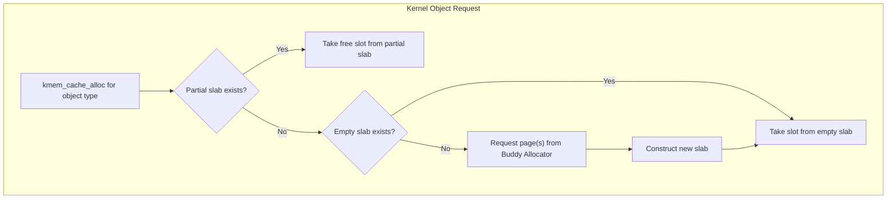

# CSE451: Memory Allocation

Memory allocation in Operating Systems occurs at two primary levels: **[[User Space Allocation]]** (via standard libraries) and **[[Kernel Space Allocation]]** (managed by the kernel for its own data structures). Both levels exist because user processes and the kernel have very different allocation needs — user programs mostly request variably-sized, general-purpose blocks through a runtime library, while the kernel must rapidly allocate and free enormous numbers of small, fixed-size, uniformly-shaped objects (like process control blocks or file descriptors) without slowing down the rest of the system.

### User Space Allocation

Userspace programs manage memory using the `malloc()` and `free()` family of functions, which are implemented by a library like `glibc`. The library itself sits between the application and the operating system: it maintains its own internal bookkeeping (such as a free list of previously released blocks) so that it does not have to ask the kernel for new memory on every single `malloc()` call. Only when the library's existing pool of memory is insufficient does it fall back to requesting more from the kernel. For the underlying C-level API details, see **[[Systems Programming/Memory Management/Malloc and Free|Malloc and Free]]** and **[[Systems Programming/Memory Management/Heap Management|Heap Management]]**, and for the general theory of dynamic memory across static, stack, and heap storage, see **[[Hardware & Software Interface/Memory Management/Memory Allocation|CSE351: Memory Allocation]]**.

#### Mechanism: sbrk vs mmap

When the userspace allocator library does need more memory from the OS, it has two system calls available, each suited to a different kind of request:

- **[[sbrk()]]**: A system call that moves the "program break" (the end of the heap). It is fast because it simply extends one contiguous region upward, but it only works for contiguous memory and doesn't easily return memory to the OS — if a block in the middle of the heap is freed, `sbrk()` cannot shrink the heap around it, since the break can only move at the very top.
- **[[mmap()]]**: A system call that maps a new region of the virtual address space. It is used for large allocations (>128KB) and allows for more flexible memory management (e.g., shared memory, anonymous mappings), including the ability to return the memory to the OS immediately via `munmap()` regardless of where it sits relative to other allocations.

The 128KB threshold reflects a trade-off: `sbrk()` is cheap for small, frequent requests because it just adjusts a pointer, whereas `mmap()` has higher per-call overhead (setting up new page table entries) but avoids permanently fragmenting the heap with large allocations that may be freed out of order.

### Kernel Space Allocation

The kernel needs to allocate memory for objects of vastly different sizes, from small network buffers to large process structures. Because the kernel allocates and frees these objects at extremely high frequency (e.g., a new `task_struct` on every process creation), naive general-purpose allocation would waste significant time on repeated initialization and would fragment memory badly given the huge number of concurrently live objects.

#### Slab Allocator

The **[[Slab Allocator]]** (and its variants SLUB/SLOB) is designed to minimize fragmentation and initialization time. See **[[Operating Systems/Virtualization/Memory/Concepts/Slab Allocation|Slab Allocation]]** for the full mechanism, and **[[Operating Systems/Virtualization/Memory/Concepts/Buddy Allocator|Buddy Allocator]]** for the underlying page-level allocator the Slab Allocator draws its pages from.

- **[[Slab]]**: A contiguous set of physical pages.
- **[[Cache]]**: A collection of slabs for a specific type of object (e.g., `task_struct`, `inode`).
- **Mechanism**: Instead of freeing memory back to the global pool, objects are kept "constructed" in the slab. When a new object is needed, an existing free one is reused immediately, avoiding the cost of re-running the object's constructor (e.g., re-initializing embedded locks or list pointers) on every allocation.

#### Internal vs External Fragmentation

These two allocator failure modes explain why neither `sbrk()`/`mmap()` alone nor a single global kernel allocator is sufficient, and motivate why the Slab Allocator exists on top of a page-level allocator like the Buddy Allocator.

- **[[Internal Fragmentation]]**: Wasted space inside an allocated block (e.g., allocating a 4KB page for a 10-byte string). The Slab Allocator directly targets this problem by sizing its slots to match the object exactly.
- **[[External Fragmentation]]**: Wasted space between allocated blocks, where no single block is large enough to satisfy a request despite having enough total free memory. This is the failure mode the Buddy Allocator's coalescing mechanism is designed to reduce.

### Memory Debugging

Because manual allocation (via `malloc`/`free` or their kernel equivalents) is error-prone, tooling exists to catch mistakes like memory leaks and use-after-free bugs before they cause silent corruption in production. See **[[Systems Programming/Memory Management/Memory Bugs and Valgrind|Memory Bugs and Valgrind]]** for the categories of bugs these tools are designed to catch (leaks, dangling pointers, double-free, buffer overflow, uninitialized reads).

- **[[Valgrind]]**: A dynamic analysis tool that uses a virtual machine to track every memory access, identifying **[[Memory Leaks]]** and "use-after-free" bugs. Because it instruments every single memory access in software, it imposes significant overhead (typically 10-30x slowdown).
- **[[AddressSanitizer (ASan)]]**: A compiler-based instrumentation tool that detects memory errors with much lower overhead than Valgrind, since it inserts its checks at compile time rather than interpreting the program in a virtual machine.

### Linux Memory Metrics

Once memory is allocated, the OS and system administrators need ways to measure how much memory a process is actually consuming and to react when memory runs critically low.

- **[[Virtual Size (VSZ)]]**: The total virtual memory a process has access to, including shared libraries and swapped-out pages. This number can be much larger than physical RAM because it counts address space that may not yet be backed by any physical page.
- **[[Resident Set Size (RSS)]]**: The portion of a process's memory that is actually held in physical RAM, as opposed to memory that has been reserved in the address space but not yet touched, or that has been swapped out to disk.
- **[[Out-of-Memory (OOM) Killer]]**: A kernel task that monitors memory pressure. If the system runs out of RAM+Swap, it assigns an `oom_score` to processes and kills the one with the highest score to save the system. This is a last-resort mechanism: rather than letting the entire system deadlock or thrash indefinitely trying to satisfy allocation requests it cannot fulfill, the kernel sacrifices one process to keep the rest of the system responsive.

## Deep Dive

The `oom_score` calculation in modern Linux weighs a process's RSS heavily but also considers factors like how long the process has been running, whether it's a root-owned system process, and whether it has an explicit `oom_score_adj` set by an administrator to protect critical daemons from being killed. Userspace allocator libraries beyond `glibc`'s `ptmalloc`, such as `jemalloc` (used by Firefox and FreeBSD) and `tcmalloc` (used by Google), implement per-thread caching layers to avoid lock contention on the global heap under high concurrency — a concern directly analogous to why the kernel's Slab Allocator maintains per-CPU partial-slab lists in its SLUB variant.

## Formal Definition

Given a page size $P$ and a requested object size $s$, the internal fragmentation of a naive page-granular allocator is:

$$F_{internal} = P - s \pmod{P}$$

The Slab Allocator reduces this to a small, fixed per-object overhead (bookkeeping metadata) rather than scaling with the gap between $s$ and $P$.

## Simplified Explanation

If you need to store a 10-byte note but the only container the OS hands out is a 4KB box, you waste almost all of the box — that's internal fragmentation. If you have plenty of boxes total but they're scattered in small unusable gaps between other boxes, that's external fragmentation — you technically have enough space, just not in one contiguous piece.

## Industry Standard Terms

| Course Term | Industry Standard Equivalent |
|:---|:---|
| Slab Allocator | Object-caching allocator / SLUB (Linux-specific implementation name) |
| Cache (kernel) | Object pool |
| Program break (`sbrk`) | Heap end pointer / brk |
| Virtual Size (VSZ) | Committed virtual memory / Address space size |
| Resident Set Size (RSS) | Working set size (Windows terminology) |
| OOM Killer | Memory pressure eviction / cgroup OOM handling (containerized contexts) |

### Related
- [[Operating Systems/Memory/Virtual Memory]]
- [[Operating Systems/Virtualization/Memory/Concepts/Slab Allocation|Slab Allocation]]
- [[Operating Systems/Virtualization/Memory/Concepts/Buddy Allocator|Buddy Allocator]]
- [[Operating Systems/Virtualization/Mechanisms/Memory/Base and BoundsComponents/Internal Fragmentation|Internal Fragmentation]]
- [[Operating Systems/Virtualization/Mechanisms/Memory/Base and BoundsComponents/External Fragmentation|External Fragmentation]]
- [[Systems Programming/Memory Management/Malloc and Free|Malloc and Free]]
- [[Systems Programming/Memory Management/Heap Management|Heap Management]]
- [[Systems Programming/Memory Management/Memory Bugs and Valgrind|Memory Bugs and Valgrind]]
- [[Hardware & Software Interface/Memory Management/Memory Allocation|CSE351: Memory Allocation]]
- [[CSE333/Memory Management/C++ Allocation]]
