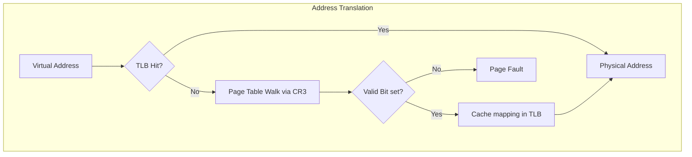

# CSE451: Virtual Memory

Virtual Memory is a memory management technique that creates an abstraction of a large, contiguous address space for each process, decoupling the **[[CSE451/Memory/Definitions/Virtual Address|Virtual Address]]** from the **[[Physical Address]]**. This is managed by the hardware **[[Memory Management Unit (MMU)]]** in coordination with the Operating System kernel. For the broader motivations behind virtual memory (isolation, resource efficiency, program flexibility), see **[[Operating Systems/Virtualization/Memory/Virtual Memory|Virtual Memory (Overview)]]**; this note focuses on the deeper mechanics of address translation, the TLB, page faults, and page replacement.

### Multi-level Page Tables

As address spaces grew (e.g., 64-bit), a single-level page table became impractical due to the massive contiguous memory required to store it — a single-level table for a 32-bit address space with 4KB pages would need $2^{20}$ entries, and every process needs its own table, so this overhead multiplies across every running process. **[[Multi-level Page Tables]]** solve this by using a tree-like structure: a top-level directory holds pointers to second-level tables, and second-level tables are only allocated for regions of the address space the process is actually using, so large stretches of unused virtual address space cost nothing beyond a null entry in the top level. This matters because the tree structure is the concrete data layout underneath the **[[Operating Systems/Virtualization/Memory/Address Translation/Page Table|Page Table]]** abstraction discussed in the overview note.

### Page Table Walk

A **[[Page Table Walk]]** is the process the hardware MMU performs to translate a virtual address to a physical one, by descending through the multi-level structure described above.
1. The CPU looks at the **[[Control Register 3 (CR3)]]** (on x86) to find the root of the page table.
2. It uses the top bits of the virtual address as an index into the Page Directory.
3. If the **[[Valid Bit]]** is set, it follows the pointer to the next level.
4. It repeats until it reaches the leaf node, which contains the **[[Physical Page Frame Number (PFN)]]**.
5. It combines the PFN with the original offset to access physical RAM.

Each level of the walk requires its own memory access to fetch the next table, so a naive multi-level walk on every single instruction would be far slower than a single-level table lookup — this cost is exactly what motivates the TLB described next.

### Translation Lookaside Buffer (TLB)

The **[[Translation Lookaside Buffer (TLB)]]** is a high-speed hardware cache that stores recent virtual-to-physical mappings to bypass the expensive Page Table Walk. See **[[Hardware & Software Interface/Memory Management/Translation Lookaside Buffer (TLB 351)|CSE351: Translation Lookaside Buffer (TLB)]]** for the hardware-level structure (tags, index, associativity) of the TLB itself.

- **[[TLB Hit]]**: The mapping is found in the cache; translation is near-instant.
- **[[TLB Miss]]**: The mapping is absent; a Page Table Walk must occur, and the result is cached.
- **[[TLB Shootdown]]**: When a mapping is changed on one core, it must notify other cores via an Inter-Processor Interrupt (IPI) to invalidate their local TLBs. This is a major performance bottleneck in multi-core systems, because the requesting core must stall and wait for every other core to acknowledge the invalidation before it can safely proceed — otherwise another core could keep using a stale mapping to memory that has since been reassigned.
- **[[Address Space Identifier (ASID)]]**: A tag in the TLB that identifies which process a mapping belongs to, allowing the TLB to persist across context switches. Without an ASID, every context switch would have to flush the entire TLB (since the same virtual address means something different in each process's address space), forcing every process to re-suffer a wave of TLB misses immediately after being scheduled.

### Page Faults

A **[[Page Fault]]** is an exception raised by the MMU when a translation fails — that is, when the Page Table Walk above reaches a leaf entry whose Valid Bit is not set, or whose permission bits forbid the attempted access. See **[[Operating Systems/Virtualization/Memory/Page Fault|Page Fault (Overview)]]** for the kernel-side handling flow (fetching the page from swap or a file-backed mapping and restarting the faulting instruction).

- **[[Minor Page Fault]]**: The page is in RAM but not mapped in the process's page table (e.g., shared library).
- **[[Major Page Fault]]**: The page is not in RAM and must be loaded from disk (Swap or File).
- **[[Protection Fault]]**: The page is present, but the process lacks permissions (e.g., writing to a read-only code segment). This often results in a **[[Segmentation Fault (SIGSEGV)]]**.

### Page Replacement Algorithms

When physical memory is full, the OS must choose a victim page to evict — this is precisely the scenario a Major Page Fault forces the kernel to resolve, since bringing a new page in from disk requires freeing a physical frame first.

- **[[Optimal Algorithm]]**: Replace the page that will not be used for the longest time in the future. (Impossible to implement, used as a benchmark). See **[[Operating Systems/Virtualization/Memory/Page Replacement/Belady's Algorithm|Belady's Algorithm]]** for the formal treatment of this benchmark.
- **[[Least Recently Used (LRU)]]**: Replace the page that hasn't been used for the longest time. See **[[Operating Systems/Virtualization/Memory/Page Replacement/LRU|LRU]]** for the implementation.
- **[[Clock Algorithm]]**: A circular buffer approximation of LRU using a "use bit." Because tracking exact LRU order requires updating metadata on every single memory access (prohibitively expensive in hardware), the Clock Algorithm instead sweeps a circular list of pages and gives each page a second chance if its use bit was set since the last sweep, approximating recency without the full bookkeeping cost.
- **[[Working Set]]**: The collection of pages a process is actively using. If the total working sets of all processes exceed RAM, the system enters **[[Operating Systems/Virtualization/Memory/Thrashing|Thrashing]]**, where it spends all its time swapping — each process's pages get evicted before they're used again, so nearly every memory access becomes a Major Page Fault, and the system does more I/O to service faults than actual useful computation. See **[[Operating Systems/Virtualization/Memory/Working set of program behavior|Working Set of Program Behavior]]** for more detail on this model.

### Linux Specifics

- **[[Highmem]]**: Memory that is not permanently mapped into the kernel's 1GB address space (on 32-bit systems). Because 32-bit kernels can only address 4GB total and reserve part of that for their own permanent mappings, physical RAM beyond that reserved region must be mapped in and out temporarily rather than being always accessible, which is what "Highmem" refers to.
- **[[Swappiness]]**: A kernel parameter (`/proc/sys/vm/swappiness`) that controls how aggressively the kernel swaps anonymous memory vs. dropping filesystem caches. A low swappiness value tells the kernel to prefer reclaiming clean filesystem cache pages (cheap to re-read from disk later) over swapping out anonymous (heap/stack) pages, which are more expensive to bring back since they require a full swap round-trip.
- **[[Dirty Ratio]]**: The percentage of system memory that can be filled with "dirty" (modified but not written to disk) pages before the kernel forces background writes. This exists as a safety valve: without a cap, an application that writes data faster than the disk can absorb it could accumulate an unbounded amount of unflushed data in RAM, risking data loss on a crash and creating a large write burst that stalls the system when memory pressure finally forces it out.

## Deep Dive

The distinction between this note and **[[Operating Systems/Virtualization/Memory/Virtual Memory|Virtual Memory (Overview)]]** mirrors a common pattern in systems documentation: the overview note answers "what is virtual memory and why do we want it" (isolation, resource efficiency, flexibility), while this note answers "how is it actually implemented in hardware and the Linux kernel" (multi-level tables, TLB shootdown mechanics, ASID tagging, swappiness tuning). In practice, TLB shootdown cost scales with core count, which is one reason modern many-core systems increasingly favor techniques like RCU-style deferred invalidation or batching multiple unmap operations into a single IPI round rather than sending one IPI per page unmapped.

## Formal Definition

For a 32-bit address with 4KB pages:
- **Level 1 (Page Directory)**: 10 bits
- **Level 2 (Page Table)**: 10 bits
- **Offset**: 12 bits

Total entries = $2^{10} \times 2^{10} = 2^{20}$ pages.

## Simplified Explanation

Instead of a giant book with a page for every house in the city, you have an index of neighborhoods. If a neighborhood is empty, you don't need the sub-index for those houses.

## Industry Standard Terms

| Course Term | Industry Standard Equivalent |
|:---|:---|
| Page Table Walk | Hardware-walked translation / MMU walk |
| TLB Shootdown | Cross-core TLB invalidation (IPI-based) |
| ASID | PCID (Intel's Process-Context Identifier implementation) |
| Highmem | High memory region (32-bit addressing limitation) |
| Swappiness | Reclaim aggressiveness / vm.swappiness sysctl |
| Dirty Ratio | Writeback threshold / dirty page throttling |

### Related
- [[Operating Systems/Memory/Allocation|Memory Allocation]]
- [[Operating Systems/Virtualization/Memory/Virtual Memory|Virtual Memory (Overview)]]
- [[Operating Systems/Virtualization/Memory/Page Fault|Page Fault (Overview)]]
- [[Operating Systems/Virtualization/Memory/Thrashing|Thrashing]]
- [[Operating Systems/Virtualization/Memory/Working set of program behavior|Working Set of Program Behavior]]
- [[Operating Systems/Virtualization/Memory/Page Replacement/LRU|LRU]]
- [[Operating Systems/Virtualization/Memory/Page Replacement/Belady's Algorithm|Belady's Algorithm]]
- [[Operating Systems/Virtualization/Memory/Address Translation/Page Table|Page Table]]
- [[Hardware & Software Interface/Memory Management/Virtual Memory|CSE351: Virtual Memory]]
- [[Hardware & Software Interface/Memory Management/Translation Lookaside Buffer (TLB 351)|CSE351: Translation Lookaside Buffer (TLB)]]
- [[CSE451/Processes/Context Switching]]
- [[CSE451/Persistence/File Systems]]
