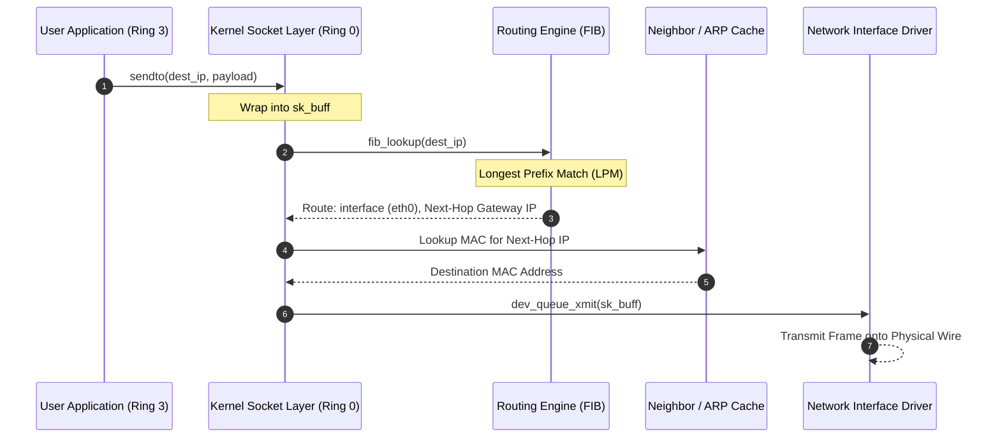

# Operating Systems: Routing Tables

A routing table is an in-kernel data structure that maps destination network address prefixes (subnets) to next-hop gateways and physical or virtual network interfaces, governing packet forwarding decisions across the operating system network stack.

---

## Routing Tables Motivation & Overview

In an operating system, user applications communicate across local networks and the global internet by creating network sockets and invoking system calls such as `send()`, `write()`, or `sendto()`. However, the application only specifies the payload and the target destination IP address; it has no inherent knowledge of which physical network interface card (NIC) to activate or which router on the local link can deliver the packet.

### Why the Kernel Maintains Routing Tables

The operating system kernel must arbitrate all outbound and incoming network traffic:

1. **Interface Selection**: Modern machines frequently possess multiple network interfaces simultaneously (e.g., wired `eth0`, wireless `wlan0`, loopback `lo`, and virtual container bridges `docker0`). The kernel must determine which interface can physically reach the destination.
2. **Next-Hop Resolution**: A host rarely has a direct physical cable to the target destination. The kernel must decide whether a destination is on the local layer-2 link (reachable directly via Ethernet MAC address) or whether it must be forwarded to an intermediary router (the **Next-Hop Gateway**).
3. **Decoupling Control Plane from Data Plane**:
   - **Control Plane (Routing)**: Processes (e.g., dynamic routing daemons running BGP or OSPF, or user tools like `ip route`) calculate optimal paths across the topology and populate the kernel table.
   - **Data Plane (Forwarding)**: The OS kernel performs ultra-fast, per-packet lookups in hardware or kernel memory to forward packets in nanoseconds.

---

## Architecture & Core Mechanics

### Kernel Network Stack Traversal

When an application sends data, the packet descends through the kernel network subsystem:



---

### Anatomy of a Kernel Routing Table Entry

In Linux and POSIX systems, routing entries in the **Forwarding Information Base (FIB)** comprise several essential attributes:

| Field | Description | Example |
| :--- | :--- | :--- |
| **Destination Subnet (Prefix)** | The network address range matched against the packet's destination IP. | `192.168.1.0` |
| **Prefix Length / Netmask** | The number of leading bits defining the network portion (`/CIDR`). | `/24` (`255.255.255.0`) |
| **Gateway (Next Hop)** | The IP address of the intermediate router. If `0.0.0.0` or `*`, the target is directly connected to the local link. | `192.168.1.1` or `0.0.0.0` |
| **Interface (`dev`)** | The network device interface used to transmit the packet. | `eth0`, `wlan0`, `veth1` |
| **Metric / Priority** | Cost metric assigned to the route. When multiple routes match with identical prefix lengths, the lowest metric wins. | `100`, `600` |
| **Scope** | Validity scope of the destination address (`host`, `link`, or `global`). | `link` |

#### Linux Routing Table Display (`ip route`)
```text
default via 192.168.1.1 dev eth0 proto dhcp src 192.168.1.45 metric 100 
10.244.0.0/16 dev cni0 proto kernel scope link src 10.244.0.1 
192.168.1.0/24 dev eth0 proto kernel scope link src 192.168.1.45 metric 100 
127.0.0.0/8 dev lo proto kernel scope host src 127.0.0.1
```

---

### Forwarding Decisions: Direct Delivery vs. Indirect Delivery

The kernel evaluates matching routes into two distinct categories:

1. **Direct Delivery (On-Link Destination)**:
   - The destination IP falls within a subnet directly attached to one of the host's interfaces (e.g., `192.168.1.0/24 scope link`).
   - The gateway is listed as `0.0.0.0` (or `link`).
   - The kernel resolves the target host's IP directly to its hardware MAC address using the **Address Resolution Protocol (ARP)** (or NDP in IPv6) and encapsulates the IP datagram into an Ethernet frame.
2. **Indirect Delivery (Gateway Required)**:
   - The destination IP resides outside the local broadcast domain.
   - The routing table specifies the IP address of an on-link gateway router (e.g., `via 192.168.1.1`).
   - The kernel resolves the **gateway's MAC address** via ARP, puts the gateway's MAC in the Layer-2 Ethernet header, but leaves the Layer-3 destination IP unchanged.

---

### Algorithmic Lookup: Longest Prefix Match (LPM)

Because IP address prefixes can overlap, multiple rules in a routing table may match a single destination IP. The kernel enforces the **Longest Prefix Match (LPM)** rule:

> **LPM Invariant**: The packet is forwarded using the route with the most specific match—meaning the entry with the greatest prefix length (largest number of matching high-order subnet mask bits).

#### Kernel Data Structures for LPM
Standard linear array scans would be prohibitively slow ($O(N)$) for core routers and high-throughput servers. Operating system kernels implement optimized data structures:
- **Radix Trees / Patricia Tries**: Bitwise binary trees storing routing prefixes at tree nodes. Lookup time is bounded by the IP bit-length ($O(W)$, where $W = 32$ for IPv4 or $128$ for IPv6).
- **Level-Compressed Tries (LC-Trie)**: Modern Linux kernels use LC-tries in the FIB to compress long single-child paths and replace dense subtries with multi-way branch nodes, achieving near $O(1)$ lookups in cache memory.

---

### Network Namespaces and Policy Routing

Modern operating systems do not restrict hosts to a single global routing table:

```mermaid
flowchart TD
    subgraph Host ["Linux Host Kernel (Default Namespace)"]
        RT_Default["Main Routing Table<br/>(eth0: default via 192.168.1.1)"]
        veth0["veth0 (Host End)"]
    end

    subgraph NetNS ["Container Network Namespace (netns)"]
        RT_Container["Isolated Container Routing Table<br/>(eth0: default via 10.0.0.1)"]
        veth1["eth0 (Container End)"]
    end

    RT_Container --> veth1
    veth1 <===="Virtual Ethernet Cable (veth pair)"====> veth0
    veth0 --> RT_Default
```

1. **Policy Routing (Multiple Tables)**:
   - Linux supports up to 255 independent routing tables configured via the Routing Policy Database (`rpdb` / `ip rule`).
   - Lookups can branch based on source IP, incoming interface, or firewall packet marks (`fwmark`) rather than destination IP alone.
2. **Network Namespaces (`netns`)**:
   - As explored in containerization ([[Operating Systems/Virtualization/Containers and Virt|Containers and Virtualization]]), each namespace possesses an entirely independent network stack, complete with its own private routing table, loopback interface, and socket bindings.

---

## Concrete Walkthrough & Execution Trace

### End-to-End Trace: Outbound Packet Routing Lookup

```
Host Configuration:
  Interface eth0: IP 192.168.1.50/24 (Subnet: 192.168.1.0/24)
  Interface eth1: IP 10.0.0.10/8     (Subnet: 10.0.0.0/8)

Routing Table (FIB):
  Rule 1: 127.0.0.0/8     dev lo    scope host
  Rule 2: 192.168.1.0/24  dev eth0  scope link (Direct)
  Rule 3: 10.0.0.0/8      dev eth1  scope link (Direct)
  Rule 4: 10.50.0.0/16    via 10.0.0.254 dev eth1 (Subnet Gateway)
  Rule 5: 0.0.0.0/0       via 192.168.1.1 dev eth0 (Default Gateway)

Scenario A: Application sends packet to 10.50.2.14
  1. fib_lookup("10.50.2.14") tests matching rules:
       - Rule 5 (0.0.0.0/0) matches (prefix length = 0).
       - Rule 3 (10.0.0.0/8) matches (prefix length = 8).
       - Rule 4 (10.50.0.0/16) matches (prefix length = 16).
  2. Longest Prefix Match selects Rule 4 (/16 is longest).
  3. Route specifies indirect delivery via Gateway 10.0.0.254 out interface eth1.
  4. Kernel queries ARP table for 10.0.0.254:
       - Found MAC: 00:1A:2B:3C:4D:5E.
  5. Packet framed with:
       - Source MAC: eth1_MAC, Destination MAC: 00:1A:2B:3C:4D:5E
       - Source IP: 10.0.0.10, Destination IP: 10.50.2.14
  6. Dispatched via eth1 ring buffer.

Scenario B: Application sends packet to 142.250.190.46 (Google DNS/Web)
  1. fib_lookup("142.250.190.46") tests matching rules:
       - Rules 1, 2, 3, 4 do not match.
       - Rule 5 (0.0.0.0/0) matches.
  2. Only Rule 5 matches (prefix length = 0). Default gateway selected.
  3. Route specifies indirect delivery via Default Gateway 192.168.1.1 out eth0.
  4. Kernel frames packet with Gateway 192.168.1.1's MAC and dispatches out eth0.
```

---

## Edge Cases, Failure Modes & Mitigations

### 1. No Route to Host (`EHOSTUNREACH` / ICMP Type 3 Code 0)
- **Failure Mode**: A packet is destined for an IP address that matches no route in the routing table (e.g., if the default route `0.0.0.0/0` was deleted or unconfigured).
- **Kernel Behavior**: The kernel immediately aborts transmission, returns error code `-EHOSTUNREACH` to the calling application socket, and drops the `sk_buff`. If the host acts as a router forwarding packets for others, it generates an **ICMP Destination Network Unreachable** packet back to the sender.

### 2. Blackhole and Null Routes
- **Failure Mode**: High-volume DDoS traffic or loops can overwhelm local interfaces.
- **Mitigation**: Administrators configure explicit `blackhole` or `unreachable` routes in the kernel table (`ip route add blackhole 203.0.113.0/24`). The kernel discards matching packets silently inside `fib_lookup` without allocating socket buffers or generating ICMP responses, saving CPU and bandwidth.

### 3. Asymmetric Routing & Reverse Path Filtering (RPFilter)
- **Failure Mode**: On multi-homed servers with multiple NICs, a packet may arrive on `eth1`, but the host's routing table routes outbound replies back through `eth0`.
- **Kernel Defense**: Linux implements **Strict Reverse Path Filtering** (`sysctl net.ipv4.conf.all.rp_filter=1`). Upon receiving a packet on `eth1`, the kernel checks its routing table to see if it would route traffic *back* to the source IP via `eth1`. If the route points to `eth0`, the kernel suspects IP spoofing and silently drops the incoming packet.
- **Mitigation**: Switch to Loose RPFilter (`rp_filter=2`) or configure policy routing rules based on incoming marks.

---

## Formal Analysis / Protocol Specification

### Longest Prefix Match (LPM) Rule

#### Formal Definition
Let an IP address be represented as a bit-vector $X \in \{0, 1\}^{32}$. A route entry $r_i \in \mathcal{R}$ in the routing table is defined by a prefix $P_i \in \{0, 1\}^{32}$, a prefix length $L_i \in [0, 32]$, and an outgoing action $\mathcal{A}_i$:

$$r_i = (P_i, L_i, \mathcal{A}_i)$$

The bitwise subnet mask $M(L_i)$ for prefix length $L_i$ is:

$$M(L_i) = \sum_{k=32-L_i}^{31} 2^k = \underbrace{11\dots1}_{L_i \text{ ones}} \underbrace{00\dots0}_{32 - L_i \text{ zeros}}$$

A route $r_i$ matches destination IP address $X$ if and only if:

$$\text{Match}(X, r_i) \iff (X \ \& \ M(L_i)) = P_i$$

The set of all matching routes is:

$$\mathcal{M}(X) = \{r_i \in \mathcal{R} \mid \text{Match}(X, r_i)\}$$

The chosen route $r^*$ selected by the kernel is the match maximizing prefix length:

$$r^* = \arg\max_{r_i \in \mathcal{M}(X)} L_i$$

In the event of a tie ($L_i = L_j$), the route with the minimum metric $\mu_i$ is chosen:

$$r^* = \arg\min_{r_i \in \arg\max L} \mu_i$$

#### Simplified Explanation
The kernel converts the target IP into binary and compares it against all rules. The rule that matches the highest number of continuous bits starting from the very first bit wins. If a destination matches both a broad rule (`/8`) and a precise rule (`/24`), the precise `/24` rule is always picked because it is more specific.

---

## Industry Standard Terms

| Course / OS Term | Industry / Standard Networking Term |
| :--- | :--- |
| **Routing Table (OS)** | Forwarding Information Base (FIB) / Kernel Route Cache |
| **Routing Daemon** | Routing Information Base (RIB) Controller (BIRD, FRR, Quagga) |
| **Default Gateway** | Gateway of Last Resort (`0.0.0.0/0`) |
| **On-Link / Direct Route** | Connected Route / Subnet Route |
| **Next Hop** | Gateway IP / Next-Hop Forwarding Address (NHFA) |
| **Network Namespace (`netns`)** | Virtual Routing and Forwarding (VRF) instance |

---

## Related

- [[Networking/Network Layer/Network Layer - Forwarding and Routing Mechanics|Forwarding and Routing Mechanics]] — Network Layer data plane forwarding, LPM, and ARP resolution
- [[Networking/Linux/Advanced Linux Networking|Advanced Linux Networking]] — Kernel bypass (DPDK/RDMA), XDP, eBPF, and container veth pairs
- [[Networking/Network Layer/Network Layer - IPv4 Addressing and Subnetting|IPv4 Addressing and Subnetting]] — Subnet masks, CIDR blocks, and address allocation
- [[Networking/Routing Layer/Routing Layer - Border Gateway Protocol (BGP)|Border Gateway Protocol (BGP)]] — Control plane protocol computing global routing tables across autonomous systems
- [[Operating Systems/Kernel/Kernel Internals|Kernel Internals and Performance]] — Monolithic kernel execution, interrupts, top/bottom halves, and network softirqs
- [[Operating Systems/Virtualization/Containers and Virt|Containers and Virtualization]] — Linux namespaces (`netns`), cgroups, and container network isolation
- [[Datacenter Systems/Course Introduction and Overview|Datacenter Systems: Course Introduction and Overview]] — Software-defined networking and datacenter network traffic routing
