# CSE451: Organization of the I/O Function

There are three general strategies the OS can use to organize how the processor communicates with I/O devices, trading off implementation simplicity against how much processor time is wasted waiting on slow I/O hardware.

## Programmed I/O with Polling

In **Programmed I/O with polling**, the processor issues an I/O command on behalf of a process, and that process then busy-waits (see [[Operating Systems/Concurrency/Synchronization/Mechanics/Synchronization|Busy-Waiting]]) for completion of the operation before proceeding. This is the simplest strategy to implement, but it wastes CPU cycles the entire time the (typically much slower) I/O device is working, since the processor cannot do anything else while it is spinning on the device's status.

## Interrupt-Driven I/O

In **interrupt-driven I/O**, the processor issues an I/O command and then continues executing other work instead of waiting. The I/O module (device controller) interrupts the processor only once it has actually finished the I/O operation. The initiator process may be suspended pending that interrupt, allowing the OS to schedule other work in the meantime. This is strictly better than polling for CPU utilization, since the processor is freed up during the (relatively enormous) time the device takes to complete a mechanical or electronic operation, but every unit of data transferred still requires a separate interrupt, which carries its own overhead — see [[Interrupts]].

## Direct Memory Access (DMA)

**Direct Memory Access (DMA)** goes a step further: a DMA module controls the exchange of data directly between the I/O module and main memory, using physical memory addresses rather than requiring the CPU to shuttle each word of data itself. The processor requests a transfer of an entire block of data from the DMA controller, and is only interrupted once, after the entire block has been transferred — rather than once per word or per smaller unit as in basic interrupt-driven I/O. This dramatically reduces the number of interrupts (and thus processor overhead) required to move a large amount of data, at the cost of the added hardware complexity of a dedicated DMA controller.

## Trade-offs

These three strategies form a progression, each solving a limitation of the previous one:
- Polling wastes CPU cycles spinning on device status.
- Interrupts free the CPU while waiting, but still require one interrupt per unit of data transferred.
- DMA offloads the actual data movement to dedicated hardware entirely, reducing interrupts to one per block rather than one per word.

## Diagram: Comparing the Three Strategies

```mermaid
flowchart TD
    subgraph PIO [Programmed I/O with Polling]
        A1["(1) CPU issues I/O command"] --> A2["(2) CPU busy-waits, polling device status"]
        A2 --> A3["(3) Device finishes; CPU notices via poll"]
    end

    subgraph INT [Interrupt-Driven I/O]
        B1["(1) CPU issues I/O command"] --> B2["(2) CPU continues other work"]
        B2 --> B3["(3) Device finishes; raises interrupt"]
        B3 --> B4["(4) CPU handles interrupt, resumes initiator"]
    end

    subgraph DMA [Direct Memory Access]
        C1["(1) CPU requests block transfer from DMA controller"] --> C2["(2) CPU continues other work"]
        C2 --> C3["(3) DMA controller moves entire block to/from memory"]
        C3 --> C4["(4) DMA raises single interrupt after full block transferred"]
    end
```

## Related
- [[IO System Hardware Environment]] — the device controllers and buses that these I/O strategies communicate over
- [[Interrupts]] — the underlying mechanism interrupt-driven I/O and DMA rely on to notify the processor
- [[Operating Systems/Concurrency/Synchronization/Mechanics/Synchronization|Busy-Waiting]] — the mechanism programmed I/O with polling relies on

## Industry Standard Terms

| Course Term | Industry-Standard Equivalent |
| :--- | :--- |
| Programmed I/O with polling | Polling I/O |
| I/O module | Device controller |
| DMA module | DMA controller |
