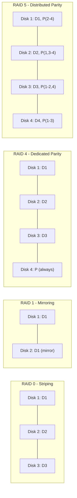

# CSE451: RAID (Redundant Array of Independent Disks)

**RAID** is a technology that combines multiple physical disk drive components (see [[Magnetic Disks]] and [[Disk Drives]]) into one or more logical units for the purposes of data redundancy, performance improvement, or both. By spreading data across multiple physical disks, RAID can tolerate the failure of individual disks and/or parallelize I/O across them, at the cost of additional disks and, for some levels, additional write overhead.

## RAID Levels

| Level | Name | Description | Redundancy |
| :--- | :--- | :--- | :--- |
| **RAID 0** | **Striping** | Data is split across disks. | **None**. One disk failure loses all data. |
| **RAID 1** | **Mirroring** | Data is duplicated on two disks. | **High**. Can survive one disk failure. |
| **RAID 4** | **Dedicated Parity** | Blocks are striped; one disk is dedicated to parity. | **Medium**. Can survive one disk failure. |
| **RAID 5** | **Distributed Parity** | Parity is rotated across all disks. | **Medium**. Can survive one disk failure. |
| **RAID 10** | **Stripe of Mirrors** | Combines RAID 1 and RAID 0. | **High**. Can survive multiple failures if they are in different mirrors. |

## RAID 4 vs RAID 5: The Parity Bottleneck

### RAID 4
In RAID 4, every write to any data disk requires updating the single **dedicated parity disk**.
- **The Problem**: The parity disk becomes a throughput bottleneck because it must be accessed for every single write operation in the array.
- **Performance**: Sequential reads are fast, but random writes are limited by the speed of the parity disk.

### RAID 5
RAID 5 solves the bottleneck by using **Distributed Parity**. The parity blocks are spread across all disks in the array.
- **The Benefit**: This allows multiple writes to occur in parallel if they happen to use different disks for their parity blocks.
- **Performance**: Better write throughput than RAID 4.

## RAID 5 Parity Math

### Calculation
Parity ($P$) is calculated using the **XOR** operation across the corresponding data blocks on each disk:
$P = D_1 \oplus D_2 \oplus D_3$

### Recovery
If a disk (e.g., $D_2$) fails, its data can be reconstructed by XORing the remaining data blocks and the parity block, because XOR is its own inverse — XORing the parity block back against the surviving data blocks cancels them out and leaves exactly the missing block:
$D_2 = D_1 \oplus D_3 \oplus P$

This is what allows RAID 4 and RAID 5 to tolerate a single disk failure using only one extra disk's worth of storage overhead, rather than the 50% overhead RAID 1 mirroring requires.

## Comparison Summary
- **RAID 0**: Best performance, no safety.
- **RAID 1**: Highest safety, 50% storage overhead.
- **RAID 5**: Best balance of safety and efficiency; requires at least 3 disks.
- **RAID 10**: High performance and high safety; very expensive (requires 4+ disks, 50% overhead).

## Diagram: RAID Layouts

## Formal Definition

For RAID 5 with data blocks $D_1, D_2, \dots, D_n$ striped across $n$ disks plus one distributed parity block per stripe:

$$P = D_1 \oplus D_2 \oplus \dots \oplus D_n$$

Given any single missing block $D_i$, it can be recovered as:

$$D_i = P \oplus D_1 \oplus \dots \oplus D_{i-1} \oplus D_{i+1} \oplus \dots \oplus D_n$$

## Simplified Explanation

Parity is just a checksum computed by XORing all the data blocks together. XOR has the property that XORing the same value twice cancels it out, so if you lose one disk, you can XOR everything you still have (the other data blocks plus the parity block) and the missing piece "falls out" of the math. RAID 4 keeps this checksum on one dedicated disk (creating a bottleneck, since every write touches it), while RAID 5 spreads the checksum blocks across all disks so no single disk is hit by every write.

## Related
- [[Magnetic Disks]] — the physical HDDs typically combined into a RAID array
- [[Disk Drives]] — HDD vs SSD comparison, relevant to what physical disks make up a RAID array
- [[Secondary Storage]] — broader storage device context
- [[Persistent Storage]] — where RAID fits in the overall persistent storage stack

## Industry Standard Terms

| Course Term | Industry-Standard Equivalent |
| :--- | :--- |
| RAID | Redundant Array of Independent (or Inexpensive) Disks |
| Striping | Data striping |
| Distributed Parity | Rotating parity |

