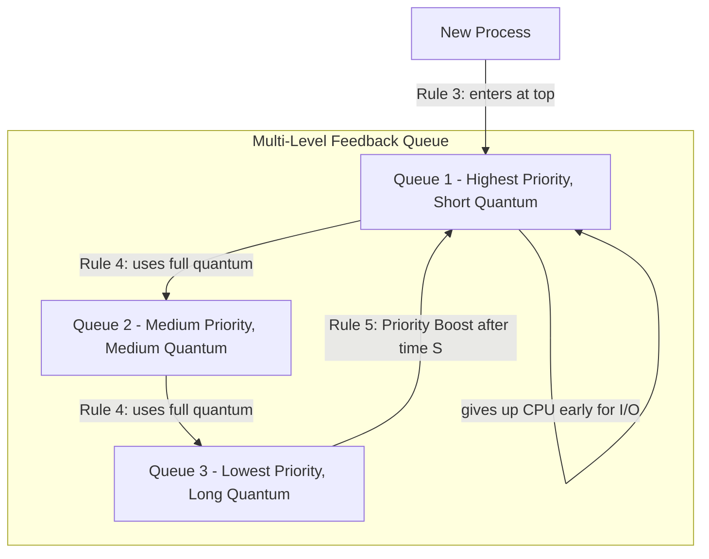

# CSE451: CPU Scheduling

## 1. Scheduling Metrics
The **CPU Scheduler** is the kernel component that decides which **[[Process and Thread Fundamentals#3. Process Lifecycle|Runnable]]** process or thread runs next on the CPU. To evaluate a scheduler's policy, we measure:
- **Turnaround Time**: Time from process submission to completion. ($T_{finish} - T_{arrival}$). Best for batch jobs, where the user only cares when the whole job is done, not when it starts.
- **Response Time**: Time from submission to the *first* time the process is scheduled. ($T_{first\_run} - T_{arrival}$). Critical for interactive apps, since a user typing at a shell cares about immediate feedback far more than total completion time.
- **Throughput**: Number of processes completed per unit of time — the metric a batch system or server cares about most.
- **CPU Utilization**: Percentage of time the CPU is busy doing useful work rather than sitting idle.

These metrics often trade off against each other: a scheduler tuned for the best average turnaround time (like SJF below) can produce poor response times for individual jobs, and a scheduler tuned for fast response time (like Round Robin) sacrifices turnaround time by context-switching frequently.

---

## 2. Basic Scheduling Policies
These are the foundational, textbook scheduling algorithms that motivate why more sophisticated schedulers like MLFQ and CFS (covered next) are necessary.

- **FIFO / FCFS (First-In, First-Out)**: Threads are run strictly in the order they arrive. Simple to implement and starvation-free, but it suffers from the **Convoy Effect** — a short job that arrives just after a long job must wait for the entire long job to finish, dragging down the average turnaround and response time for everyone behind it.
- **SJF (Shortest Job First)**: Always runs the job with the smallest remaining CPU burst next. This is provably optimal for minimizing average turnaround time, but it is impossible to implement perfectly in practice because the kernel cannot know a job's future CPU burst length in advance — it can only estimate based on past behavior.
- **Round Robin (RR)**: Runs each process for a fixed **Scheduling Quantum** (time slice) and then moves it to the back of the queue, giving every process a bounded wait before its next turn. This is great for response time, since no process waits longer than $(N-1) \times \text{quantum}$ before its first run, but it is bad for turnaround time because jobs are constantly interrupted and re-queued rather than run to completion.

### Multi-Level Feedback Queue (MLFQ)
MLFQ is the standard scheduling approach for modern interactive OSs (like Linux/macOS), because it approximates SJF's good turnaround time without requiring the kernel to know burst lengths ahead of time — instead, it infers a process's likely behavior from how it has behaved so far.
- **Heuristic**: If a process uses its entire time slice, it's likely CPU-bound, so the scheduler lowers its priority (moves it to a lower queue with a longer quantum, since compute-bound work benefits from running longer, less-interrupted stretches). If it gives up the CPU early (because it's waiting on I/O), it's likely interactive, so the scheduler keeps or raises its priority — this way interactive jobs that only need brief CPU bursts get scheduled quickly, close to how SJF would behave, without the kernel ever having to predict the future.
- **Priority Boosting**: Because the heuristic above would otherwise permanently punish a process that had one long CPU-bound phase, the scheduler periodically moves all processes back to the top queue. This avoids **Starvation** of CPU-bound tasks that might have since become interactive, and also prevents gaming of the scheduler (e.g., a process that yields the CPU right before its quantum expires just to stay in a high-priority queue).

---

## 3. Linux Completely Fair Scheduler (CFS)
CFS is the default Linux scheduler. It abandons the fixed-time-slice-per-queue model of MLFQ entirely and instead aims to divide CPU time equally among all processes by directly tracking how much CPU time each process has actually received.

### Virtual Runtime (vruntime)
- Instead of assigning fixed time slices, CFS tracks the **vruntime** of each process — its actual runtime normalized by its weight (see Nice Values below).
- The scheduler always picks the process with the **minimum vruntime** to run next, since that process is the one that has received the least CPU time so far relative to its entitled share; running it next is what keeps the overall allocation "fair."

### Data Structure: Red-Black Tree
- CFS stores runnable processes in a **Red-Black Tree** (a self-balancing binary search tree) indexed by `vruntime`.
- **Why?**: Finding the minimum-vruntime process is $O(1)$ (it is always the leftmost node in the tree), and insertions/deletions when a process becomes runnable or blocks are $O(\log N)$. This scales far better than a simple linked list or unsorted queue would for systems with thousands of runnable threads, where a linear scan to find the minimum on every scheduling decision would be prohibitively slow.

### Nice Values
- Ranges from -20 (highest priority) to +19 (lowest priority).
- A lower nice value increases a process's **weight**, causing its `vruntime` to increase more slowly for the same amount of actual CPU time consumed. Since the scheduler always picks the minimum-vruntime process, a slower-growing vruntime means the process is picked more often, and thus receives more physical CPU time overall — this is how "niceness" translates into an actual share of the CPU.

---

## 4. Multiprocessor & Cloud Considerations
Once a system has multiple CPUs, the scheduler must additionally decide *which* CPU a thread runs on, not just *when*.

- **CPU Affinity**: The tendency of a scheduler to keep a process on the same CPU to keep its cache "hot" — moving a thread to a different CPU means its working set is no longer resident in that CPU's caches or **[[Operating Systems/Virtualization/Memory/Address Translation/Translation Lookaside Buffer (TLB)|Translation Lookaside Buffer (TLB)]]**, so it stalls fetching cold data all over again (the same **Cache/TLB Pollution** cost discussed for context switches in **[[Process and Thread Fundamentals#Context Switching|Process and Thread Fundamentals]]**).
- **Work Stealing**: An idle CPU "steals" tasks from the runqueue of a busy CPU to balance the load, trading a small amount of affinity loss for better overall utilization of otherwise-idle processors.
- **NUMA (Non-Uniform Memory Access)**: In multi-socket systems, memory access to local RAM (attached to the same socket as the CPU) is faster than remote RAM (attached to a different socket, reached over an interconnect). The scheduler should be **NUMA-aware**, placing threads near the memory they access, since otherwise every memory access pays the extra latency of crossing sockets.

---

## Deep Dive

### Priority Inversion
A related multiprocessor/priority-scheduling hazard not covered above is **Priority Inversion**: a high-priority thread is blocked waiting on a lock held by a low-priority thread, while a medium-priority thread (which doesn't need the lock) keeps preempting the low-priority thread and running instead. This effectively lets the medium-priority thread starve the high-priority one indirectly. Real-time systems commonly solve this with **Priority Inheritance**, where the lock-holding low-priority thread temporarily inherits the priority of the highest-priority thread waiting on it, ensuring it gets to run and release the lock promptly.

### Kleinrock's Conservation Law
A more formal way to see why scheduling metrics trade off against each other: Kleinrock's Conservation Law states that $\sum U_p \times R_p = \text{constant}$, where $U_p$ is the fraction of CPU utilization attributable to priority class $p$ and $R_p$ is its average response time. Improving the response time of one priority class necessarily degrades it for another, since the weighted sum is fixed — this formalizes the intuition that no scheduling policy can simultaneously optimize every job's response time. See **[[Operating Systems/Virtualization/Processes/Scheduling#Fundamental Laws of Scheduling|Scheduling: Fundamental Laws]]** for the related Utilization Law and Little's Law.

## Formal Definition
$$vruntime_{new} = vruntime_{old} + \frac{\text{actual\_runtime} \times \text{NICE\_0\_LOAD}}{\text{weight}}$$
The scheduler selects, at every decision point, the runnable process $p$ minimizing $vruntime_p$, implemented as the leftmost node of a Red-Black Tree keyed by vruntime.

## Simplified Explanation
CFS keeps a running "how much CPU have you gotten so far, adjusted for how important you are" tally for every process, and always lets whoever is furthest behind go next. A lower nice value (higher priority) makes your tally grow more slowly, so you get picked more often without ever needing a fixed time-slice-per-process scheme.

## Industry Standard Terms
- **Scheduling Quantum** $\rightarrow$ Time Slice
- **MLFQ Priority Boosting** $\rightarrow$ Anti-Starvation / Aging
- **CPU Affinity** $\rightarrow$ Processor Affinity
- **vruntime** $\rightarrow$ Weighted Fair Queuing (WFQ) runtime accounting (the general networking/scheduling technique CFS is based on)

## Related
- [[Process and Thread Fundamentals|Process & Thread State]]
- [[Operating Systems/Virtualization/Processes/Scheduling|Processor Scheduling: Policies and Mechanisms]]
- [[Operating Systems/Concurrency/Problems/Starvation|Starvation]]
- [[Operating Systems/Virtualization/Memory/Address Translation/Translation Lookaside Buffer (TLB)|Translation Lookaside Buffer (TLB)]]
