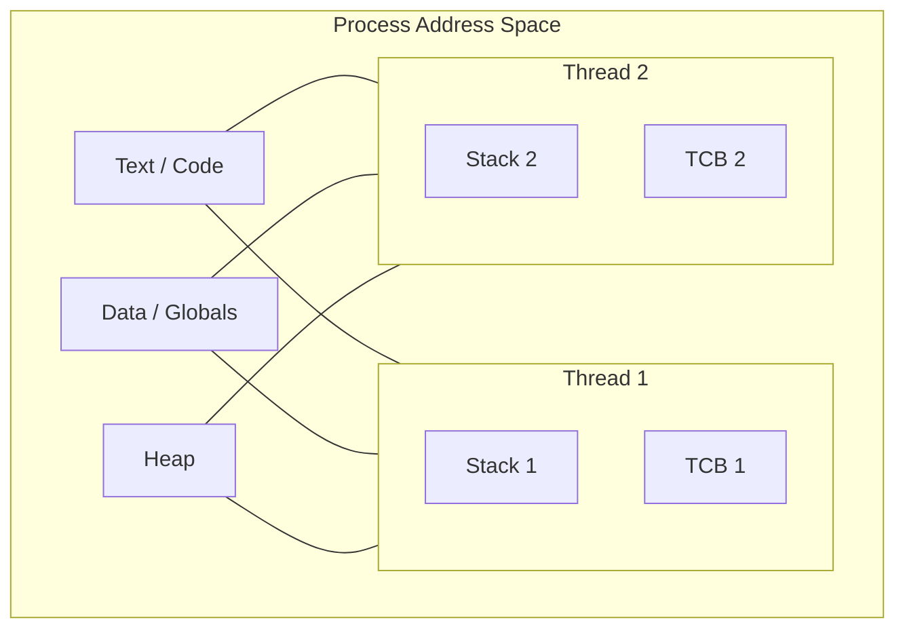

# CSE451: Process and Thread Fundamentals

## 1. The Process Abstraction
A **Process** is an execution environment that provides the illusion of an independent machine. It includes a private **Virtual Address Space** and a **Process Control Block (PCB)** maintained by the kernel.

### Address Space Contents
The address space is organized into several segments:
- **Text**: Executable instructions (read-only).
- **Data**: Global and static variables.
- **Heap**: Dynamically allocated memory (managed via `malloc` and `free`).
- **Stack**: Function call frames, local variables, and return addresses.

### Process Control Block (PCB)
The kernel's "identity card" for a process. It contains all metadata required for management:
- **PID**: Process Identifier.
- **State**: Running, Runnable (Ready), Blocked (Waiting), Zombie.
- **CPU Registers**: PC (Program Counter), SP (Stack Pointer), and GPRs (General Purpose Registers), saved during context switches.
- **Memory Maps**: Pointers to **[[Operating Systems/Virtualization/Memory/Virtual Memory#Page Tables|Page Tables]]**.
- **I/O Status**: Open file descriptors and network sockets.

---

## 2. Threads: Lightweight Processes
**Threads** exist within a process and share its entire address space (Heap, Data, Text) and resources (Files). However, each thread maintains its own **Thread Control Block (TCB)** and a private **Stack**.

### Context Switching
- **Mechanism**: The kernel saves the current CPU state to a TCB/PCB and loads the state of the next task.
- **Process vs. Thread Switch**: A thread switch is "cheaper" because it avoids reconfiguring the **[[CSE351/Memory Fundamentals/Cache#TLB|Translation Lookaside Buffer (TLB)]]** and page tables, preserving cache locality.
- **The True Cost**: The primary overhead is **Cache/TLB Pollution**. After a switch, the CPU stalls while fetching "cold" data into caches.

---

## 3. Process Lifecycle
- **fork()**: Creates a child process via **Copy-on-Write (COW)**. The child is a bit-perfect copy of the parent but with a unique PID.
- **exec()**: Replaces the current address space with a new program. The PID remains the same.
- **Zombie Process**: A terminated process whose exit status hasn't been reaped by the parent via `wait()`.
- **Orphan Process**: A process whose parent has died; adopted by `init` (PID 1) to ensure eventual reaping.

---

## Industry Standard Terms
- **Runnable** $\rightarrow$ Ready State
- **Blocked** $\rightarrow$ Waiting / Sleeping State
- **TCB** $\rightarrow$ Thread Context / Thread State
- **Text Segment** $\rightarrow$ Code Segment

## Related
- [[Operating Systems/Virtualization/Memory/Virtual Memory|Virtual Memory and Paging]]
- [[CPU Scheduling|CPU Scheduling Algorithms]]
- [[CSE451/Concurrency/Threads/Multithreading Models|Multithreading Models]]
- [[CSE333/Process Management/Process Creation|CSE333: Process Creation in C]]
- [[CSE351/Procedures and Stack/The Stack|CSE351: Stack Frames and Procedures]]
