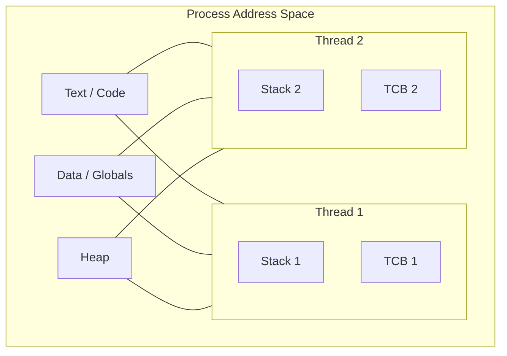
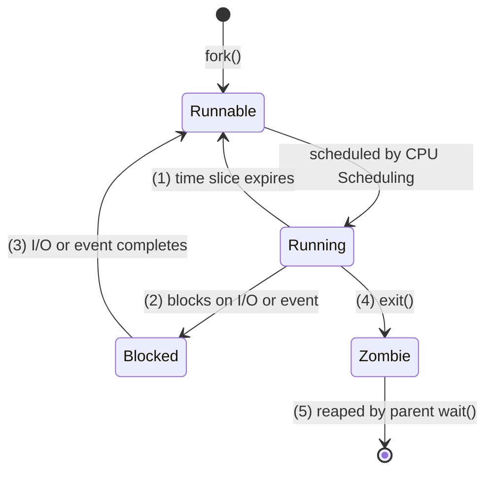

# CSE451: Process and Thread Fundamentals

## 1. The Process Abstraction
A **[[Operating Systems/Virtualization/Processes/Process|Process]]** is an execution environment that provides the illusion of an independent machine. It includes a private **[[Operating Systems/Virtualization/Memory/Virtual Memory|Virtual Address Space]]** and a **Process Control Block (PCB)** maintained by the kernel.

### Address Space Contents
The address space is organized into several segments:
- **Text**: Executable instructions (read-only).
- **Data**: Global and static variables.
- **Heap**: Dynamically allocated memory (managed via `malloc` and `free`).
- **Stack**: Function call frames, local variables, and return addresses.

### Process Control Block (PCB)
The **[[Operating Systems/Virtualization/Processes/Process/Process Control Block|Process Control Block (PCB)]]** is the kernel's "identity card" for a process. It contains all metadata required for management, and the kernel consults and updates it on every context switch, system call, and scheduling decision:
- **PID**: Process Identifier — a unique integer that distinguishes this process from every other process in the system.
- **State**: Running, Runnable (Ready), Blocked (Waiting), Zombie. See **[[#3. Process Lifecycle|Process Lifecycle]]** below for how a process moves between these states.
- **CPU Registers**: PC (Program Counter), SP (Stack Pointer), and GPRs (General Purpose Registers), saved during context switches so the process can resume exactly where it left off.
- **Memory Maps**: Pointers to **[[Operating Systems/Virtualization/Memory/Virtual Memory#Page Tables|Page Tables]]**, which the **[[Operating Systems/Virtualization/Memory/Address Translation/Translation Lookaside Buffer (TLB)|Translation Lookaside Buffer (TLB)]]** and Memory Management Unit consult to translate virtual addresses into physical ones.
- **I/O Status**: Open file descriptors and network sockets, tracked through the **[[Signals and Syscalls#File Descriptors|File Descriptor]]** tables described in Signals and Syscalls.

---

## 2. Threads: Lightweight Processes
**[[Operating Systems/Concurrency/Threads/Thread|Threads]]** exist within a process and share its entire address space (Heap, Data, Text) and resources (Files). Because sibling threads all read and write the same Heap and Data segments, they can communicate directly through shared memory without the kernel-mediated Inter-Process Communication (IPC) a process needs. However, each thread maintains its own **Thread Control Block (TCB)** and a private **Stack**, since each thread executes independently and needs its own call frames, local variables, and saved register state to make forward progress without stepping on another thread's execution.

```mermaid
graph TD
    subgraph Process [Process Address Space]
        Text[Text / Code]
        Data[Data / Globals]
        Heap[Heap]
        subgraph Thread1 [Thread 1]
            Stack1[Stack 1]
            TCB1[TCB 1]
        end
        subgraph Thread2 [Thread 2]
            Stack2[Stack 2]
            TCB2[TCB 2]
        end
    end
    Text --- Thread1
    Data --- Thread1
    Heap --- Thread1
    Text --- Thread2
    Data --- Thread2
    Heap --- Thread2
```

### Context Switching
- **Mechanism**: The kernel saves the current CPU state (registers, PC, SP) to the outgoing task's TCB/PCB, then loads the saved state from the incoming task's TCB/PCB into the CPU registers. This is what allows execution to later resume exactly where it left off, even though the CPU has been running other work in the interim.
- **Process vs. Thread Switch**: A thread switch (between two threads of the *same* process) is "cheaper" than a full process switch because both threads already share the same address space. The kernel therefore avoids reconfiguring the **[[Operating Systems/Virtualization/Memory/Address Translation/Translation Lookaside Buffer (TLB)|Translation Lookaside Buffer (TLB)]]** and page tables, preserving cache locality — the physical-to-virtual address mappings cached from the outgoing thread remain valid for the incoming thread. See **[[Operating Systems/Virtualization/Memory/Address Translation/Translation Lookaside Buffer (TLB)#Context Switches|TLB Context Switch Problem]]** for why a process switch invalidates these mappings.
- **The True Cost**: The primary overhead in either kind of switch is **Cache/TLB Pollution**. After a switch, the CPU stalls while fetching "cold" data into caches, because the newly-scheduled task's working set is not resident in the L1/L2 caches or TLB. A process switch is more expensive precisely because it invalidates the TLB entries wholesale (different address space, different mappings), whereas a thread switch only disturbs the caches, not the address translation state.

---

## 3. Process Lifecycle
- **fork()**: Creates a child process via **[[Operating Systems/Virtualization/Memory/Concepts/Copy-on-Write|Copy-on-Write (COW)]]**. The child is a bit-perfect copy of the parent but with a unique PID. Rather than eagerly copying every page of the parent's address space, the kernel marks the parent's and child's page tables as read-only and lets them share the same physical pages; only when either process writes to a shared page does the kernel intercept the resulting page fault and make a private copy for the writer — this avoids the cost of copying memory that may never be touched.
- **exec()**: Replaces the current address space with a new program. The PID remains the same, since `exec()` operates on the existing process rather than creating a new one — it discards the old Text, Data, Heap, and Stack segments and loads the new program's segments in their place. The common `fork()`-then-`exec()` pattern used by shells is discussed further in **[[Systems Programming/Process Management/Process Management#Executing Programs|CSE333: Process Management]]**.
- **Zombie Process**: A terminated process whose exit status hasn't been reaped by the parent via `wait()`. The process's PCB entry (including PID and exit code) is deliberately kept around by the kernel until the parent retrieves it, so that the parent has a chance to observe how the child terminated.
- **Orphan Process**: A process whose parent has died; adopted by `init` (PID 1) to ensure eventual reaping, since without a live parent to call `wait()`, an orphan's exit status would otherwise never be collected and it would remain a zombie indefinitely.

### Process State Transitions
The **State** field of the PCB (Running, Runnable/Ready, Blocked/Waiting, Zombie) moves through the following transitions as a process executes, is scheduled, and eventually terminates:

```mermaid
stateDiagram-v2
    [*] --> Runnable : fork()
    Runnable --> Running : scheduled by CPU Scheduling
    Running --> Runnable : (1) time slice expires
    Running --> Blocked : (2) blocks on I/O or event
    Blocked --> Runnable : (3) I/O or event completes
    Running --> Zombie : (4) exit()
    Zombie --> [*] : (5) reaped by parent wait()
```

See **[[Operating Systems/Virtualization/Processes/Process/Process State|Process State]]** for the fuller state diagram used in Virtualization/Processes, and **[[CPU Scheduling|CPU Scheduling]]** for how the scheduler decides which Runnable process moves to Running.

---

## Industry Standard Terms
- **Runnable** $\rightarrow$ Ready State
- **Blocked** $\rightarrow$ Waiting / Sleeping State
- **TCB** $\rightarrow$ Thread Context / Thread State
- **Text Segment** $\rightarrow$ Code Segment

## Related
- [[Operating Systems/Virtualization/Memory/Virtual Memory|Virtual Memory and Paging]]
- [[CPU Scheduling|CPU Scheduling Algorithms]]
- [[Signals and Syscalls|System Calls and Signals]]
- [[Operating Systems/Virtualization/Processes/Process|Virtualization/Processes: Process Overview]]
- [[Operating Systems/Virtualization/Processes/Process/Process Control Block|Process Control Block (PCB) Detail]]
- [[Operating Systems/Virtualization/Processes/Process/Process State|Process State Diagram]]
- [[Operating Systems/Concurrency/Threads/Achieving Multithreading|Achieving Multithreading]]
- [[Operating Systems/Concurrency/Threads/Threads and Processes|Threads and Processes]]
- [[Systems Programming/Process Management/Process Management|CSE333: Process Management (fork/exec/wait)]]
- [[Hardware & Software Interface/Procedures and Stack/Stack Frames|CSE351: Stack Frames and Procedures]]
