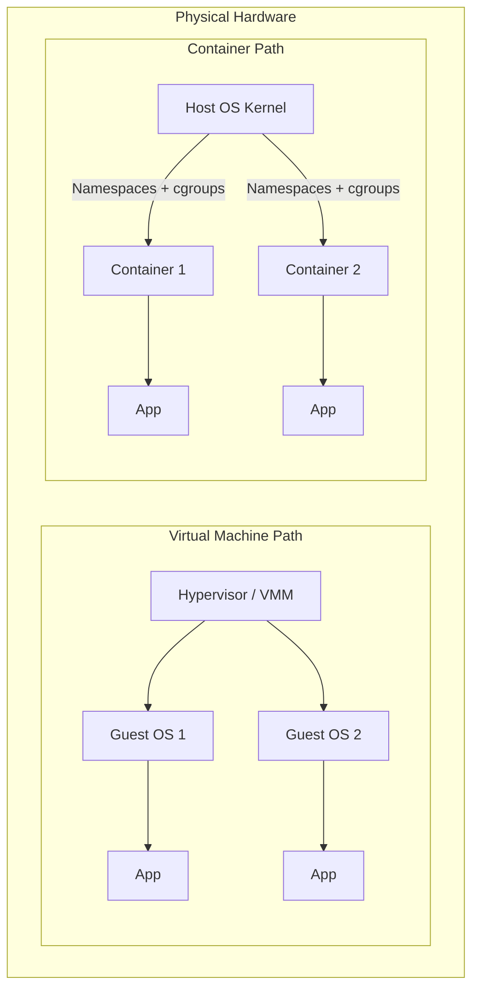

# CSE451: Virtualization and Containers

**Virtualization** allows multiple isolated Operating System instances to run on a single physical machine by virtualizing the underlying hardware. This builds on the general concept of the **[[Virtual Machine/Virtual Machine|Virtual Machine]]** abstraction, and focuses specifically on how modern CPUs accelerate that abstraction in hardware, along with the lighter-weight alternative of OS-level containers.

### Hardware-Assisted Virtualization
Modern CPUs (e.g., Intel VT-x) provide specific support for the **[[Hypervisor (VMM)]]**, avoiding the high overhead of pure software techniques like binary translation (see [[Virtual Machine/Virtual Machine#CPU Virtualization and Privileged Instructions|CPU Virtualization and Privileged Instructions]]).

- **[[Root Mode]]**: The mode in which the Hypervisor runs (Ring -1). This sits below the [[Ring 0|Ring 0]]/[[Ring 3|Ring 3]] privilege levels used by the Host and Guest OSes, giving the Hypervisor the ability to intercept privileged operations from either.
- **[[Guest Mode]]**: The mode in which the Guest OS runs. From inside Guest Mode, the Guest OS still believes it is executing its own privileged instructions directly on hardware, even though the CPU is prepared to trap out to Root Mode.
- **[[VMCS (Virtual Machine Control Structure)]]**: A hardware structure that stores the state of a virtual machine, including its register values and the conditions that should trigger a transition out of Guest Mode.
- **[[VM Exit]]**: Occurs when the Guest performs a privileged operation, forcing a transition to Root Mode so the Hypervisor can emulate the instruction. Once the Hypervisor finishes emulating the effect of the instruction, it issues a VM-Entry to resume the Guest back in Guest Mode.

### Type 1 vs Type 2 Hypervisors
- **[[Type 1 (Bare Metal)]]**: Runs directly on the hardware (e.g., Xen, VMware ESXi). More efficient because there is no Host OS layer between the Hypervisor and the physical hardware, but harder to manage since it replaces the role a general-purpose Host OS would normally play.
- **[[Type 2 (Hosted)]]**: Runs as an application within a Host OS (e.g., VirtualBox, VMware Workstation). Easier to install because it is just another program on top of an existing OS, but introduces host-OS overhead since every hardware access must also pass through the Host OS.
- **[[KVM (Kernel-based Virtual Machine)]]**: A hybrid approach where the Linux kernel itself becomes a Type 1 hypervisor. Because KVM is built into the kernel, it can use the kernel's own scheduler and memory manager for Guest VMs rather than reimplementing them, blurring the line between Type 1 and Type 2 designs.

### Containers
**[[Containers]]** provide OS-level virtualization. Unlike VMs, containers share the same host kernel, making them significantly lighter and faster since there is no need to boot a separate Guest OS kernel or emulate hardware for each isolated instance.

#### Core Linux Technologies
- **[[Namespaces]]**: Provide **isolation**. Each container has its own view of the system (e.g., PID namespace prevents a container from seeing other processes). Other namespace types isolate mount points, network interfaces, and user/group IDs so that a container appears to be its own independent system.
- **[[Control Groups (cgroups)]]**: Provide **resource limiting**. Restricts the amount of CPU, memory, and I/O a container can consume, preventing a single container from starving other containers or the Host OS of resources.
- **[[Union FS (OverlayFS)]]**: Allows multiple file systems to be layered. Each container starts with a read-only "image" layer and a private writable layer on top, so writes made inside the container do not modify the shared, read-only base image and multiple containers can share the same underlying image layer without duplicating storage.

### Paravirtualization
- **[[virtio]]**: A standardized interface for "virtual IO" where the Guest OS is aware it is running in a VM and uses optimized drivers to communicate with the Hypervisor, bypassing expensive hardware emulation. This mirrors the paravirtualized I/O approach described in [[Virtual Machine/Virtual Machine#I/O Virtualization|I/O Virtualization]], where the Guest and Hypervisor cooperate through a shared Virtual Queue instead of trapping on every I/O request.

## Deep Dive

### Containers vs. VMs at a Glance

Each Guest OS in the VM path has its own full kernel, so isolation happens at the hardware-virtualization boundary. Each container in the container path shares one kernel, so isolation happens at the Namespaces/cgroups boundary instead — this is the structural reason containers start faster and use less memory than VMs, at the cost of weaker isolation (a kernel-level container escape compromises every container on the host, whereas a VM escape must first defeat the Hypervisor).

## Industry Standard Terms

| Course Term | Industry-Standard Equivalent |
|---|---|
| Hypervisor (VMM) | Virtual Machine Monitor / Virtualization Layer |
| Root Mode | VMX Root Operation (Intel VT-x terminology) |
| Guest Mode | VMX Non-Root Operation |
| VM Exit / VM Entry | Trap-and-emulate transition (also called "world switch") |
| Type 1 (Bare Metal) | Native Hypervisor |
| Type 2 (Hosted) | Hosted Hypervisor |
| Containers | OS-level virtualization / Lightweight virtualization (e.g., Docker, LXC) |
| Namespaces | Isolation primitives (Linux kernel feature) |
| Control Groups (cgroups) | Resource quotas / Resource governance |
| Union FS (OverlayFS) | Layered/Copy-on-write image filesystem (e.g., Docker image layers) |
| virtio | Paravirtualized device driver standard |

### Related
- [[Virtual Machine/Virtual Machine|Virtual Machine]] — the general VM abstraction, memory/IO virtualization details, and Containers vs. VMs trade-offs
- [[Ring 0|Ring 0]] / [[Ring 3|Ring 3]] — the privilege rings that Root Mode sits below
- [[CSE451/Virtualization/KVM]]
- [[CSE451/Virtualization/Memory Ballooning]]
