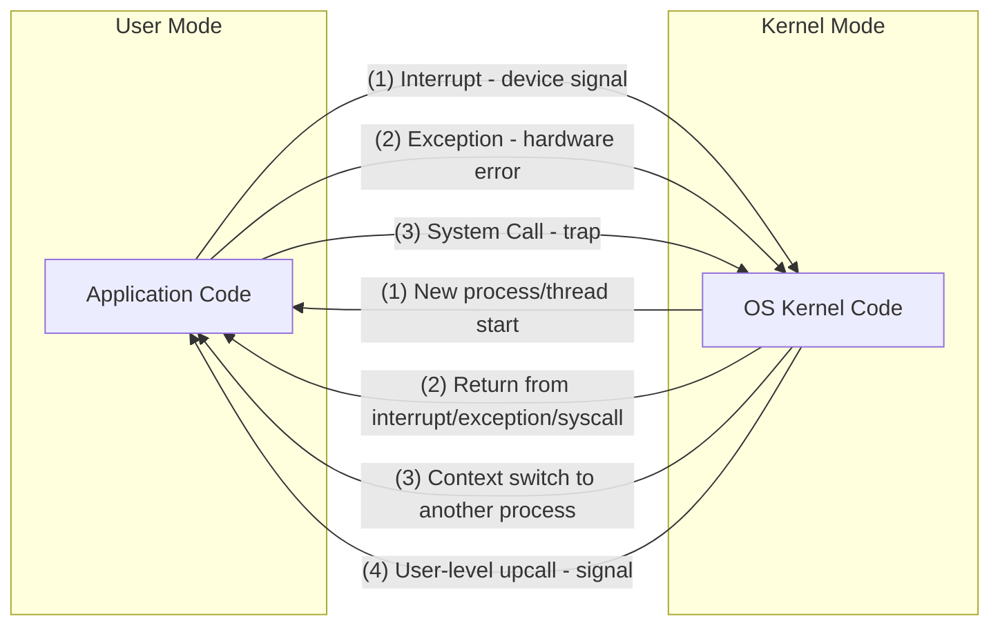

# CSE451: Mode Switch

A **mode switch** is the transition between kernel mode and user mode (and vice versa).

## Kernel to User
1. **New process/thread start** — jump to the first instruction in the program/thread
2. **Return from interrupt, exception, or system call** — resume suspended execution
3. **Process/thread context switch** — resume some other process
4. **User-level upcall (UNIX signal)** — asynchronous notification to user program
	- Example: user types Ctrl+C, which fires an interrupt and executes signal handler code

## User to Kernel
- [[Interrupts|Interrupts]] — hardware device signals the CPU
- [[Operating Systems/Virtualization/Mechanisms/Exceptions/Exception]] — program causes a hardware error (e.g., segfault)
- [[System Call]] — protected procedure call (trap) to request OS service

## Related
- [[Hardware Modes]] — the modes being switched between
- [[Atomic Transfer of Control]] — the hardware mechanism for user-to-kernel transitions
- [[Traps|Traps]] — the general mechanism for user-to-kernel transitions
- [[CPU State#Context Switch|Context Switch]] — switching between processes (not just modes)

## Industry Standard Terms
| Course Term | Industry Standard Equivalent |
|---|---|
| Mode Switch | Privilege level transition / ring transition |
| User-Level Upcall | Signal delivery |
