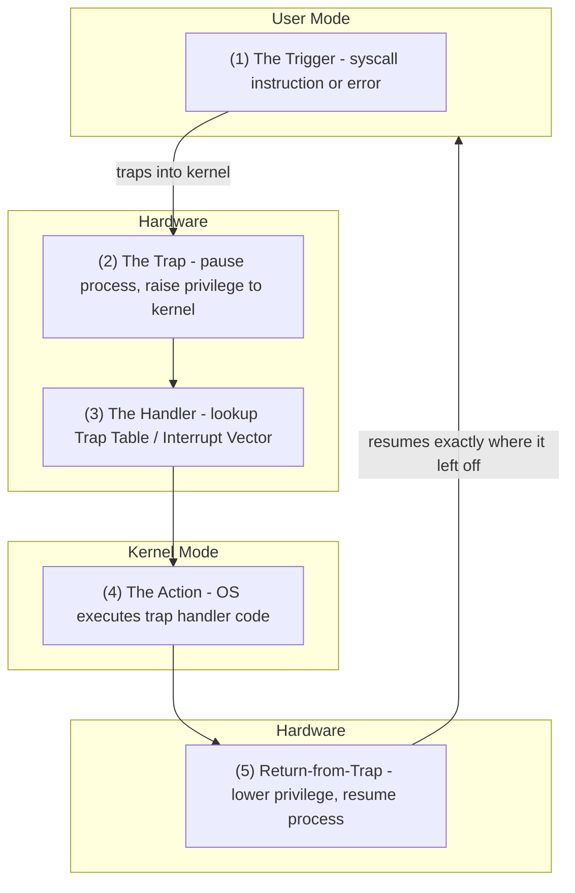

# CSE451: How Traps Work

Traps follow a five-step sequence from trigger to return:

1. **The Trigger** — the process executes a special instruction (`syscall`) or causes an error (divide by zero)
2. **The Trap** — the hardware detects this, pauses the process, and raises the privilege level from user to kernel
3. **The Handler** — the hardware looks up a predefined location called the [[Trap Table]] (or [[Interrupt Vector]] table) to find the handler code responsible for this specific event
4. **The Action** — the OS executes the trap handler code (e.g., performs the file read or kills the crashing process)
5. **Return-from-Trap** — if the process is allowed to continue, the OS executes a special `return-from-trap` instruction, which lowers the privilege back to user mode and resumes the process exactly where it left off

## Related
- [[Traps|Traps]] — the parent concept
- [[Trap Table]] — step 3 uses this dispatch table
- [[Atomic Transfer of Control]] — step 2 uses this mechanism
- [[Transparent Restartable Execution]] — step 5 relies on this property
- [[Types of Traps]] — what kinds of events trigger step 1

## Industry Standard Terms
| Course Term | Industry Standard Equivalent |
|---|---|
| Return-from-Trap | `iret` / `sysret` (x86 return-from-trap instructions) |
