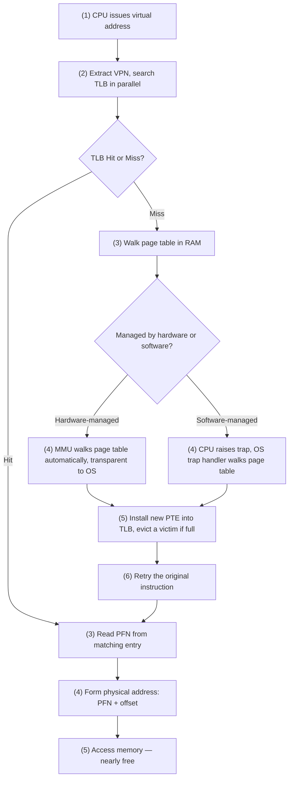

# CSE451: Translation Lookaside Buffer (TLB)

A **Translation Lookaside Buffer (TLB)** is a hardware cache of recent virtual-to-physical address translations. It is part of the chip's **[[Operating Systems/Virtualization/Memory/Address Translation/Memory Management Unit]]** — a tiny, ultra-fast memory chip physically located inside the MMU.

The TLB solves the performance problem created by **[[Operating Systems/Virtualization/Memory/Concepts/Virtual Addresses|virtual addressing]]**: without a TLB, every memory access would require walking the **[[Operating Systems/Virtualization/Memory/Address Translation/Page Table|page table]]** in RAM to translate a virtual address to a physical one — meaning every single instruction pays the cost of one or more *extra* memory accesses just to figure out where to find the data it actually wants. The TLB caches the results of recent page-table walks so that repeated translations can be satisfied instantly instead of walking the page table again. A typical TLB holds 32-256 entries — tiny compared to main memory, but effective because of locality (see below).

## Physical Structure

The TLB is implemented as a **fully associative cache** inside the MMU: on every lookup, all entries are searched in parallel (all at once), rather than being indexed by address the way a direct-mapped cache would be. This parallel search is what makes a hit "nearly free" — the hardware doesn't need to iterate through entries one at a time; it compares the requested tag against every stored tag simultaneously and reports a match instantly.

Conceptually, the cache stores pairs:

| component | value |
|-----------|-------|
| cache tags | virtual page numbers (VPN) |
| cache values | page table entries (PTEs) — including protection and valid bits |
| lookup result | PFN + page offset -> physical address |

Each line (entry) in the TLB holds one cached address translation, physically laid out as a row of fields:

```
 ┌────────┬─────────────────┬───────┬───────┬──────────────┬─────────────────┐
 │  ASID  │       VPN       │ valid │ dirty │  prot bits   │       PFN       │
 └────────┴─────────────────┴───────┴───────┴──────────────┴─────────────────┘
    who       virtual page     is       was    r / w / x      physical frame
   owns it     to look up     this    written   permissions     to map to
                              valid?    to?
```

| field | size | purpose |
|-------|------|---------|
| VPN (Virtual Page Number) | ~20 bits (varies) | the virtual page number being translated — used as the lookup key (tag) |
| PFN (Physical Frame Number) | ~20 bits (varies) | the physical frame number — the actual location in RAM; the result of the translation |
| valid bit | 1 bit | whether this entry holds a real translation (`1`) or should be ignored (`0`) |
| dirty bit | 1 bit | whether the page has been written to and must be written back before eviction |
| protection bits | 3 bits | read / write / execute permissions for this page |
| ASID (Address Space ID) | ~8 bits | identifies which process owns this entry — allows entries from multiple processes to coexist in the TLB without flushing (see Context Switches below) |

A virtual address is split into a VPN and a page offset. Only the VPN portion is looked up in the TLB; the offset bits are never translated — they pass straight through unchanged, since the page boundary is identical in both virtual and physical address spaces:

```
virtual address:
 ┌─────────────────┬──────────────┐
 │       VPN       │    offset    │
 └─────────────────┴──────────────┘
         │                │
         │ matched         │ passed through
         ▼                ▼
 ┌─────────────────┬──────────────┐
 │       PFN       │    offset    │  ← physical address
 └─────────────────┴──────────────┘
```

## Lookup Process: Hit and Miss

When a process tries to access a virtual address, the hardware follows a fixed sequence of steps:

| step | action |
|------|--------|
| 1 | extract the VPN from the virtual address |
| 2 | check if the VPN is present in the TLB (all entries searched in parallel) |
| 3 — **TLB hit** | the PFN is found immediately; the hardware forms the physical address and accesses memory |
| 4 — **TLB miss** | the hardware or OS walks the page table in RAM, finds the translation, installs it in the TLB, and retries the access |



Address translations are handled by the TLB more than 99% of the time in practice. On a miss, the translation is fetched from the page table and a cached entry is evicted to make room for the new one (see Replacement Policies below).

### Hardware-Managed vs. Software-Managed Misses

Who handles the slow path when a translation isn't cached differs by architecture:

| | hardware-managed (e.g. x86/Intel) | software-managed (e.g. MIPS, RISC-V, SPARC) |
|--|-----------------------------|------------------------------------|
| who handles the miss | the MMU / CPU automatically | OS trap handler |
| mechanism | CPU pauses the current instruction, walks the page table in RAM itself, updates the TLB, and resumes | CPU raises a trap; the OS pauses the process, runs kernel code to look up the address, updates the TLB, and restarts the instruction |
| page table format | must be hardware-defined / match the hardware spec | OS can choose and define any format it likes |
| OS involvement | none — completely transparent to the OS, it doesn't even know a miss happened | OS runs on every miss |
| speed | automatic, fast | typically 20-1000 cycles per miss |
| flexibility | low | high |
| ISA support | — | CPU provides dedicated TLB manipulation instructions for the OS to use |

### Keeping the TLB Consistent

Because the TLB is just a cache of the page table, the OS must keep the two in sync: whenever protection bits in a page table entry (PTE) change, the OS must invalidate the corresponding TLB entry if it is currently cached — otherwise the TLB could serve a translation with stale, incorrect permissions.

## Why the TLB Is Effective: Locality

The TLB is tiny (32-256 entries) relative to the number of pages a process might touch over its lifetime, yet it achieves a very high hit rate. This works because processes only use a handful of pages at any given moment — their **working set** ("hot set") — and the TLB can hold translations for that entire working set. Hit rate is the key performance metric for a TLB: even a small TLB covers the vast majority of memory accesses because of two forms of locality:

| locality type | why it helps the TLB |
|---------------|----------------------|
| temporal | if a variable is accessed now, it will likely be accessed again soon (e.g. inside a loop) — the translation is still cached in the TLB from the previous access |
| spatial | if you access `a[0]`, you are likely to access `a[1]` next; since both live on the same page, a single TLB entry covers many sequential accesses |

The performance impact of this locality is stark:

| | without TLB | with TLB |
|--|-------------|----------|
| translation cost | 1+ extra memory accesses per instruction (a full page-table walk) | nearly free on a hit (fast, parallel lookup) |
| bottleneck | every memory access is slowed by page table walks | only misses pay the penalty |
| key metric | — | miss rate — even a small TLB covers most accesses due to locality |

## Context Switches

**Problem**: each process has its own page tables, and the TLB caches translations for whichever process last ran. When the OS switches from Process A to Process B, the TLB still contains Process A's translations. If Process B were allowed to use those cached entries as-is, it would access Process A's physical memory — a security breach, since a VPN that means one thing for Process A's address space can mean something entirely different for Process B's.

The OS must do one of two things on every context switch:

| approach | how it works | tradeoff |
|----------|-------------|----------|
| **flush the TLB** | empty the entire cache on every switch | safe and simple, but the next process starts "cold" with zero hits and runs slowly until its working set is re-cached — a significant cost of process context switches |
| **use ASIDs** | tag each TLB entry with an Address Space ID (essentially a process ID) plus the virtual address, so entries from multiple processes can coexist safely in the TLB at the same time | no flush needed; the hardware only matches entries whose ASID matches the currently running process, giving much better performance across switches |

## Replacement Policies

When the TLB is full and a new entry must be installed after a miss, an existing entry must be evicted to make room. Choosing which entry to evict is the **TLB replacement policy**, determined by hardware:

| policy | how it works | tradeoff |
|--------|-------------|----------|
| LRU (Least Recently Used) | evict the least recently used entry | better hit rate, but requires more complex hardware to track recency |
| random | evict a randomly chosen entry | simpler hardware to implement, and surprisingly effective in practice |

## What Virtual Memory + TLB Together Enable

Because address translation is fast (thanks to the TLB) and every process has its own page tables, the OS can build several higher-level features on top of this mechanism:

| feature | what it provides |
|---------|-----------------|
| read-only instructions | code pages are marked read-only — bad pointers can't corrupt program code |
| null pointer protection | address 0 is left unmapped — hardware catches null dereferences as interrupts |
| inter-process protection | each process has its own address space — the same virtual address maps to different physical frames per process |
| shared libraries | one physical copy of libc is shared across all processes via their page table entries |
| shared memory | two processes can map the same physical frames for fast IPC without syscalls |
| Copy-on-Write | parent and child share pages read-only after `fork` — the OS copies a page only on a write fault |
| memory-mapped files | files are mapped into virtual address space and paged in/out on demand |

### Shared Memory

Regions of two separate processes' address spaces can map to the same physical frames. Each process keeps its own PTE for the region, so different access rights can be granted per process (e.g. one process gets read-only, another gets read-write). No syscall is needed to communicate afterward — the processes simply read and write the shared region directly.

### Copy-on-Write (CoW)

On `fork`, instead of copying all of the parent's pages immediately, the parent and child share a read-only mapping of the parent's pages (see **[[Operating Systems/Virtualization/Memory/Concepts/Copy-on-Write]]**). When either process writes to a shared page, a page fault occurs (see **[[Operating Systems/Virtualization/Memory/Page Fault]]**) and the OS copies just that one page before letting the write proceed. This avoids an expensive full copy of the address space in the common case where the child immediately calls `exec` and discards the parent's data anyway.

### Memory-Mapped Files

Instead of the traditional `open` / `read` / `write` / `close` syscall sequence, a file can be mapped directly into a region of virtual address space starting at some address `X`. Accessing `X+N` then refers directly to byte offset `N` in the file. All pages in the mapped region start out invalid, and the OS reads them in from disk on demand as they are accessed (triggering page faults for the not-yet-loaded pages). Dirty pages are written back to the file when they are eventually evicted. If the mapping window is smaller than the file itself, the window can be slid forward to cover different parts of the file over time.

![[Screenshot 2026-02-20 at 12.20.19 PM.png]]

### Loading Shared Libraries

A shared library such as libc appears mapped into multiple processes' virtual address spaces, but all of those mappings point to the same underlying physical frames — the library's code and read-only data exist in RAM exactly once no matter how many processes are using it. Each library has a preferred virtual load address, and the OS tries to honor this same address across all processes to simplify linking. **Problem**: over time, as more shared libraries are loaded, their preferred addresses can conflict with each other, which requires dynamic relocation to resolve.

## Deep Dive

The consistency and replacement concerns originally scattered across the "Managing" fragment are folded directly into "Keeping the TLB Consistent" and "Replacement Policies" above rather than repeated in a separate section, per the vault's DRY principle.

## Formal Specification: Hit/Miss Decision and ASID Matching

### Formal Definition

Let a TLB entry $e$ have fields $(ASID_e, VPN_e, valid_e, PFN_e)$. For a memory access issued by a process with address-space identifier $A$ requesting virtual page number $v$, define the lookup predicate:

$$\text{hit}(A, v) = \exists\, e \in TLB : valid_e = 1 \land VPN_e = v \land ASID_e = A$$

If $\text{hit}(A, v)$ is true, the physical frame number returned is $PFN_e$ for the matching entry $e$, and the physical address is computed as $PA = PFN_e \cdot \text{pagesize} + \text{offset}$. If $\text{hit}(A, v)$ is false, a **TLB miss** occurs: the page table is walked (by hardware or by an OS trap handler, depending on architecture) to find $PFN_v$, a victim entry is evicted according to the replacement policy, and a new entry $(A, v, 1, PFN_v)$ is installed before the access is retried.

### Simplified Explanation

The TLB asks two questions at once for every memory access: "Do I already know where this virtual page lives?" and "Does this cached answer actually belong to the process asking?" If both answers are yes, it hands back the physical frame instantly. If either answer is no — the page isn't cached, or it's cached but tagged for a different process — the hardware falls back to the slow path of walking the page table, and remembers the new answer for next time (tagged with the asking process's ID so nobody else can accidentally reuse it).

## Industry Standard Terms

| Course term | Industry-standard equivalent |
|-------------|------------------------------|
| Translation Lookaside Buffer (TLB) | Address Translation Cache |
| ASID (Address Space ID) | Address Space Identifier / Context ID (used identically in ARM and x86 literature) |
| VPN (Virtual Page Number) | Virtual Page Number / Tag (cache terminology) |
| PFN (Physical Frame Number) | Physical Frame Number / Page Frame Number (PFN) |
| hardware-managed TLB | Hardware-Walked TLB |
| software-managed TLB | Software-Walked TLB / OS-Managed TLB |
| flush the TLB | TLB Invalidation / TLB Shootdown (in multiprocessor contexts) |

## Related

- [[Translation Lookaside Buffer (TLB 351)|TLB (351)]]
- [[Hardware & Software Interface/Memory Management/Virtual Memory]]
- [[Operating Systems/Virtualization/Memory/Address Translation/Memory Management Unit]]
- [[Operating Systems/Virtualization/Memory/Address Translation/Page Table]]
- [[Operating Systems/Virtualization/Memory/Page Fault]]
- [[Operating Systems/Virtualization/Memory/Concepts/Virtual Addresses]]
- [[Operating Systems/Virtualization/Memory/Concepts/Copy-on-Write]]
- [[Operating Systems/Virtualization/Processes/CPUState/CPU State|Context Switch]]
