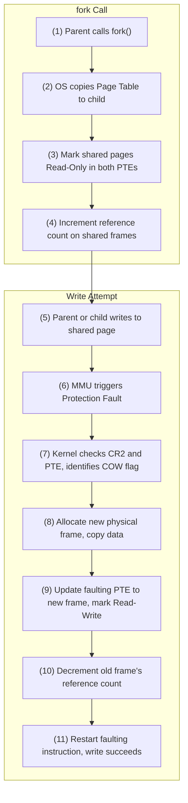

# CSE451: Copy-on-Write (COW)

**Copy-on-Write (COW)** is an optimization strategy used in OS kernel design to minimize memory usage and overhead during process creation (`fork()`).

## 1. The `fork()` Operation
When a process calls `fork()`, the OS must create a child process that is an exact copy of the parent. 
- **Naive Approach**: Copy all physical memory pages from parent to child. This is $O(Memory)$ and extremely slow, especially since the child often calls `exec()` immediately, throwing away the copied data.
- **COW Approach**: The parent and child share the **same physical pages** initially.

## 2. Implementation Mechanics
1. **PTE Modification**: The OS copies the parent's **[[Operating Systems/Virtualization/Memory/Address Translation/Page Table|Page Table]]** to the child. However, it marks all writable pages in both the parent and child as **Read-Only**.
2. **Metadata**: The OS sets a "COW" flag in the OS-reserved bits of the **[[Operating Systems/Virtualization/Memory/Address Translation/Page Table/Page Table Entry Anatomy|Page Table Entry (PTE)]]** or maintains this state in its internal memory management structures (e.g., the `vm_area_struct` in Linux).
3. **Reference Counting**: The OS increments a reference count for each shared physical frame.

## 3. Handling the Write (The Fault)
When either the parent or the child attempts to write to a shared page:
1. **Protection Fault**: The MMU detects a write attempt to a page marked Read-Only and triggers a **[[Operating Systems/Virtualization/Memory/Page Fault|Page Fault]]** (Interrupt 14 on x86). See **[[Operating Systems/Virtualization/Memory/Page Fault Lifecycle|Page Fault Lifecycle]]** for the full hardware-to-software handling sequence this triggers.
2. **Trap to Kernel**: The OS fault handler is invoked. It checks the faulting address (CR2) and the corresponding PTE.
3. **Identifying COW**: The handler sees the RO bit is set but the internal COW flag is also set. This indicates it is not a genuine protection violation but a COW event.
4. **Copying**:
    - The OS allocates a **new physical frame**.
    - It copies the data from the shared frame to the new frame.
    - It updates the faulting process's PTE to point to the new frame and marks it as **Read-Write**.
5. **Reference Count Update**: The reference count of the old frame is decremented. If it reaches 1, the remaining owner's PTE can be changed back to Read-Write without further faults.
6. **Instruction Restart**: The OS returns from the trap, and the CPU re-executes the write instruction, which now succeeds on the private copy.

## Benefits
- **Performance**: `fork()` becomes $O(PageTable)$ rather than $O(Memory)$.
- **Memory Efficiency**: Pages that are never written to (e.g., shared libraries, static data) are never duplicated.

## Timeline Diagram

## Deep Dive
Because the child process created by `fork()` frequently calls `exec()` immediately afterward (e.g., in shells implementing `fork()` + `exec()` to launch a new program), many of the pages that COW defers copying for are never written to at all before being discarded — meaning COW doesn't just delay the copy, it often avoids the copy entirely. This is why COW is such a large win in practice: the naive $O(Memory)$ copy would have wasted work on pages the child never touches.

## Industry Standard Terms
| Course Term | Industry / General Term |
|---|---|
| Copy-on-Write (COW) | Copy-on-write (standard term across OS/VM/DB systems) |
| COW flag | Copy-on-write bit / shared-page marker |
| Reference Counting | Refcounting |

## Related
- [[Operating Systems/Virtualization/Memory/Page Fault Lifecycle|Page Fault Lifecycle]]
- [[Operating Systems/Virtualization/Memory/Page Fault|Page Fault]]
- [[Operating Systems/Virtualization/Memory/Address Translation/Page Table|Page Table]]
- [[Operating Systems/Virtualization/Memory/Address Translation/Page Table/Page Table Entry Anatomy|Page Table Entry Anatomy]]
- [[Operating Systems/Virtualization/Memory/Virtual Memory|Virtual Memory]]
