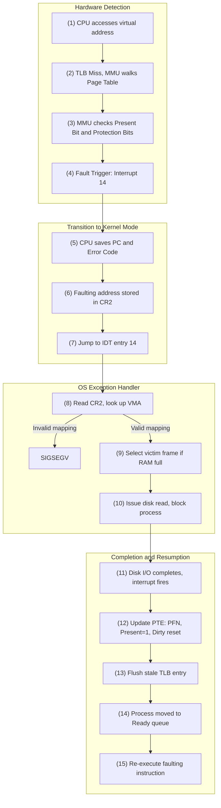

# CSE451: Page Fault Lifecycle (Hardware + Software)

The **[[Operating Systems/Virtualization/Memory/Page Fault|Page Fault]]** is a critical mechanism in virtual memory systems that allows the OS to handle memory accesses for pages not currently resident in physical RAM. On x86 architectures, this is handled via **Interrupt 14**.

## 1. Hardware Detection (The MMU)
1. **Instruction Execution**: The CPU attempts to access a virtual address.
2. **TLB Miss**: The address is not in the **[[Operating Systems/Virtualization/Memory/Address Translation/Translation Lookaside Buffer (TLB)|TLB]]**; the MMU performs a **Page Table Walk**.
3. **PTE Check**: The MMU finds the **[[Operating Systems/Virtualization/Memory/Address Translation/Page Table/Page Table Entry Anatomy|Page Table Entry (PTE)]]**. It checks the **Present Bit** and **Protection Bits**.
4. **Fault Trigger**: If the Present Bit is 0, or if the operation (Read/Write/Execute) violates the Protection Bits, the MMU stops and triggers a **Hardware Exception** (Interrupt 14).

## 2. Transition to Kernel Mode
1. **Context Save**: The CPU saves the current Program Counter (PC) and flags. On x86, it pushes an **Error Code** onto the kernel stack (indicating if the fault was due to a non-present page or a protection violation).
2. **Register Update**: The faulting virtual address is stored in the **CR2 register**.
3. **Trap Handler**: The CPU jumps to the address specified in the **Interrupt Descriptor Table (IDT)** for entry 14.

## 3. OS Exception Handler
1. **Identify the Address**: The OS reads the CR2 register to determine which address caused the fault.
2. **VMA Lookup**: The OS looks up the process's **Virtual Memory Areas (VMA)** or "Segments" — see **[[Operating Systems/Virtualization/Memory/Concepts/Address Space Contents|Address Space Contents]]** for the regions (stack, heap, static data, code) these areas typically correspond to — to see if the address is part of a valid mapping.
    - **Invalid**: If the address is not in any VMA, the OS sends a `SIGSEGV` (Segmentation Fault).
3. **Select Victim Frame**: If RAM is full, the OS runs a **Page Replacement Algorithm** (e.g., LRU, Clock) to pick a physical frame to evict.
4. **I/O Operation**:
    - If the page is on disk (Swap or File-backed), the OS issues a disk read.
    - The faulting process is moved to the **Blocked** state.
    - The CPU is yielded to another process.

## 4. Completion and Resumption
1. **I/O Interrupt**: When the disk controller finishes, it triggers an interrupt.
2. **Update PTE**: The OS updates the PTE with the new Physical Frame Number (PFN), sets the **Present Bit to 1**, and resets the **Dirty Bit**.
3. **TLB Invalidation**: The OS flushes the TLB entry for this virtual address (to ensure the MMU sees the update).
4. **Ready State**: The faulting process is moved to the **Ready** queue.
5. **Re-execution**: When scheduled, the OS restores the context. The CPU re-executes the **exact same instruction** that caused the fault. This time, the MMU walk succeeds.

## Timeline Diagram

## Deep Dive
This lifecycle is the general mechanism underlying several more specific scenarios documented elsewhere in this vault: a **[[Operating Systems/Virtualization/Memory/Concepts/Copy-on-Write|Copy-on-Write]]** fault follows exactly the same hardware detection and trap-to-kernel steps, but the OS exception handler branches differently once it recognizes the COW flag on the PTE, allocating a new frame instead of doing an I/O read from disk. Similarly, a fault serviced entirely by demand paging is a special case of Step 3 above where the "victim frame selection" and "disk read" steps are simply skipped because a free frame is already available.

## Formal Definition

The Page Fault Lifecycle can be modeled as a state machine over the states $\{Running, Trapped, Blocked, Ready\}$:

$$Running \xrightarrow{\text{PTE.present} = 0 \lor \text{protection violation}} Trapped$$
$$Trapped \xrightarrow{\text{VMA valid}} Blocked \quad \text{(if disk I/O required)}$$
$$Trapped \xrightarrow{\text{VMA invalid}} \text{SIGSEGV (terminate)}$$
$$Blocked \xrightarrow{\text{I/O complete, PTE.present} \leftarrow 1} Ready$$
$$Ready \xrightarrow{\text{scheduled, re-execute instruction}} Running$$

## Simplified Explanation

A page fault is the CPU saying "I don't have this data in memory, I need to stop and ask the OS to fetch it." The OS checks whether the request was legitimate (a real page that's just not in RAM yet) or bogus (accessing memory the process never should have touched). If legitimate, the OS finds room, kicks off a disk read, puts the process to sleep so other work can happen while waiting, and wakes it back up once the data has arrived — replaying the exact instruction that failed, which now succeeds because the data is finally there.

## Industry Standard Terms
| Course Term | Industry / General Term |
|---|---|
| Page Fault | Page fault (standard term) / Access violation (Windows) |
| Present Bit | Present bit (x86) / Valid bit (other architectures) |
| Virtual Memory Area (VMA) | Memory mapping / memory region |
| CR2 Register | Faulting address register (architecture-specific naming) |

## Related
- [[Operating Systems/Virtualization/Memory/Page Fault|Page Fault]]
- [[Operating Systems/Virtualization/Memory/Concepts/Copy-on-Write|Copy-on-Write]]
- [[Operating Systems/Virtualization/Memory/Address Translation/Translation Lookaside Buffer (TLB)|Translation Lookaside Buffer (TLB)]]
- [[Operating Systems/Virtualization/Memory/Address Translation/Page Table/Page Table Entry Anatomy|Page Table Entry Anatomy]]
- [[Operating Systems/Virtualization/Memory/Concepts/Swapping|Swapping]]
