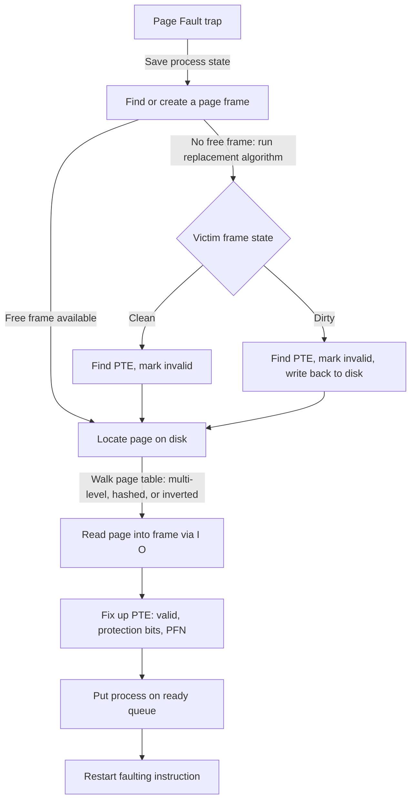

# CSE451: How the OS Handles Page Faults

When the hardware raises a **[[Page Fault]]**, the CPU traps into the kernel and the OS runs a fixed sequence of steps to bring the missing page into memory and resume the faulting process. The overall outline is: (1) trap and save state, (2) find or create a page frame to hold the incoming page, (3) locate the needed page on disk and read it in, (4) fix up the page table entry, and (5) put the process back on the ready queue.

## (1) Trap to the Page Fault Handler

A **[[Page Fault]]** causes the system to trap: the hardware saves the state of the running process (registers, program counter) and vectors execution to the page fault handler routine in the kernel.

## (2) Find or Create a Page Frame

The OS must find or create — through eviction if necessary — a page frame into which the needed page can be loaded.

- If no free frame is available, the OS runs a **[[Operating Systems/Virtualization/Memory/Page Replacement/Page replacement|page replacement algorithm]]** to pick a victim frame. A victim frame falls into one of three states:
	1. **Free page frame**: nothing to do — it can be used immediately.
	2. **Assigned but clean page frame**: the frame holds a page that hasn't been modified since it was loaded, so its disk copy is already up to date.
		- Find the **[[Operating Systems/Virtualization/Memory/Address Translation/Page Table/Page Table Entry Anatomy|Page Table Entry (PTE)]]** that maps to this frame — it may belong to a different process than the one that faulted.
		- Mark that PTE as invalid, so the disk address is available for a subsequent reload if that page is touched again.
	3. **Assigned and dirty page frame**: the frame holds a page that has been modified (dirty/modified bit set in its PTE), so its RAM contents differ from what's on disk.
		- Find the PTE.
		- Mark it as invalid.
		- Write the dirty page out to disk before the frame can be reused, since discarding it now would lose the modifications.
- While this I/O is happening, the OS can run some other process rather than block, since eviction and page-in are both blocking disk operations.
- The OS may speculatively maintain a list of clean and dirty frames that have already been selected as replacement candidates, so that a victim is ready the next time one is needed without having to run the replacement algorithm from scratch. It may also speculatively clean dirty pages ahead of time by writing them to disk during idle I/O bandwidth, so that when they are actually chosen as victims they are already clean and can be reused immediately.

## (3) Locate the Needed Page on Disk and Read It In

Once a frame is available, the OS must find where the faulting page actually lives on disk and bring it in.

- The OS can run some other process while this I/O is going on, same as during eviction.
- The processor makes the process ID and the faulting virtual address available to the page fault handler.
- The process ID gets the handler to the base of that process's **[[Operating Systems/Virtualization/Memory/Address Translation/Page Table|Page Table]]**.
- The **VPN** (Virtual Page Number) portion of the virtual address is then used to index into the page table and find the relevant **PTE**.
- A data structure analogous to the page table (tracking each page's location on the backing store) contains the disk address of the page.
- The OS issues the I/O to read the page off disk into the target frame. During this window, the OS must be positive that the target page frame remains available — it cannot let another process's fault or eviction claim that same frame while the read is still in flight.

### Locating the PTE: Page Table Organizations

Walking "the page table" to find a PTE is not always a single flat array lookup — the organization of the page table itself affects how this walk happens.

#### Multi-Level Page Tables

With a two-level page table, a virtual address is split into three parts: a master page number, a secondary page number, and an offset.

1. The master page number indexes into the master page table, which maps the master page number to the base of a secondary page table.
2. The secondary page number indexes into that secondary page table, which maps it to a **Physical Frame Number (PFN)**.
3. The offset is combined with the PFN to yield the final physical address.

This avoids allocating a single giant flat table for the entire virtual address space — most of the master table's entries can be left unallocated (pointing to nothing) if large regions of the address space are unused, saving memory relative to a single-level table sized for the whole address space.

#### Alternatives to Multi-Level Page Tables

- **Hashed page table**: well suited for sparse address spaces.
	- The VPN is used as the hash key.
	- Collisions are resolved by chaining: the linked list at a given hash bucket stores entries that include both the VPN and the PFN, so a lookup can walk the chain and confirm a match by comparing VPNs.
- **Inverted page table**: dramatically reduces the space needed for translation structures.
	- There is one entry per physical page frame (rather than one entry per virtual page), so the table's size scales with physical memory instead of virtual address space size.
	- Each entry includes the process ID and VPN that currently owns that frame.
	- Because the table is indexed by frame rather than by VPN, translation requires searching for a matching (process ID, VPN) pair, which is harder to search efficiently than a direct index.
	- An inverted page table cannot support **[[Operating Systems/Virtualization/Memory/Concepts/Copy-on-Write|Copy-on-Write]]**, since Copy-on-Write relies on multiple virtual pages (from different processes or address space regions) being able to point at the same physical frame, and an inverted table only stores a single (process ID, VPN) owner per frame.

## (4) Fix Up the Page Table Entry

Once the page has been read into the frame, the OS fixes up the PTE:

- Mark the PTE as valid.
- Set the referenced and modified (dirty) bits to false, since this is a fresh, unmodified load.
- Set the protection bits appropriately (read/write/execute) for this page.
- Point the PTE to the correct physical page frame.

## (5) Resume Execution

The process is put back on the ready queue, and when it is next scheduled the faulting instruction is restarted — this time the translation succeeds since the PTE is now valid and present.

## Issues

- **Memory reference overhead of address translation**: a naive page table walk costs two memory references per address lookup (one to read the PTE from the page table, one to access the actual data). The standard solution is a hardware cache of recent translations, the **[[Operating Systems/Virtualization/Memory/Address Translation/Translation Lookaside Buffer (TLB)|Translation Lookaside Buffer (TLB)]]**, which lets most accesses skip the page table walk entirely.
- **Memory required to hold page tables can be huge**: a flat, single-level page table sized to cover an entire virtual address space wastes memory for the large unused regions of a typical address space — this is exactly what multi-level, hashed, and inverted page tables above are designed to reduce.

## Related
- [[Page Fault]]
- [[Operating Systems/Virtualization/Memory/Page Replacement/Page replacement|Page replacement]]
- [[Operating Systems/Virtualization/Memory/Address Translation/Page Table|Page Table]]
- [[Operating Systems/Virtualization/Memory/Address Translation/Page Table/Page Table Entry Anatomy|Page Table Entry Anatomy]]
- [[Operating Systems/Virtualization/Memory/Address Translation/Translation Lookaside Buffer (TLB)|Translation Lookaside Buffer (TLB)]]
- [[Operating Systems/Virtualization/Memory/Concepts/Copy-on-Write|Copy-on-Write]]
- [[Operating Systems/Virtualization/Memory/Paged Virtual Memory|Paged Virtual Memory]]
- [[Operating Systems/Virtualization/Memory/How do we load a program|How do we load a program]]

## Industry Standard Terms
| Course Term | Industry Standard Equivalent |
|---|---|
| Page Fault Handler | Page fault handler / trap handler |
| Master page table / secondary page table | Page directory / page table (x86 terminology) |
| Assigned and dirty frame | Modified frame |
| Ready queue | Run queue |
