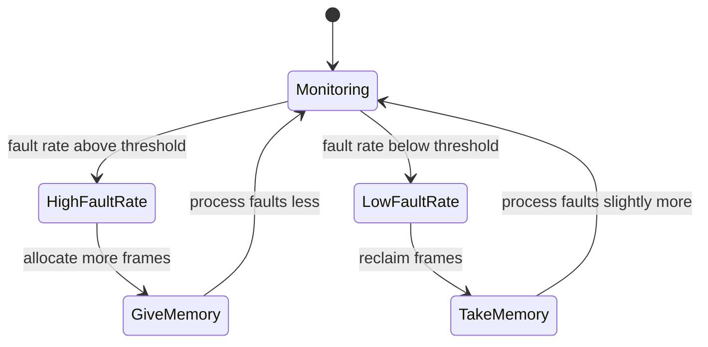

# CSE451: Page Fault Frequency (PFF)

**Page Fault Frequency (PFF)** is a variable-space page replacement algorithm — instead of giving every process a fixed number of frames, it dynamically grows or shrinks each process's frame allocation based on how often that process is actually faulting. Rather than trying to compute an ideal working set directly, PFF uses a more ad hoc approach: it attempts to equalize the fault rate among all processes and to keep a tolerable system-wide fault rate.

## Mechanism

1. The OS monitors the fault rate for each process individually.
2. If a process's fault rate is above a given threshold, the OS gives it more memory (more frames), so that it faults less. A high fault rate is a signal that the process's **[[Working set of program behavior|working set]]** does not currently fit in its allotted frames, so it keeps evicting pages it needs again shortly after.
3. If a process's fault rate is below the threshold, the OS takes memory away from it (reclaims frames). The reasoning is that a process faulting rarely has more frames than its working set actually needs, so those spare frames can be redistributed — that process should fault a bit more (since some of its rarely-used pages are reclaimed), allowing someone else with a higher fault rate to fault less.

## Why It Matters

PFF is a practical, measurement-driven alternative to computing the working set directly: rather than tracking exactly which pages fall within a time window `w` (as in the formal working set definition), it uses the observable fault rate as a proxy signal for whether a process currently has enough memory. This connects directly to **[[Thrashing]]**: if the system-wide fault rate stays high even after PFF has shifted memory around, it is a symptom that there simply isn't enough total physical memory for the current set of active processes' working sets, and the only real remedy is admitting fewer processes (reducing the degree of multiprogramming) rather than reshuffling frames among them.

## Related
- [[Working set of program behavior]]
- [[Thrashing]]
- [[Operating Systems/Virtualization/Memory/Page Replacement/Page replacement|Page replacement]]

## Industry Standard Terms
| Course Term | Industry Standard Equivalent |
|---|---|
| Page Fault Frequency (PFF) | Page Fault Frequency algorithm (standard term) |
| Variable-space algorithm | Local vs. global allocation policy (variable-space category) |
