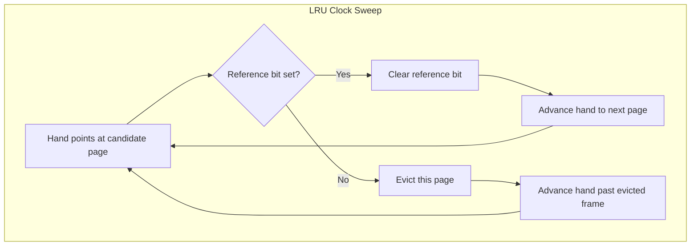

# CSE451: LRU Clock

**LRU Clock**: a cheap, hardware-friendly approximation of **[[Operating Systems/Virtualization/Memory/Page Replacement/LRU|LRU]]**, also known as **Not Recently Used (NRU)** or **Second Chance**.

## Algorithm
1. Replace a page that is "old enough" — i.e. one that hasn't been referenced recently.
2. Logically, arrange all physical page frames in a big circle (a clock), implemented as a circular linked list.
3. A "clock hand" is used to select a good LRU candidate:
	1. Sweep through the pages in circular order.
	2. If the reference bit (ref bit) is off, the page hasn't been recently used — evict it.
	3. If the reference bit is on, turn it off and move on to the next page (giving that page a "second chance" before it can be evicted on the hand's next pass).

## Clock Sweep State Machine

## Important Things to Note
1. The arm moves quickly when pages are needed frequently, since it can evict as soon as it finds a page with the reference bit off.
2. Low overhead if there is plenty of memory relative to the working set, since most pages the hand encounters will have their reference bit off already.
3. If memory is large, "accuracy" degrades: the hand may take a long time to sweep all the way around, so a page could be reused shortly after the hand clears its reference bit and still look "unused" for a long stretch.
	1. Fix: add more hands (e.g. a fast-clearing hand and a slower evicting hand) to keep the reference information fresher.

## Formal Definition
**LRU Clock (NRU / Second Chance)** models each resident frame's reference bit as a binary state $b_p \in \{0, 1\}$. The clock hand $h$ advances circularly over the ordered set of frames. At each step:
$$
\text{if } b_h = 0: \text{ evict } h; \quad \text{if } b_h = 1: \; b_h \leftarrow 0, \; h \leftarrow h + 1 \pmod{n}
$$
This approximates true LRU's total order over "time since last reference" with a coarser binary partition — "referenced since the hand last passed" vs. "not referenced since the hand last passed" — updated lazily as the hand sweeps rather than continuously.

## Simplified Explanation
Picture all the page frames arranged in a circle with a clock hand pointing at one of them. To find a victim, the hand walks around the circle: if the page it's pointing at hasn't been touched since the last time the hand passed (reference bit off), evict it. If it has been touched (reference bit on), give it a second chance — turn its bit off and move on, so it survives this pass but not necessarily the next one.

## Industry Standard Terms
| Course Term | Industry / General Term |
|---|---|
| LRU Clock | Clock algorithm / Second Chance / Not Recently Used (NRU) |

## Related
- [[Operating Systems/Virtualization/Memory/Page Replacement/LRU|LRU]] — the exact algorithm this approximates
- [[Operating Systems/Virtualization/Memory/Page Replacement/Evicting the best page|Evicting the best page]] — notes that LRU Clock can be implemented as either a local or global replacement policy
- [[Operating Systems/Virtualization/Memory/Memory Models/Page Table Entries|Page Table Entries]] — the reference bit this algorithm sweeps and clears
- [[Operating Systems/Virtualization/Memory/Page Replacement/Page FIFO|Page FIFO]] — a simpler, purely age-based alternative that this improves on by consulting usage information
