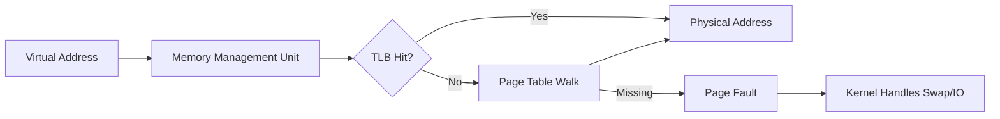

# CSE451: Virtual Memory

**Virtual Memory** is an architectural abstraction that provides each process with the illusion of a private, contiguous, and large memory space, regardless of the physical memory (RAM) available on the machine.

## Primary Objectives

### 1. Resource Efficiency
- **Demand Paging**: Programs can execute even if only a fraction of their address space is in physical memory.
- **Lazy Allocation**: The OS only allocates physical frames when the process actually touches a page, reducing wasted RAM.

### 2. Isolation and Protection
- **Address Space Isolation**: One process cannot name or access the memory of another process because they use distinct page tables.
- **Access Control**: Each page can be marked with permissions (Read, Write, Execute). The hardware prevents unauthorized access (e.g., writing to the **Text** segment).

### 3. Program Flexibility
- Programs can be larger than the physical RAM.
- **Relocation**: Code can be loaded anywhere in physical memory without modifying the binary, as the **[[Operating Systems/Virtualization/Memory/Virtual Memory#Address Translation|Address Translation]]** layer handles the mapping.

---

## Address Translation Mechanism

The transition from a **Virtual Address** to a **Physical Address** involves cooperation between the kernel and hardware.

### Key Components
- **Memory Management Unit (MMU)**: The hardware component that performs the translation.
- **[[Hardware & Software Interface/Memory Management/Virtual Memory#TLB|Translation Lookaside Buffer (TLB)]]**: A high-speed cache of recent virtual-to-physical mappings.
- **[[Operating Systems/Virtualization/Memory/Virtual Memory#Page Tables|Page Table]]**: A data structure (usually a multi-level tree) managed by the OS that stores the mappings.
- **Page Fault**: A hardware exception triggered when a process accesses a page not currently mapped in RAM.

---

## Industry Standard Terms
- **Virtual Memory** $\rightarrow$ VM
- **Physical Memory** $\rightarrow$ RAM / Main Memory / Frames
- **Page Fault** $\rightarrow$ Segment Violation (when invalid) / Swap Event
- **Swap Space** $\rightarrow$ Pagefile / Backing Store

## Related
- [[Process and Thread Fundamentals|Process and Thread Fundamentals (PCB/TCB)]]
- [[CSE451/Virtualization/Memory/Allocation|Memory Allocation (Slab/Buddy)]]
- [[Hardware & Software Interface/Memory Management/Virtual Memory|CSE351: Virtual Memory Fundamentals]]
- [[Hardware & Software Interface/Memory Management/Paging|CSE351: Paging and Address Translation]]
- [[Direct Memory Access (DMA)|CSE461: Direct Memory Access (DMA)]]