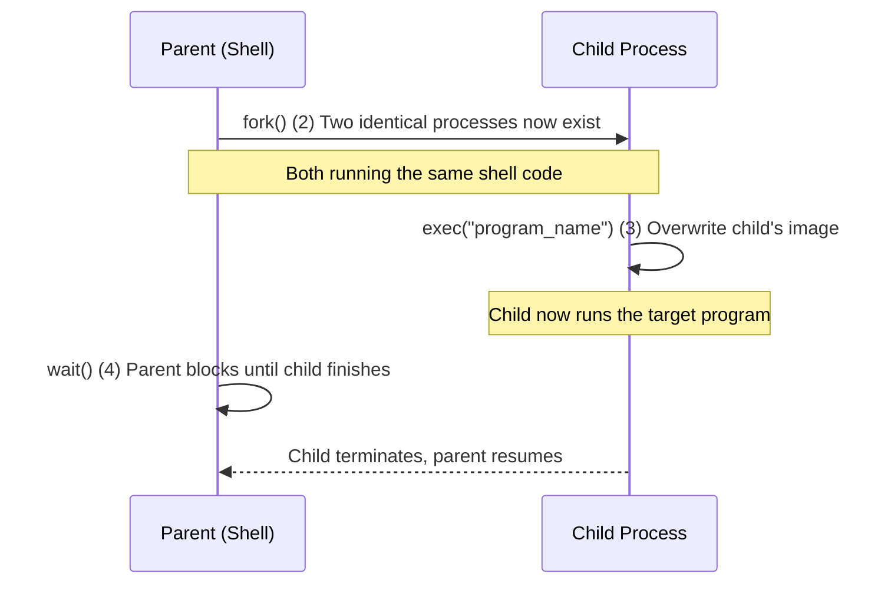

# CSE451: exec vs fork

In Unix-like operating systems, creating a new process that runs a different program is typically done in two distinct steps: **[[Fork|fork()]]** followed by **[[Exec|exec()]]**.

## Summary Comparison

| Feature | `fork()` | `exec()` |
| :--- | :--- | :--- |
| **Primary Goal** | Create a new process. | Replace current program with a new one. |
| **Process ID (PID)** | Child gets a new PID. | PID remains the same. |
| **Address Space** | Creates a copy of parent's address space. | Overwrites current address space with new program. |
| **Returns** | Returns twice (once in parent, once in child). | Does not return (except on failure). |
| **Relation to Parent** | Creates a parent-child relationship. | No change in relationships. |

## How They Work Together

The standard pattern to run a new program (e.g., in a shell) is:
1.  **[[Fork|Fork]]**: The shell calls `fork()`. Now there are two processes, both running the shell.
2.  **[[Exec|Exec]]**: In the child process, `exec("program_name")` is called. This replaces the shell code in the child with the code of the target program.
3.  **Wait**: The parent process usually calls `wait()` to wait for the child to finish.

## Why Two Steps?

Separating process creation (`fork`) from program execution (`exec`) allows the child process to perform setup *before* the new program starts, such as:
- Redirecting standard input/output/error.
- Changing environment variables.
- Changing user/group IDs or permissions.
- Changing the working directory.

If `fork` and `exec` were combined into a single syscall, none of this child-side setup would be possible, since the new program would take over immediately with no opportunity for the child to configure its own environment first.

## Related
- [[Fork|Fork]] — details on process cloning
- [[Exec|Exec]] — details on image replacement
- [[Optimizing Fork|Optimizing Fork]] — why copying the whole address space isn't as slow as it sounds (COW)
- [[Process Creation|Process Creation]]
- [[Process|Process]]

## Industry Standard Terms
| Course Term | Industry-Standard Equivalent |
|---|---|
| fork + exec pattern | POSIX process spawning (`posix_spawn` is a combined convenience wrapper) |

