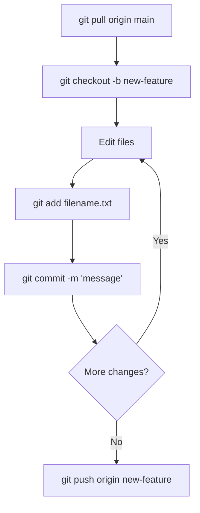

# CSE391: Git Workflow and Best Practices

Git is a tool for developers to manage their code's history and collaborate with others. To use Git effectively, you should follow this common workflow.

## (1) Prepare Your Environment

Before starting any work, ensure you are in the correct repository and on the correct branch.

### Update from remote
Always pull any changes from the server before you begin your own work.
```bash
git checkout main
git pull origin main
```

### Create a new branch
Start your task in its own isolated environment.
```bash
git checkout -b new-feature
```

---

## (2) Edit and Stage Changes

Modify your files as needed. Use `git status` frequently to see which files you have changed.

### Stage a file
Tell Git which files to include in the next commit.
```bash
git add filename.txt
```

### Unstage a file
If you accidentally stage the wrong file:
```bash
git reset HEAD filename.txt
```

---

## (3) Commit Changes

Save your work locally. Each commit should represent a single, logical change.
```bash
git commit -m "Add descriptive message here"
```

---

## (4) Push and Share

Upload your local history to the remote server so others can see it (or to back up your work).
```bash
git push origin new-feature
```

## Workflow Diagram



---

## The .gitignore File

Not every file belongs in your repository. You should exclude files like:
- **Temporary files:** `*.tmp`, `*.log`
- **Compiler output:** `*.class`, `*.o`, `bin/`
- **User configuration:** `.vscode/`, `.DS_Store`

### To ignore files:
Create a file named `.gitignore` in the root of your project and list the files/folders you want to exclude.

## Related
- [[Git Fundamentals|Git Core Concepts (Repo, Branch, Commit)]]
- [[Four Phases of Git|The Four Phases of Git]]
- [[Branching and Merging|Branching and Merging]]
- [[Remote Repositories|Connecting to Remote Servers]]

## Industry Standard Terms
| Course Term | Industry-Standard Equivalent |
| :--- | :--- |
| .gitignore | `.gitignore` — file specifying intentionally untracked files |
| Feature branch | Feature branch — isolated branch for a unit of work |
| git reset HEAD | Unstage files — remove from index without losing changes |
