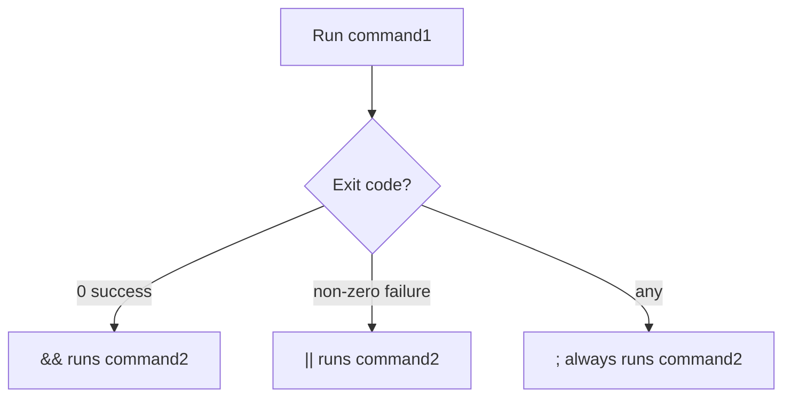

# CSE391: Control Flow Operators

**Control Flow Operators** allow you to chain multiple commands together on a single line and control their execution based on the success or failure of previous commands. The shell uses numeric **exit codes** (stored in `$?`) to determine success or failure.

## Exit Status (Exit Codes)

- **0:** Success
- **1-255:** Failure (different numbers often indicate different types of errors).
- Use `echo $?` to see the exit status of the most recent command.

## Background Operator (`&`)

Runs the preceding command in the background, allowing you to continue using the terminal while the task runs.
- **Usage:** `long_task &`
- **Checking progress:** Use `jobs` to see background tasks or `fg` to bring them to the foreground.
- **Example:** `python3 -m http.server 8000 &` (starts a server while keeping the terminal usable).

## AND Operator (`&&`)

The second command runs **ONLY IF** the first command succeeded (returned an exit status of 0).
- **Usage:** `command1 && command2`
- **Example:** `gcc main.c -o main && ./main` (compiles and only runs if compilation was successful).

## OR Operator (`||`)

The second command runs **ONLY IF** the first command failed (returned a non-zero exit status).
- **Usage:** `command1 || command2`
- **Example:** `grep "pattern" file.txt || echo "Pattern not found"` (prints a fallback message if grep fails to find the pattern).

## Semicolon (`;`)

Runs commands sequentially, regardless of whether the previous command succeeded or failed.
- **Usage:** `command1 ; command2`
- **Example:** `mkdir backup ; cp *.txt backup/ ; ls backup` (creates folder, copies files, and lists them one after another).

---

## Combining Operators

Operators can be combined and grouped with parentheses for complex logic.
```bash
# Attempt to compile and run; if either fails, print an error message
(gcc main.c -o main && ./main) || echo "Build or execution failed"
```

## Operator Decision Flow



## Related
- [[System and Software Tools/Streams Redirection and Pipes/Pipes|Pipes]]
- [[Xargs|Xargs]]
- [[Control Flow|Bash Control Flow (if, for, while)]]

## Industry Standard Terms
| Course Term | Industry-Standard Equivalent |
| :--- | :--- |
| AND Operator (`&&`) | Short-circuit AND — conditional command chaining |
| OR Operator (`\|\|`) | Short-circuit OR — fallback command chaining |
| Background Operator (`&`) | Background process / job control |
| Exit Code / Exit Status | POSIX exit status (0 = success, non-zero = error) |
