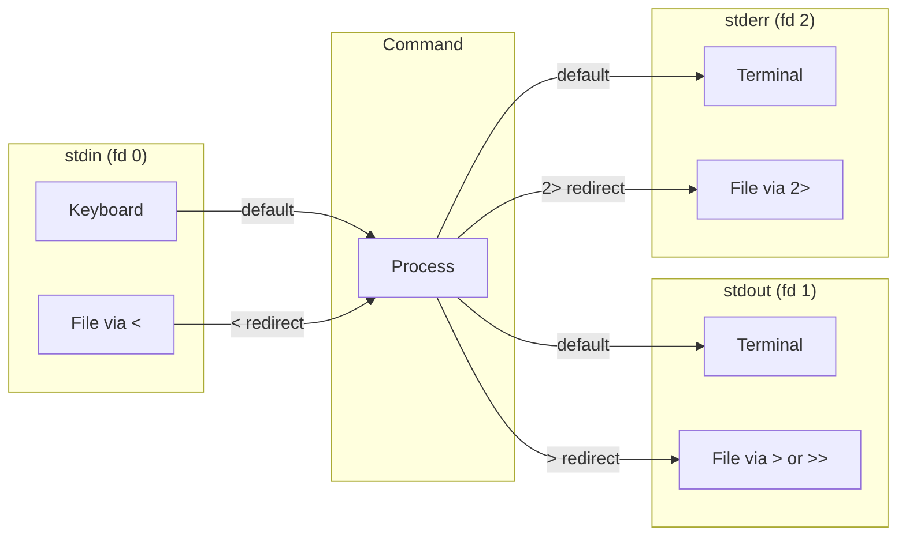

# CSE391: Input/Output Redirection

**Redirection** allows you to change where a command reads its input from or writes its output to, instead of using the default terminal. All redirection operators work by manipulating the [[Standard Streams|standard streams]].

## Output Redirection (`>`)

The `>` operator redirects **[[Standard Streams#(2) stdout (Standard Output) — File Descriptor 1|stdout]]** to a file. If the file already exists, its contents will be overwritten.
- Example: `ls > files.txt` stores the list of files in `files.txt`.
- Example: `grep "berry" fruits.txt > berries.txt` stores all lines containing "berry" from `fruits.txt` into `berries.txt`.

## Input Redirection (`<`)

The `<` operator redirects a file's contents into a command's **[[Standard Streams#(1) stdin (Standard Input) — File Descriptor 0|stdin]]**.
- Example: `grep "a" < berries.txt` searches for "a" within the contents of `berries.txt`.

## Append Redirection (`>>`)

The `>>` operator redirects **stdout** to a file, but appends the output to the end of the file instead of overwriting it.
- Example: `date >> log.txt` adds the current date/time as a new line at the end of `log.txt`.

## Error Redirection (`2>`)

Since **[[Standard Streams#(3) stderr (Standard Error) — File Descriptor 2|stderr]]** is stream 2, you can redirect it using `2>`.
- Example: `command 2> errors.txt` redirects only the error messages to `errors.txt`.
- Example: `command > output.txt 2>&1` redirects both `stdout` and `stderr` to the same file.

## Redirection Diagram

## Related
- [[Standard Streams|Standard Streams]]
- [[System and Software Tools/Streams Redirection and Pipes/Pipes|Pipes]]

## Industry Standard Terms
| Course Term | Industry-Standard Equivalent |
| :--- | :--- |
| Output Redirection (`>`) | stdout redirection / shell output redirect |
| Input Redirection (`<`) | stdin redirection / shell input redirect |
| Append Redirection (`>>`) | Append redirect |
| Error Redirection (`2>`) | stderr redirect |
