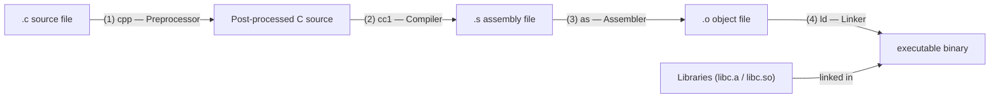

# CSE333: GCC Workflow

The **GNU Compiler Collection (gcc)** handles the transformation of C source code into machine-executable binaries through several distinct stages.

## Compilation Stages

1. **Preprocessing (`cpp`)**:
   - Handles directives (`#include`, `#define`, `#ifdef`).
   - Removes comments.
   - Result: Post-processed C source code (still human-readable text).
   - Manual run: `gcc -E foo.c`

2. **Compilation (`cc1`)**:
   - Translates C code into **Assembly Language** specific to the target architecture (e.g., x86-64).
   - Manual run: `gcc -S foo.c` (generates `foo.s`)

3. **Assembly (`as`)**:
   - Translates assembly code into **Machine Code** (binary).
   - Result: An **Object File** (`.o`) containing machine code and a **symbol table** listing defined and referenced symbols.
   - Manual run: `gcc -c foo.c` (generates `foo.o`)

4. **Linking (`ld`)**:
   - Combines multiple object files and libraries (e.g., `libc`) into a single executable binary.
   - **Resolves symbol references** between files — matches each undefined symbol to its definition in another object file or library.

## Common GCC Flags

- `-Wall`: Enable all standard warnings (highly recommended — treat warnings as errors with `-Werror`).
- `-g`: Include debugging information for `gdb`.
- `-std=c11`: Use the C11 language standard.
- `-o <name>`: Specify the output filename.
- `-c`: Compile but do not link (generates `.o` file).

## Related

- [[Preprocessor|Preprocessor]]
- [[Makefiles|Makefiles]]
- [[Linkage and Visibility|Linkage and Visibility]]

## Industry Standard Terms

- **GCC** — GNU Compiler Collection; `clang` (LLVM) is a popular alternative with better error messages and built-in sanitizers
- **Object file** — A relocatable binary containing machine code; not yet executable because symbol references are unresolved
- **Linker** — Resolves symbol references and produces the final executable; `gold` and `lld` are faster alternatives to the default `ld`
- **Static library (`.a`)** — An archive of object files linked into the executable at build time
- **Shared library (`.so`)** — A library loaded at runtime; reduces binary size and allows updating the library without recompiling the application
