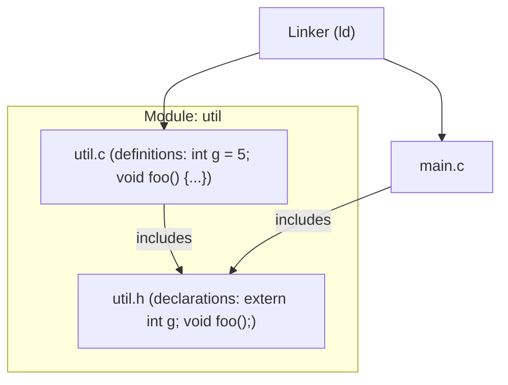

# CSE333: Linkage and Visibility

**Linkage** determines whether symbols (variables and functions) are visible across different translation units (source files). Understanding linkage is essential for structuring multi-file C programs correctly.

## Linkage Types

- **External Linkage**: The symbol is visible to other files during linking. This is the **default** for global variables and functions defined outside of any function.
- **Internal Linkage**: The symbol is restricted to the file in which it is defined. Other translation units cannot see or reference it.

## Keywords

- **extern**: Declares a symbol that is defined elsewhere (usually in another `.c` file). It tells the compiler "this symbol exists, but find its definition at link time."
  - Used in header files to make globals available to modules that include them.
- **static**: When used in a global context (outside a function), it forces **internal linkage**.
  - **Good Practice**: Use `static` to "defend" globals and functions, hiding internal implementation details from other modules. This is the C equivalent of marking something `private`.

## Module Conventions

- **.h files**: Should contain only declarations (prototypes, `extern` variables, `typedefs`), never definitions.
- **.c files**: Should contain definitions. Prototype declarations for exported functions belong in the corresponding `.h` file.
- **Inclusion**: NEVER `#include` a `.c` file — doing so duplicates the definitions and causes linker errors.
- **Consistency**: A `.c` file should include its own `.h` file so the compiler can check for consistency between declarations and definitions.

## Related

- [[Preprocessor|Preprocessor]]
- [[GCC Workflow|GCC Workflow]]
- [[Introduction to C|Introduction to C]]

## Industry Standard Terms

- **External linkage** — Symbols with external linkage appear in the object file's **symbol table** and can be resolved by the linker across compilation units
- **Internal linkage (`static`)** — Equivalent to "file-private" or "module-private"; the symbol is marked as a local symbol in the object file and is invisible to the linker
- **Translation unit** — A single `.c` file after preprocessing; the unit of compilation in C/C++
