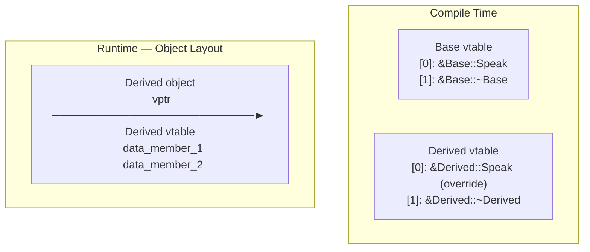

# CSE333: Virtual Table (vtable)

The **Virtual Table (vtable)** is the underlying mechanism that enables **dynamic dispatch** (runtime polymorphism) in C++. Every class with at least one virtual function gets its own vtable.

## Creation and Initialization

The vtable and its associated per-object pointer are managed at different stages:

1. **Compile-Time**: The compiler creates exactly **one vtable for each class** that contains at least one virtual function. This table is a static array stored in the program's **read-only data segment** (`.rodata`).
2. **Runtime (Constructor)**: When an object is instantiated, the **constructor** initializes the object's hidden **vptr** (virtual pointer) to point to the correct vtable for its class.

## Memory Overhead

Using virtual functions adds a small, predictable memory cost.

### Per-Class Overhead (The vtable)

Each polymorphic class has one static vtable shared across all instances.

- **Size**: `(Number of Virtual Functions) * (Size of a Pointer)`
- On a 64-bit system, a class with 5 virtual functions adds ~40 bytes to the program's static data segment — negligible in practice.

### Per-Instance Overhead (The vptr)

Every object instance of a polymorphic class carries a hidden member called the **vptr**.

- **Size**: Exactly one pointer (8 bytes on 64-bit, 4 bytes on 32-bit). See [[Data Type Sizes|Data Type Sizes]].
- **Impact**: This increases `sizeof()` the object. For example, an "empty" class with only a virtual destructor will have a `sizeof()` of 8 bytes instead of 1 byte.

## How it Works: The Lookup

When a virtual function is called through a base pointer (e.g., `ptr->Speak()`):

1. The CPU follows the **vptr** inside the object to find the **vtable**.
2. It looks up the function pointer at the specific index reserved for `Speak()`.
3. It jumps to that address and executes the code.

This is one extra pointer dereference compared to static dispatch, which is why virtual calls have a small runtime overhead.

## Inheritance and Overriding

- **Overriding**: If a derived class overrides a function, the compiler puts the address of the *new* implementation in the **derived class's vtable** at the same index.
- **Not Overriding**: If the derived class does *not* override a function, its vtable entry simply points to the base class's implementation.

## Related

- [[Inheritance|Inheritance]]
- [[C++ Casting|C++ Casting]]
- [[Static Dispatch|Static Dispatch]]
- [[Data Type Sizes|Data Type Sizes]]

## Industry Standard Terms

- **vtable** — "Virtual dispatch table"; the implementation mechanism for runtime polymorphism in C++, Java, and many other OOP languages (Java calls it a "method table")
- **vptr** — "Virtual pointer"; the hidden per-object pointer to the vtable; adds exactly one pointer's worth of overhead to every polymorphic object
- **Dynamic dispatch** — Also called "late binding"; the vtable lookup at runtime that selects the correct function implementation based on the actual object type
