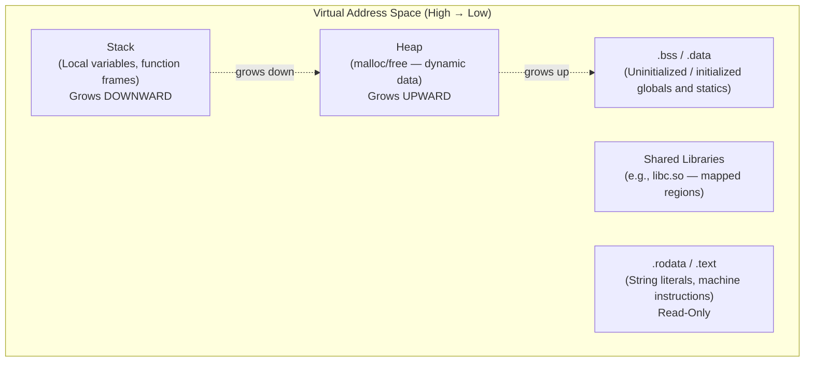

# CSE333: C Memory Model

A C program's **virtual address space** is organized into several segments, each serving a distinct purpose.

## Memory Segments

- **Stack**: Stores local variables and function call frames. Managed automatically by the compiler. Grows **downward** from high addresses.
- **Shared Libraries**: Mapped regions for shared code (e.g., `libc.so`).
- **Heap**: Used for dynamically allocated memory (via `malloc`). Managed manually by the programmer. Grows **upward** from low addresses.
- **Read/Write Data (`.data`, `.bss`)**: Stores global and static variables. `.data` holds initialized globals; `.bss` holds uninitialized globals (zero-initialized at startup).
- **Read-Only Data (`.rodata`, `.text`)**: Stores string literals and the program's machine instructions.

## Address Space Layout Randomization (ASLR)

Modern OSs like Linux randomize the base addresses of the stack, heap, and shared libraries on each run. This is a security feature designed to make **buffer overflow** attacks harder to execute, since the attacker cannot predict the absolute address of code or data.

## Related

- [[Systems Programming/Memory Management/Stack|Stack]]
- [[Systems Programming/Memory Management/Heap Management|Heap Management]]
- [[Systems Programming/C Fundamentals/Pointers|Pointers]]
- [[Words and Memory|CSE351: Words and Memory]]
- [[Memory Allocation|CSE351: Memory Allocation]]

## Industry Standard Terms

- **Virtual address space** — Each process gets its own isolated address space from the OS via virtual memory; physical memory is shared but invisible to the process
- **ASLR** — Address Space Layout Randomization; a standard defense-in-depth mitigation enabled by default on Linux, macOS, and Windows
- **`.bss` segment** — "Block Started by Symbol"; a historical name for the uninitialized data segment that is zero-filled before `main()` runs
